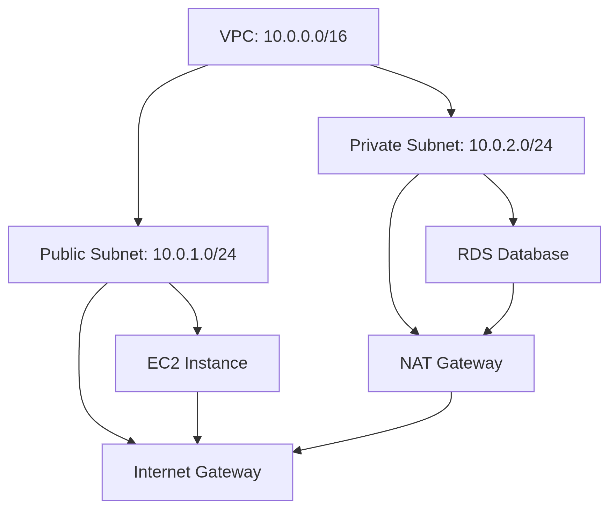

# Servicios cloud
## IaaS
Infreaestructura como servicio
- Capacidad de almacenamiento
- Redes
- Procesamiento
- Memoria
El usuario gestiona los recursos, usualmente nos proveen un sistema operativo con los permisos que necesitamos para resolver tareas, es como si estuviéramos en el servidor directamente
- Instalar aplicaciones (paquetes)
- Configurar las aplicaciones
- Gestionar los permisos (grupos de seguridad) apertura de puertos

### Recursos IAAS en AWS
#### VPC Virtual private cloud
- Nos permiten configurar redes
- Routers: Tablas de enrutamiento
- Firewalls
- NAT 
- Subredes (Zona de disponibilidad) Una región tiene tres o más zonas de disponibilidad
- Seguridad: Grupos de seguridad, ACL
VPC Virtual private cloud nos permite mapear la insfraestructura de red onpremises (localización de la organización)

#### EC2 
Nos provee computación: procesamiento, capacidad de CPU, Almacenamiento (temporal - instance store, EBS (bloques, a niveles recursos de AWS), EFS (Sistemas de archivos en red))
#### Componentes principales

| Componente              | Descripción                                                               |
| ----------------------- | ------------------------------------------------------------------------- |
| **Instancia**           | Servidor virtual con CPU, memoria, almacenamiento y redes                 |
| **AMI**                 | Imagen de Máquina Amazon - Plantilla preconfigurada (SO + software)       |
| **Tipos de instancia**  | Configuraciones optimizadas (Cómputo, Memoria, GPU, Almacenamiento, etc.) |
| **Par de claves**       | Claves SSH para acceso seguro (Linux/Windows)                             |
| **Grupos de seguridad** | Reglas de firewall _stateful_ para tráfico de instancias                  |
| **Volúmenes EBS**       | Almacenamiento persistente vinculado a instancias                         |
| **Instance Store**      | Almacenamiento temporal (efímero)                                         |
| **IP elástica**         | Dirección IPv4 pública estática (Cambia)                                  |
| **IP Public**           | Se puede asignar directamente una IP Publica (que no cambia)              |
# PaaS
**PaaS** (Platform as a Service) es un modelo de computación en la nube que proporciona un entorno listo para usar donde los desarrolladores pueden **construir, implementar y administrar aplicaciones** sin preocuparse por la infraestructura subyacente (servidores, almacenamiento, redes, etc.).

| Elemento                  | Descripción                                                                   |
| ------------------------- | ----------------------------------------------------------------------------- |
| **Entorno de desarrollo** | Herramientas integradas (SDKs, IDEs en la nube, APIs) para codificar.         |
| **Middleware**            | Servicios preconfigurados (bases de datos, colas de mensajes, autenticación). |
| **Infraestructura**       | Gestionada por el proveedor (AWS, Azure, Google Cloud, etc.).                 |
| **Escalabilidad**         | Ajuste automático de recursos según demanda.                                  |
| **Sistemas operativos**   | Actualizaciones y parches manejados por el proveedor.                         |
1. **AWS Elastic Beanstalk**
    
    - Implementa aplicaciones web en AWS sin configurar servidores manualmente.
        
2. **Google App Engine** (GCloud)
    
    - Permite ejecutar apps en la infraestructura de Google con autoescalado.
        
3. **Microsoft Azure App Services**
    
    - Ideal para aplicaciones .NET, Java, Node.js, etc., con integración CI/CD.
        
4. **Heroku**
    
    - Popular para startups, soporta múltiples lenguajes (Ruby, Python, etc.).

### AWS Beanstalk
Nos permite desplegar aplicaciones con enfoque de servidor, va a aprovisionar
1. Configuraciones de red (Subnets, grupos de seguridad)
2. Instancias de EC2
### AWS Amplify
Nos permite desplegar aplicaciones pero en enfoque serverless (usa la infraestructura de amazon)

| Característica        | Elastic Beanstalk                    | Amplify                             |
| --------------------- | ------------------------------------ | ----------------------------------- |
| **Tipo de servicio**  | PaaS (Plataforma como Servicio)      | Suite de desarrollo full-stack      |
| **Enfoque principal** | Backend y aplicaciones web/server    | Aplicaciones web/móviles (frontend) |
| **Escalabilidad**     | Autoescalado vertical/horizontal     | Escalado automático (managed)       |
| **Casos de uso**      | APIs, microservicios, web apps       | SPAs, apps móviles, Jamstack        |
| **Precio**            | Pago por recursos usados (EC2, etc.) | Gratis para starters, pago por uso  |
### AWS Codecommit
https://docs.aws.amazon.com/codecommit/latest/userguide/getting-started-cc.html

### Otros servicios
1. AWS Fargate (contenedores serverless)
2. EKS (Contenedores con servidor)

### Otros servicios externos PAAS
- Vercel (V0)
- Codespaces (Github) [https://education.github.com/pack](https://education.github.com/pack "https://education.github.com/pack")
- Heroku (Pago)
- Amazon codecommit

## SaaS Software como servicio
### **Definición de SaaS (Software as a Service)**

**SaaS** es un modelo de distribución de software donde las aplicaciones son alojadas por un proveedor en la nube y entregadas a los usuarios a través de internet. El usuario no necesita instalar, mantener o actualizar el software, ya que todo se gestiona desde la nube.

**Ejemplos:** Google Workspace, Microsoft 365, Salesforce, Slack.

---

### **Diferencias entre SaaS, PaaS e IaaS**

| **Modelo**                             | **Definición**                                             | **Control del Usuario**       | **Responsabilidad del Proveedor**        | **Ejemplos**                                     |
| -------------------------------------- | ---------------------------------------------------------- | ----------------------------- | ---------------------------------------- | ------------------------------------------------ |
| **SaaS**                               | Software listo para usar, accesible vía web.               | Solo configuración y uso.     | Infraestructura, plataforma, aplicación. | Gmail, Zoom, Dropbox                             |
| **PaaS** (Platform as a Service)       | Entorno para desarrollar y desplegar aplicaciones.         | Desarrollo de apps, datos.    | Infraestructura y sistema operativo.     | Heroku, Google App Engine, AWS Elastic Beanstalk |
| **IaaS** (Infrastructure as a Service) | Infraestructura virtualizada (servidores, almacenamiento). | SO, middleware, aplicaciones. | Hardware y virtualización.               | AWS EC2, Azure VMs, Google Compute Engine        |

---

### **Resumen clave**

- **SaaS:** "Software listo" (sin gestión técnica).
- **PaaS:** "Plataforma para crear software".
- **IaaS:** "Infraestructura en la nube" (máx. flexibilidad, máx. gestión).

# **Resumen: Servicios Cloud (IaaS, PaaS, SaaS)**  

#### **1. IaaS (Infraestructura como Servicio)**  
- **Qué es:** Proporciona recursos virtualizados (procesamiento, almacenamiento, redes).  
- **Control del usuario:**  
  - Gestiona SO, aplicaciones, permisos, redes (subredes, firewalls).  
  - Ejemplo: Configurar una instancia EC2 en AWS como si fuera un servidor físico.  
- **Componentes clave en AWS:**  
  - **VPC (Virtual Private Cloud):**  
    - Redes privadas, subredes, tablas de enrutamiento, grupos de seguridad.    
  - **EC2 (Elastic Compute Cloud):**  
    - Instancias con CPU, memoria, almacenamiento (EBS persistente o Instance Store efímero).  
    - AMIs (imágenes preconfiguradas), IP elásticas, seguridad con SSH.  

---

#### **2. PaaS (Plataforma como Servicio)**  
- **Qué es:** Entorno listo para desarrollar/desplegar aplicaciones sin gestionar infraestructura.  
- **Características:**  
  - Middleware integrado (bases de datos, autenticación).  
  - Escalabilidad automática.  
- **Ejemplos en AWS:**  
  - **Elastic Beanstalk:** Despliega apps con servidores (EC2 automáticos).  
  - **Amplify:** Enfoque *serverless* para frontends (SPAs, móviles).  
  - **Otros:** Heroku, Vercel, GitHub Codespaces.  

---

#### **3. SaaS (Software como Servicio)**  
- **Qué es:** Aplicaciones listas para usar vía web (sin instalación/mantenimiento).  
- **Ejemplos:** Google Workspace, Slack, Salesforce.  

---

### **Diferencias Clave**  
| **Modelo** | **Enfoque**               | **Control Usuario**       | **Ejemplo AWS**       |  
|------------|---------------------------|---------------------------|-----------------------|  
| **IaaS**   | Infraestructura bruta     | SO, redes, apps           | EC2, VPC             |  
| **PaaS**   | Plataforma de desarrollo  | Solo código y datos       | Elastic Beanstalk     |  
| **SaaS**   | Software terminado        | Solo configuración        | Google Drive         |  

### **Conclusión**  
- **IaaS:** Máximo control, ideal para sysadmins.  
- **PaaS:** Ideal para desarrolladores (sin DevOps).  
- **SaaS:** Soluciones listas para usuarios finales.  

