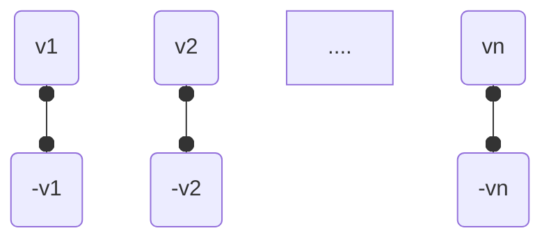
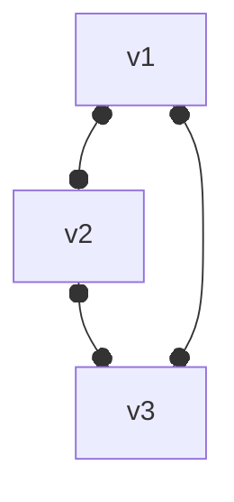
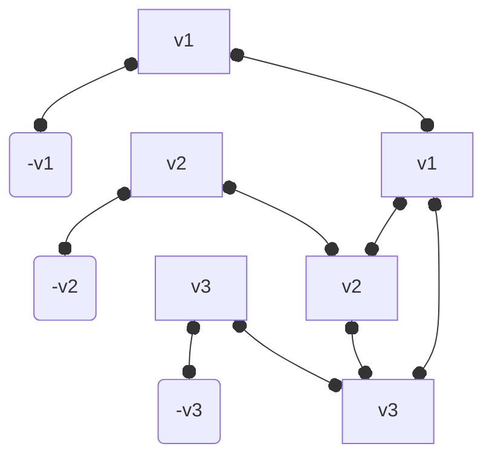

Recibe un grafo $G = (V,E)$ y recibe un entero $k \leq |V|$.

¿Existe un subconjunto de a lo sumo $k$ vértices donde cada arista $e\in E$ tiene al menos uno de los vértices en el subconjunto?

La salida es 1 si existe $V' \subseteq V$ tal que $|V'| \leq k$ y

$$
\forall e(u,v) \in E, (u \in V' \vee v \in V')
$$

Ejemplo de Vertex Cover con $k = 3$:

![[Pasted image 20251106112452.png]]

# Demostrar que VC es NP-Completo

## VC es NP

Se puede validar una solución de VC en tiempo polinomial.

Una solución tiene un conjunto de vértices seleccionados $V'$.

Se debe validar que todas las aristas $E(u,v)$ tengan al menos $u \in V' \vee v \in V'$.

$2*|V'|*|E| = O(|V||E|)$ es polinomial.

1. Si están todas las aristas, es una instancia positiva
2. Si falta alguna, es una instancia negativa

## Demostrar que VC es NP-Completo

### Paso 1
$3-SAT \leq_p VC$ Esto significa que VC es tan o más difícil que 3-SAT (esto no lo demostramos, lo asumimos).

### Paso 2

Dado que 3-SAT tiene $n$ variables $(v_1,v_2,...v_n)$:

Para cada cláusula $(v_1,v_2,v_3)$ vamos a crear:

Vamos a conectar las variables que pusimos al inicio con las de las cláusulas:

![[Pasted image 20251106114329.png]]

$K = 2*C + N$

### Ejemplo

![[Pasted image 20251106115756.png]]

### Complejidad de la reducción

1. ¿Cuántos vértices creo? $2*N+3*C$ $O(N+C)$
2. ¿Cuántas aristas creo? $N + 3*C + 3*C = N+ 6*C$ $O(N+C)$
Por lo que es polinomial.

### Instancias positivas de 3-SAT son instancias positivas de VC

Para que un 3-SAT sea satisfactible tiene que pasar que todos sus literales deben ser verdaderos, dentro de estos debe existir al menos una variable que sea VERDADERA.

![[Pasted image 20251106120539.png]]

En un 3-SAT positivo va a pasar que al menos una de las aristas externas a cada triángulo está cubierta, por lo tanto se pueden seleccionar los otros dos del triángulo para cubrir las aristas que no están cubiertas.

### Instancias negativas de 3-SAT son instancias negativas de VC

En 3-SAT negativo al menos uno de los literales da FALSO, en VC esto quiere decir que ninguna de las 3 aristas exteriores del triángulo está cubierta. NO ES POSIBLE seleccionar dos vértices en el triángulo que cubran las 3 aristas externas.

Por lo tanto, al menos una de las aristas externas del triángulo que representa el literal va a quedar sin cobertura, por lo tanto no es un VERTEX COVER.

## Ejemplo adicional

Supongamos un 3-SAT con variables $(x,y,z)$ y cláusulas $(x \vee y \vee z)$, $(\bar{x} \vee \bar{y} \vee z)$.

Transformación a VC:
- Variables: $x, \bar{x}, y, \bar{y}, z, \bar{z}$ (6 vértices)
- Cláusula 1: triángulo con vértices $x, y, z$
- Cláusula 2: triángulo con vértices $\bar{x}, \bar{y}, z$
- Conexiones entre variables y sus negaciones
- $K = 2*2 + 3 = 7$

El vertex cover debe seleccionar vértices que cubran todas las aristas, incluyendo las de los triángulos de cláusulas.