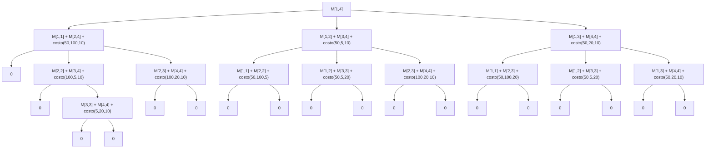

# Problema MCM (Multiplicación de Matrices)

## Definición del Problema

Dada una secuencia de matrices multiplicables:
$$M_1 \times M_2 \times M_3 \times \cdots \times M_n$$

Determinar la agrupación óptima de operaciones que minimice el número total de multiplicaciones escalares.

## Restricciones de Multiplicación

Para multiplicar dos matrices $M_{a}$ de dimensiones $n \times m$ y $M_{b}$ de dimensiones $m \times p$, el número de multiplicaciones requeridas es $n \times m \times p$, resultando en una matriz de dimensiones $n \times p$.

## Ejemplo Ilustrativo

Consideremos las matrices:
- $M_1 = 50 \times 100$
- $M_2 = 100 \times 5$ 
- $M_3 = 5 \times 20$

**Caso 1:** $((M_1 \times M_2) \times M_3)$
- $M_1 \times M_2$: $50 \times 100 \times 5 = 25,000$ → matriz $50 \times 5$
- Resultado $\times M_3$: $50 \times 5 \times 20 = 5,000$
- **Total: 30,000 multiplicaciones**

**Caso 2:** $(M_1 \times (M_2 \times M_3))$
- $M_2 \times M_3$: $100 \times 5 \times 20 = 10,000$ → matriz $100 \times 20$
- $M_1 \times$ resultado: $50 \times 100 \times 20 = 100,000$
- **Total: 110,000 multiplicaciones**

El primer agrupamiento es óptimo al minimizar las operaciones.

## Solución mediante Programación Dinámica

### Subestructura Óptima

El problema exhibe **subestructura óptima**: la solución óptima del problema general contiene soluciones óptimas de sus subproblemas.

Para $M[i,j]$ (multiplicar matrices $i$ hasta $j$), consideramos todas las particiones posibles:
$$M[i,j] = M[i,k] \times M[k+1,j] \quad \text{para } i \leq k < j$$

### Decisión en Divide y Vencerás

En cada paso, la **decisión crítica** es elegir el punto de división $k$ que minimice el costo total:
- Dividir el problema en dos subproblemas óptimos
- Combinar sus soluciones con el costo de multiplicar los resultados

### Formulación Recursiva

$$
M[i,j] = 
\begin{cases} 
0 & \text{si } i = j \\
\min\limits_{i \leq k < j} \left\{ M[i,k] + M[k+1,j] + p_{i-1} \cdot p_k \cdot p_j \right\} & \text{si } i < j 
\end{cases}
$$

Donde $p_i$ representa la dimensión de la fila de la matriz $i$ (y $p_{i-1}$ la dimensión de la columna de la matriz $i-1$).

## Ejemplo con 4 Matrices

Sean:
- $M_1 = 50 \times 100$
- $M_2 = 100 \times 5$
- $M_3 = 5 \times 20$
- $M_4 = 20 \times 10$

## Análisis de la Solución

La **subestructura óptima** se manifiesta en que cada subproblema $M[i,j]$ se resuelve encontrando el punto de división $k$ que minimiza la suma de:
1. El costo óptimo del subproblema izquierdo $M[i,k]$
2. El costo óptimo del subproblema derecho $M[k+1,j]$
3. El costo de multiplicar los resultados: $p_{i-1} \cdot p_k \cdot p_j$

La **decisión de dividir** en cada nivel representa la elección del paréntesis óptimo, donde el algoritmo evalúa sistemáticamente todas las posibles agrupaciones para encontrar la configuración de mínimo costo.