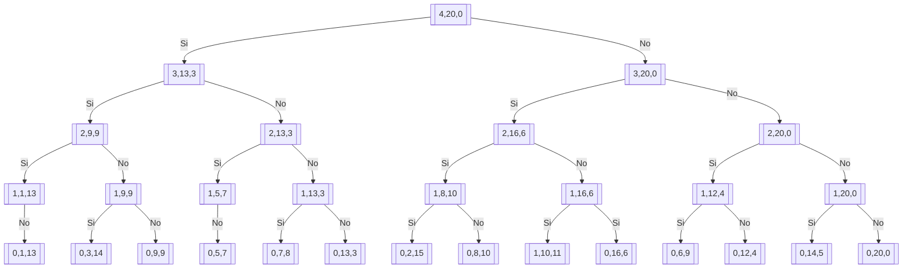

# Definicion
El problema de la mochila consiste en lo siguiente:

1. Tenemos una mochila con capacidad $M$
2. Tenemos con conjunto de elementos con peso $w_i$ y beneficio $b_i$
3. La idea es llenar la mochila de tal forma podamos llevar los elementos y maximize el beneficio
$$ \sum \limits_{i=0}{n} = x_i*b_i $$ sea maximo
$x_i$ es un vector binario, donde cuando tenemos un cero no llevamos el elementos y cuando tenemos 1 lo llevamos
A esto se le conoce como el problema **la mochila 0/1**

# Entender el problema

Tenemos una mochila asi:

1. $M=20$ la capacidad es 20
2. $w = \{6,8,4,7\}$ los pesos de los elementos
3. $b = \{5,4,6,3\}$ los beneficios de los elementos

La solución es un vector x binario de tamaño 4.

## Posibles soluciones

Vamos a enumerar todas las posibles soluciones binarias para el vector $x = (x_1, x_2, x_3, x_4)$ y calcular el peso total y beneficio para cada una, considerando que solo son válidas aquellas con peso total $\leq 20$ (aunque en este caso todas cumplen ya que el peso máximo de un elemento es 8 y hay 4 elementos, por lo que el peso máximo total sería $6+8+4+7=25$, pero como la capacidad es 20, algunas combinaciones pueden excederla). Sin embargo, dado que la capacidad es 20 y los pesos individuales son bajos, la mayoría de las combinaciones son válidas. Vamos a listar todas las $2^4 = 16$ posibilidades:

1. $\{0,0,0,0\}$: Peso = 0, Beneficio = 0  
2. $\{1,0,0,0\}$: Peso = 6, Beneficio = 5  
3. $\{0,1,0,0\}$: Peso = 8, Beneficio = 4  
4. $\{0,0,1,0\}$: Peso = 4, Beneficio = 6  
5. $\{0,0,0,1\}$: Peso = 7, Beneficio = 3  
6. $\{1,1,0,0\}$: Peso = 6+8=14, Beneficio = 5+4=9  
7. $\{1,0,1,0\}$: Peso = 6+4=10, Beneficio = 5+6=11  
8. $\{1,0,0,1\}$: Peso = 6+7=13, Beneficio = 5+3=8  
9. $\{0,1,1,0\}$: Peso = 8+4=12, Beneficio = 4+6=10  
10. $\{0,1,0,1\}$: Peso = 8+7=15, Beneficio = 4+3=7  
11. $\{0,0,1,1\}$: Peso = 4+7=11, Beneficio = 6+3=9  
12. $\{1,1,1,0\}$: Peso = 6+8+4=18, Beneficio = 5+4+6=15  
13. $\{1,1,0,1\}$: Peso = 6+8+7=21 > 20 (no válida)  
14. $\{1,0,1,1\}$: Peso = 6+4+7=17, Beneficio = 5+6+3=14  
15. $\{0,1,1,1\}$: Peso = 8+4+7=19, Beneficio = 4+6+3=13  
16. $\{1,1,1,1\}$: Peso = 6+8+4+7=25 > 20 (no válida)  

Las soluciones válidas ($peso \leq 20$) son las 1 a 12, 14 y 15. Las soluciones 13 y 16 no son válidas porque superan la capacidad de 20.

En tu mensaje ya mencionaste las soluciones 1, 2 y 3. Las que faltan son las restantes (4 a 12, 14 y 15). Aquí están todas listadas:

1. $\{1,0,0,0\}$: Peso=6, Beneficio=5  
2. $\{0,1,0,0\}$: Peso=8, Beneficio=4  
3. $\{0,0,1,0\}$: Peso=4, Beneficio=6  
4. $\{0,0,0,1\}$: Peso=7, Beneficio=3  
5. $\{1,1,0,0\}$: Peso=14, Beneficio=9  
6. $\{1,0,1,0\}$: Peso=10, Beneficio=11  
7. $\{1,0,0,1\}$: Peso=13, Beneficio=8  
8. $\{0,1,1,0\}$: Peso=12, Beneficio=10  
9. $\{0,1,0,1\}$: Peso=15, Beneficio=7  
10. $\{0,0,1,1\}$: Peso=11, Beneficio=9  
11. **$\{1,1,1,0\}$: Peso=18, Beneficio=15**  11. **$\{1,1,1,0\}$: Peso=18, Beneficio=15
12. $\{1,0,1,1\}$: Peso=17, Beneficio=14  
13. $\{0,1,1,1\}$: Peso=19, Beneficio=13  

Nota: Las soluciones $\{1,1,0,1\}$ (peso=21) y $\{1,1,1,1\}$ (peso=25) no son válidas y se excluyen.

La solución optima es la 11, porque tiene el mayor beneficio

## Plantear la subestructura optima

### ¿Como mapeamos los subproblemas?

1. ¿Cual es el caso base? Que la capacidad sea menor que el paso $M < w_i$ la decisión inmediata es no llevar y el beneficio es 0. Cuando tenemos 0 elementos, el beneficio es 0
2. Me voy con el mayor beneficio entre llevar y no llevar
3. ¿Como mapeamos los subproblemas a la estructura?
	1. Dimension del número de elementos
	2. Capacidad
Se plantea la subestructura optima como una matriz, cuyas filas representan la capacidad y columnas representa el número de elemento

$$
m[i,j] = \begin{cases}
          0 && j = 0 \\
		 m[i, j-1] && i < w_j \\
		 max(m[i - w_j,j - 1 ]+b_j,m[i,j-1]) && \texttt{En otro caso}
		 \end{cases}
		 $$ 
### Entender la subestructura optima

1. Cada posicion i,j que representa un subproblema
2. Los problemas base están en la primera columna
3. La solución general la esquina inferior derecha

## ¿Como la recorremos?

De acuerdo a esto debemos llenar por columnas desde 1 hasta n, de arriba hacia abajo, recordando que la primera columna esta llena de 0 por ser trivial (caso base)

### Matriz de solución

La ultima fila contiene la solución

# Conclusión Programación Dinamica

Es una técnica que utiliza divide y vencerás donde los problema se repiten y son independientes. Además se busca optimizar (hallar la mejor solución)

Tenemos que proponer una subestructura optima, la cual almacena los resultados optimos de los subproblemas, considera el caso base.

Esta subestructura se llena desde los problemas base hacia el general, buscando que si un subproblema depende de otro, este debe estar resuelto (bottom-up)
Basándonos en el contexto proporcionado sobre el problema de la mochila 0/1 y su resolución mediante programación dinámica, podemos extraer las siguientes conclusiones clave:

---

### 1. **La programación dinámica es eficiente para problemas con subestructura óptima y solapamiento de subproblemas**
- El problema de la mochila 0/1 tiene una **subestructura óptima**: la solución óptima para una instancia del problema (capacidad $M$, $n$ elementos) se puede construir a partir de soluciones óptimas de subproblemas más pequeños (capacidad $i < M$, $j < n$ elementos).
- Hay **solapamiento de subproblemas**: muchas combinaciones de capacidad y número de elementos se recalculan repetidamente en un enfoque recursivo ingenuo. La programación dinámica evita esto almacenando resultados en una tabla.

---

### 2. **La definición de la subestructura óptima es crucial**
- Se define una matriz $m[i][j]$ donde:
  - $i$ representa la capacidad disponible (desde 0 hasta $M$).
  - $j$ representa el número de elementos considerados (desde 0 hasta $n$).
- $m[i][j]$ almacena el **máximo beneficio achievable** con capacidad $i$ y los primeros $j$ elementos.

---

### 3. **La relación de recurrencia captura la esencia de la decisión**
Para cada subproblema $(i, j)$:
$$
m[i][j] = 
\begin{cases} 
0 & \text{if } j = 0 \\
m[i][j-1] & \text{if } i < w_j \\
\max\left(m[i - w_j][j-1] + b_j,\ m[i][j-1]\right) & \text{otherwise}
\end{cases}
$$
- **Caso base**: si no hay elementos ($j=0$), el beneficio es 0.
- **Si el elemento $j$ no cabe** ($i < w_j$), no se puede incluir: se hereda la solución de $j-1$.
- **Si cabe**, se elige el máximo entre:
  - Incluir el elemento: beneficio $b_j$ + solución óptima para capacidad $i - w_j$ y $j-1$ elementos.
  - No incluirlo: solución óptima para capacidad $i$ y $j-1$ elementos.

---

### 4. **El llenado de la tabla es sistemático y evita recomputación**
- Se llena la tabla **por columnas** (para cada $j$ desde 1 hasta $n$) y **por filas** (para cada $i$ desde 0 hasta $M$).
- Esto garantiza que al calcular $m[i][j]$, los subproblemas $m[i][j-1]$ y $m[i - w_j][j-1]$ ya están resueltos.
- La complejidad es $O(n \cdot M)$, mucho mejor que la fuerza bruta ($O(2^n)$) para $M$ no demasiado grande.

---

### 5. **La solución óptima se encuentra en $m[M][n]$**
- En el ejemplo, con $M=20$, $n=4$, $w = \{6,8,4,7\}$, $b = \{5,4,6,3\}$, el máximo beneficio es 15 (logrado con $\{1,1,1,0\}$).
- La esquina inferior derecha de la tabla ($m[20][4]$) contiene este valor.

---

### 6. **La reconstrucción de la solución requiere seguir decisiones**
- Para saber qué elementos se incluyeron, se recorre la tabla hacia atrás:
  - Si $m[i][j] != m[i][j-1]$, el elemento $j$ fue incluido (restar $w_j$ a $i$ y pasar a $j-1$).
  - De lo contrario, no se incluyó (pasar a $j-1$ con misma $i$).

---

### 7. **Limitaciones y consideraciones prácticas**
- La programación dinámica para la mochila es **pseudo-polinómica**: depende de $M$, que puede ser grande en algunos casos.
- Si $M$ es muy grande, otros enfoques (como algoritmos voraces aproximados o branch and bound) pueden ser más adecuados.
- Sin embargo, para instancias con $M$ moderado, es muy eficiente y exacto.

---

### 8. **Conclusión general**
La programación dinámica es una técnica poderosa para el problema de la mochila 0/1 porque:
- **Organiza los subproblemas** de forma estructurada.
- **Evita la recomputación** mediante almacenamiento en tabla.
- **Garantiza la optimalidad** gracias a la subestructura óptima.
- **Es escalable** para instancias razonables.

El ejemplo concreto ($M=20$, 4 elementos) ilustra cómo se construye la tabla y cómo se obtiene la solución óptima (beneficio 15) de manera sistemática, demostrando la efectividad del método.

---

**Referencia visual**: Los diagramas y matrices adjuntos en el contexto muestran el proceso de llenado y la estructura de dependencias, reforzando la lógica detrás de la programación dinámica.
