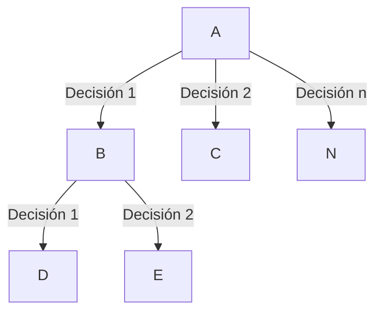
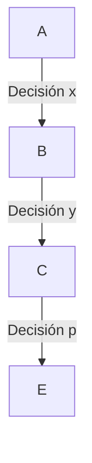
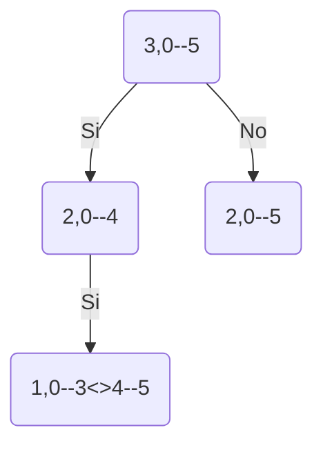

# Que es
La programación voraz es una técnica de programación basada en la programación dinámica, es decir cumple los mismos criterios

1. Que exista divide y vencerás
2. Los subproblemas se repiten
3. Existe una subestructura óptima

La programación dinámica explora la mejor decisión considerando las decisiones posteriores, pero la programación voraz sólo toma una decisión local, mira la mejor solución en el subproblema dado.

La ganancia es que es mucho más rapido, pero pierdo **la garantía de la mejor solución** pero en algunos casos la voraz da la mejor solución.

Solucion dinamica explora todas las posibilidades de acuerdo a la decisión

Programación toma decisiones locales

# Selección de actividades

El problema de selección de actividades consiste en seleccionar un conjunto de actividades que se puedan hacer en un recurso dado, es de anotar que no se pueden hacer al tiempo dos actividades

# Ejemplo

$(0,5),(1,3)(4,5)$

Soluciones

1. $(0,5)$ No puedo hacer las otras
2. $(1,3)(4,5)$ No puedo hacer la actividad $(0,5)$ esta es la solución óptima porque es el mayor número de actividades realizadas

### Solución dinamica

1. Recurso va desde 1 hasta cuando termina la ultima actividad
2. Tomar una actividad
	1. Hacerla si es posible, quito la actividad y reduzco el recurso
	2. No hacerla, quito la actividad

La desventaja de programación dinamica, es para que mapear un problema necesitamos el número de actividades y el recurso disponible (rango)

El caso base está identificado como cuando tenemos 0 actividades o bien el rango es nulo o conjunto vacio.

Otro problema es que existen pocos problema solapados dado la variabilidad del rango de recurso disponible.

En conclusión, se puede resolver por programación dinámica pero no es la mejor opción  considerando la complejidad computacional.

# Solución voraz

Para la solución voraz:

1. Que se puede resolver por programación dinámica
2. Existe una propiedad de escogencia voraz, buscar el optimo global desde soluciones locales

En el caso de selección de actividades, buscamos realizar el mayor número de tareas posible, una estrategia es escoger las actividades que finalizan primero.

$(0,5),(1,3)(4,5)$

Vamos a aplicar un ordenamiento de acuerdo al tiempo de finalización

$(1,3),(0,5),(4,5)$

La idea es colocar las actividades que finalizan primero con la esperanza de que tengamos el mayor espacio disponible para las actividades siguientes, por lo tanto el ordenamiento de acuerdo al tiempo de finalización es el criterio de escogencia voraz

1. Escogemos $(1,3)$
2. Intentamos escoger $(0,5)$ no es posible
3. Escogemos $(4,5)$
En este punto obtenemos la solución optima

Es de anotar que esto no garantiza la solución optima, solo una buena solución con optimos locales.

A diferencia de la programación dinámica es una estrategia **rápida** para resolver problemas

## ¿Complejidad de la solución voraz?

1. Costo de ordenar $O(nlog(n))$
2. Costo de ir seleccionando las actividades $O(n)$
3. Por lo que el costo total es $O(nlog(n)$