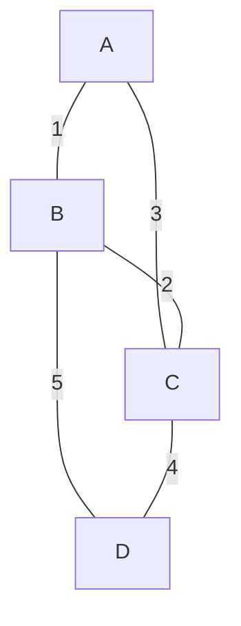
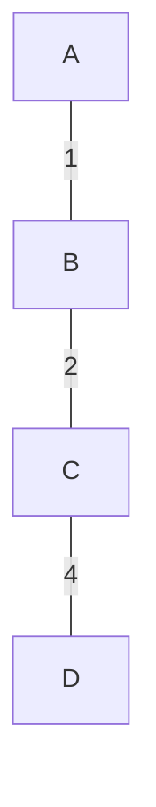

Dado un grafo G(E,V) no dirigido ponderado conexo, escoger las aristas E' para generar el arbol suyacente que incluye todos los vértices V.

Estrategia voraz: Escoger aristas conservando que no existan ciclos. Si ya existe un conjunto de aristas elegido, siempre se escogerá la mejor arista posible, dada la propiedad que no existan ciclos, no es posible escoger una mejor arista que la seleccionado dado que generará un ciclo.

# Prim

**Algoritmo de Prim**  
Algoritmo voraz para encontrar un **árbol de expansión mínima (MST)** en un grafo conexo no dirigido con pesos. Comienza desde un nodo arbitrario y expande el árbol agregando en cada paso la arista de menor peso que conecte un nodo del árbol con uno fuera de él.

**Pasos:**  
1. Inicializar un árbol con un nodo arbitrario.  
2. Repetir hasta incluir todos los nodos:  
   - Encontrar la arista de mínimo peso que conecte un nodo en el árbol con uno fuera es decir quee sea adyacente a el.  
   - Agregar esa arista y el nodo al árbol.  

**Complejidad:** $O(E \log V)$ con cola de prioridad.  

---

**Ejemplo:** Grafo con nodos A, B, C, D y aristas:  
- A-B: 1  
- A-C: 3  
- B-C: 2  
- B-D: 5  
- C-D: 4  

**Proceso:**  
1. Comenzar en A.  
2. Arista mínima desde A: A-B (peso 1) → agregar B.  
3. Aristas desde {A,B}: mínima es B-C (peso 2) → agregar C.  
4. Aristas desde {A,B,C}: mínima es C-D (peso 4) → agregar D.  
**MST final:** A-B, B-C, C-D (peso total = 1+2+4=7).  

**Nota:** Las aristas A-C (3) y B-D (5) no se incluyen por tener mayor peso.

# Kruskal
**Algoritmo de Kruskal**  
Algoritmo voraz para encontrar un **árbol de expansión mínima (MST)** en un grafo conexo no dirigido con pesos. Ordena todas las aristas por peso y las agrega al árbol si no forman un ciclo (usando Union-Find para verificar conectividad).

**Pasos:**  
1. Ordenar todas las aristas por peso (ascendente).  
2. Inicializar un conjunto vacío para el MST.  
3. Para cada arista (en orden):  
   - Si agregarla no crea un ciclo, incluirla en el MST.  
4. Repetir hasta tener $V-1$ aristas.

**Complejidad:** $O(E \log E)$ por el ordenamiento.

---

**Ejemplo con mismo grafo:**  
Aristas ordenadas:  
1. A-B (1)  
2. B-C (2)  
3. A-C (3)  
4. C-D (4)  
5. B-D (5)  

**Proceso:**  
- Agregar A-B (peso 1) ✅  
- Agregar B-C (peso 2) ✅  
- Ignorar A-C (3) ❌ (forma ciclo con A-B-C)  
- Agregar C-D (peso 4) ✅ (MST completo: 3 aristas para 4 nodos)  

**MST final:** A-B, B-C, C-D (peso total = 1+2+4=7).

# Complejidad

Soponiendo una estructura ordenada **cola de prioridad** las operaciones aqui cuesta $O(log(n))$ por lo tanto se va a requerir en ambos algoritmos utilizar estas operaciones, esto se va hacer $V$ veces para un grafo $G(V,E)$ entonces la complejidad va ser $O(Elog(V))$