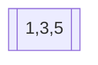
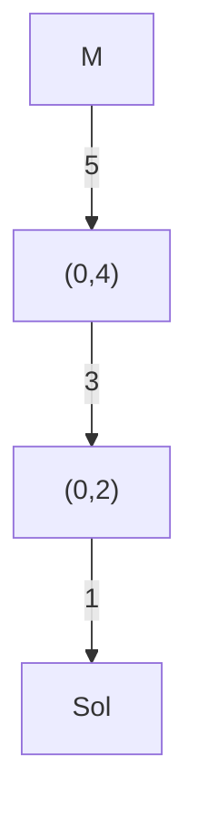
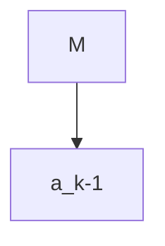

**Problema de cambio de monedas (Coin Change Problem)**

**Definición formal:**  
Dado un conjunto de monedas $C = \{c_1, c_2, ..., c_n\}$ con valores enteros positivos y una cantidad objetivo $T \in \mathbb{N} \cup \{0\}$, encontrar el número mínimo de monedas necesarias para formar $T$, o todas las combinaciones posibles si se requieren.

**Notación:**  
- $C$: conjunto de denominaciones de monedas (sin duplicados).  
- $T$: cantidad a cambiar.  
- $S$: solución, multiconjunto de monedas tal que $\sum_{c_i \in S} c_i = T$.

---

**Ejemplo con $C = \{1, 3, 5\}$ y $T = 9$:**

**Todas las soluciones posibles (combinaciones con repetición):**  
1. $\{1,1,1\}$ 3 monedas
2. $\{0,3,0\}$ 3 monedas
3. $\{9,0,0\}$ 9 monedas
4. $\{4,0,1\}$ 5 monedas

Como se puede observar tenemos monedas de 1, 3 y 5
1. No importa la cantidad $M \geq 5$ siempre vamos a tener un residuo entre $0 \leq r \leq 4$ moneda mas alta me impone un rango y ese rango va desde 0 hasta el predecesor del valor.
2. Una vez usemos las monedas de denominación 5, el problema se transforma entre 0 y 4, tenemos el hecho de la moneda 3, si el problema tiene residuo mayor o igua que 3, no lo va transforma en 0,1 o 2. Usaremos como maximo una moneda.
3. Una vez se use la moneda de 3, nos queda un problema entre 0 y 2, lo que implica que maximo usaremos dos monedas de 2.

+
Para entender la subestructura optima, primero tomamos lo que es $M \texttt{ mod  } 5$ esto va a dar un valor entre 0 y 4, de alli los subproblemas dependen de los otros valores que yo pueda cambiar.

La propiedad de escogencia voraz: Escoja la denominación más alto posible siempre, esto reduce el problema entre 0 y esa denonominación menos 1, lo que es la operación **módulo**

**Ejemplo 1:** $C = \{1, 2, 5\}$, $T = 7$  
**Número total de soluciones:** 6  
**Soluciones (cada fila es una combinación):**  

| Monedas de 5 | Monedas de 2 | Monedas de 1 | Total monedas |
|--------------|--------------|--------------|---------------|
| 1            | 1            | 0            | 2             |
| 1            | 0            | 2            | 3             |
| 0            | 3            | 1            | 4             |
| 0            | 2            | 3            | 5             |
| 0            | 1            | 5            | 6             |
| 0            | 0            | 7            | 7             |

---

**Ejemplo 2:** $C = \{1, 4, 6\}$, $T = 8$  
**Número total de soluciones:** 4  
**Soluciones:**  

| Monedas de 6 | Monedas de 4 | Monedas de 1 | Total monedas |
|--------------|--------------|--------------|---------------|
| 1            | 0            | 2            | 3             |
| 0            | 2            | 0            | 2             |
| 0            | 1            | 4            | 5             |
| 0            | 0            | 8            | 8             |
# Complejidad computacional

Dado un conjunto de monedas tamaño $n$ y una entrada $M$ a cambiar que debo hacer para conocer la solución voraz.

$$C=\{a_1,a_2, \cdots a_n\}$$

Supongamos que C es un arreglo.

1. C[n-1] $O(1)$ 
2. Calculo $r = M \texttt{ mod } C[n-1]$ $O(1)$ calculo el subproblema (sobrante)
3. Calculo $x_n = M / C[n-1]$ O(1)
4. El problema se va repetir con $M = r$
5. Itero hasta que mi $r = 0$ o bien quedo con la moneda $C[0]$ que es la denominación 1.

La solución cuesta $O(n)$ tomando en cuenta que use como estructura de datos un **arreglo** se entiende que llega ordenado de menor a mayor.

Si toca ordenar $O(nlog(n))$