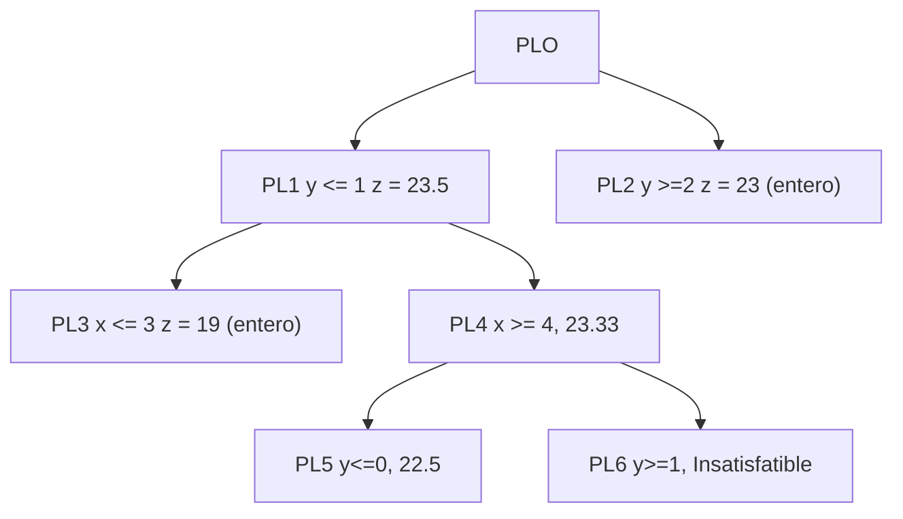

Actualmente podemos resolver sistemas de programación lineal, sin embargo, hay situaciones donde se requiere que las soluciones sean enterar, por ejemplo, quiero seleccion un número de cajeros que maximizan la productividad.

¿Que sucede con una solución no entera? Por ejemplo, necesito 14.5 cajeros. No, porque el problema requiere que tengamos un número entero. para esto vamos a aplicar una técnica conocida como Branch and Bound

```
max 5x + 4y

x + y <= 5
10x + 6y <= 45
x,y >= 0 y enteros
```

# Paso 1

Resolver el sistema

```
max z = 5x + 4y

x + y + a = 5
10x + 6y + b = 45
x,y >= 0 y enteros
```

Tablero

```
z - 5x - 4y = 0

x + y + a = 5
10x + 6y + b = 45
x,y >= 0 y enteros
```
## Tablero simplex inicial:

| VB  | z   | x   | y   | a   | b   | LD  |
| --- | --- | --- | --- | --- | --- | --- |
| z   | 1   | -5  | -4  | 0   | 0   | 0   |
| a   | 0   | 1   | 1   | 1   | 0   | 5   |
| b   | 0   | 10  | 6   | 0   | 1   | 45  |

**Variables básicas:** a, b  
**Variables no básicas:** x, y  
**Solución básica inicial:** x = 0, y = 0, a = 5, b = 45, z = 0

Aqui entra X

| VB  | z   | x   | y   | a   | b   | LD  |                        |
| --- | --- | --- | --- | --- | --- | --- | ---------------------- |
| z   | 1   | -5  | -4  | 0   | 0   | 0   |                        |
| a   | 0   | 1   | 1   | 1   | 0   | 5   | a = 0, x = 5           |
| b   | 0   | 10  | 6   | 0   | 1   | 45  | b = 010x = 45, x = 4.5 |
|     |     |     |     |     |     |     |                        |
Sale b

| VB  | z   | x   | y    | a   | b    | LD    |
| --- | --- | --- | ---- | --- | ---- | ----- |
| z   | 1   | -5  | -4   | 0   | 0    | 0     |
| a   | 0   | 1   | 1    | 1   | 0    | 5     |
| x   | 0   | 1   | 6/10 | 0   | 1/10 | 45/10 |


| VB  | z   | x   | y    | a   | b     | LD     |
| --- | --- | --- | ---- | --- | ----- | ------ |
| z   | 1   | 0   | -1   | 0   | 5/10  | 225/10 |
| a   | 0   | 0   | 4/10 | 1   | -1/10 | 5/10   |
| x   | 0   | 1   | 6/10 | 0   | 1/10  | 45/10  |
Entra a la base y, sale

| VB  | z   | x   | y    | a   | b     | LD     |                 |
| --- | --- | --- | ---- | --- | ----- | ------ | --------------- |
| z   | 1   | 0   | -1   | 0   | 5/10  | 225/10 |                 |
| a   | 0   | 0   | 4/10 | 1   | -1/10 | 5/10   | a = 0, y = 5/4  |
| x   | 0   | 1   | 6/10 | 0   | 1/10  | 45/10  | x = 0, y = 45/6 |

Entra y y sale a


| VB | z | x | y | a | b | LD |
|----|---|---|---|---|---|----|
| z  | 1 | 0 | 0 | 5/2 | 0 | 95/4 |
| y  | 0 | 0 | 1 | 5/2 | -1/4 | 5/4 |
| x  | 0 | 1 | 0 | -3/2 | 1/4 | 15/4 |


Resolvimos el primer sistema

z = 95/4 = 23.75
y = 5/4 = 1.25
x = 15/4 = 3.75 


```
var float: x;
var float: y;


constraint x + y <= 5;
constraint 10*x + 6*y <= 45;
constraint x >= 0;
constraint y >= 0;
solve maximize 5*x + 4*y;
```

A este problema lo vamos a denotar como PLO

Esto nos obliga a seleccionar una variable no entera (x e y), voy a trabajar con x

Pero en las diapositivas trabajan con y


Tengo en cuenta que mi función objetivo da 23.75, evaluando las ramas naturalmente esta va a reducir, pero podemos usar este criterio para poder detenernos si una de las ramificaciones esta por debajo de otra

```
%Problema PL1
max z = 5x + 4y

x + y + a = 5
10x + 6y + b = 45
y <= 1
x,y >= 0 y enteros
```
Resultado

x = 3.9;
y = 1.0;
_objective = 23.5;


```
%Problema PL2
max z = 5x + 4y

x + y + a = 5
10x + 6y + b = 45
y >= 2
x,y >= 0 y enteros
```

x = 3.0;
y = 2.0;
_objective = 23.0;

Observen que PL1 dio 23.5 sin ser entero, pero PL2 dio 23 siendo entero, si PL1 hubiera dado menor que PL2 se podria detener.

Esto significa que PL2 debo ramificar x = 3.9; esto significa que debo generar PL3 $x \leq 3$ y PL4 con $x \geq 4$ 

PL3
```
% PL3
max z = 5x + 4y

x + y + a = 5
10x + 6y + b = 45
y <= 1
x <= 3
x,y >= 0 y enteros
```

```
x = 3.0;
y = 1.0;
_objective = 19.0;
```
La funcion objetivo dio 19, aqu no es necesario ramificar mas

PL4

```
max z = 5x + 4y

x + y + a = 5
10x + 6y + b = 45
y <= 1
x >= 4
x,y >= 0 y enteros
```

```
x = 4.0;
y = 0.8333333333333333;
_objective = 23.33333333333333;
```

Aqui no me puedo detener, la mejor que tengo z = 23, pero aqui hay 23.33. Debo generar PL5 $y \leq 0$ y PL6 $y \geq 1$ 

PL5

```
max z = 5x + 4y

x + y + a = 5
10x + 6y + b = 45
y <= 1
x >= 4
y <= 0
x,y >= 0 y enteros


x = 4.5;
y = -0.0;
_objective = 22.5;
```
No ramifico porque la mejor entera que tengo 23 (rama PL0) no se puede mejorar

PL6

```
max z = 5x + 4y

x + y + a = 5
10x + 6y + b = 45
y <= 1
x >= 4
y >= 1
x,y >= 0 y enteros


Insatisfactible
```




