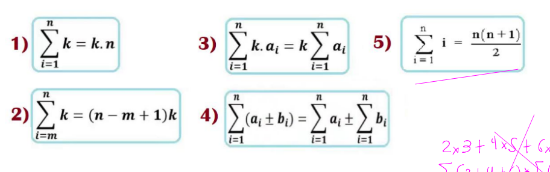

# Fundamentos de algoritmos

## Problemas

-Especificación de datos de entrada: Tipo, el rango como se puede mapear: int, double, long, string, int[], vector, 
-  Especificación de lo que se busca de salida: tipo de la salida
- Los problemas puede ser de diversos tipo
	- Optimización: Buscar el mejor valor (solución)
	- Búsqueda: Encontrar un valor dentro de muchos
	- Ordenamiento: Reordenar la entrada de acuerdo a algún criterio


## Instancia
Es un conjunto de entrada válidas para el algoritmo con su correspondiente salida

## Dominio de un problema
Son los valores que son validos para las entradas, dominios finitos o infinitos

$$
D \in \mathbb{N}
$$
Este seria el caso de los números naturales que es un dominio infinito

## Tamaño de un problema
Es la cantidad de datos que ingresan como entrada, por ejemplo, en el caso de un arreglo, sería el número de elementos
En el caso de una matriz tendrías filas por columnas (es el número de elementos)

## Sucesiones

Secuencia de números
- Artimetica cuando se suma un valor constante (d = 3) 1,4,7, 10, ...
- Geometrica cuando se multiplica un valor constante (r = 2) 3,6,12,24,48,...
- Lo que tenemos son términos a1,a2,a3,a4,...   1,4,7, 10 => a1 = 1, a2 = 4, ...

Sumatorias
Suma de una serie: geometrica o aritmetica



# Calculo de complejidad

Notaciones
$$O$$ Sirve para el peor caso
$$ \Omega $$ Se usa para el mejor caso
$$ \Theta $$ Caso promedio
## Calculo de complejidad
Operaciones elementales (toman tiempo 1)
- Operaciones artimeticas
- Asignaciones a variables
- Llamadas a funciones
- Retornos, captura de datos, prints
- Comparaciones lógicas
- Acceso a estructuras de datos (arreglo)
### Condicionales
Se toma como mejor caso la bifurcación que menos se demore (menos pasos tenga) y el otro caso es el peor. **Recordar** El programa sólo se irá por una de las dos (true o else)
## Ciclos
- Inicialización int i = ..
- Repetición: comparación i<=n, incremento i++, instrucciones esto se repite tantas veces el ciclo se hace
- Salida la ultima comparación (esta da falso)

## Formulas de sumatorias

1)$$  \sum_{i=1}^n k = k \cdot n $$

2) $$ \sum_{i=m}^n k = (n-m+1)k $$

3) $$ \sum_{i=1}^n k \cdot a_i = k \sum_{i=1}^n a_i $$

4) $$ \sum_{i=1}^n (a_i \pm b_i) = \sum_{i=1}^n a_i \pm \sum_{i=1}^n b_i $$

5) $$ \sum_{i=1}^n i = \frac{n(n+1)}{2} $$
## Ejemplos de análisis de código

### Análisis de Complejidad Temporal $T(n)$ con Conteo Simplificado  

**Código:**  
```cpp
int main() {
    int a, b, c, res;       // 1 (declaración)
    cin >> a;               // 1 (lectura)
    cin >> b;               // 1 (lectura)
    cin >> c;               // 1 (lectura)
    
    if (a > b) {            // 1 (comparación)
        res = a * b + c;    // 1 (op. compuesta: mult + suma)
        res = res % 10;     // 1 (módulo)
        res = res + c - 2;  // 1 (op. compuesta: suma + resta)
        cout << res;        // 1 (escritura)
    } else {
        cout << res;        // 1 (escritura)
    }
    return 0;               // 1 (retorno)
}
```  

**Conteo de Operaciones (cada bloque cuenta como 1, aunque combine operaciones):**  

- **Mejor caso (`a <= b`):**  
  - Declaración: **1**  
  - Lecturas (`cin >> a/b/c`): **3**  
  - Comparación (`if (a > b)`): **1**  
  - Escritura (`else`): **1**  
  - Retorno: **1**  
  **Total = 7 operaciones**  

- **Peor caso (`a > b`):**  
  - Declaración: **1**  
  - Lecturas (`cin >> a/b/c`): **3**  
  - Comparación (`if (a > b)`): **1**  
  - Cálculo de `res` (`a * b + c`): **1**  
  - Módulo (`res % 10`): **1**  
  - Ajuste (`res + c - 2`): **1**  
  - Escritura (`cout << res`): **1**  
  - Retorno: **1**  
  **Total = 10 operaciones**  

---  

### Ejemplo 1

```cpp
int main() {
    int a, b, c, res;       // 1 (declaración)
    cin >> a;               // 1 (lectura)
    cin >> b;               // 1 (lectura)
    cin >> c;               // 1 (lectura)
    
    if (a > b) {            // 1 (comparación)
        res = a * b + c;    // 1 (op. compuesta: mult + suma)
        res = res % 10;     // 1 (módulo)
        res = res + c - 2;  // 1 (op. compuesta: suma + resta)
        cout << res;        // 1 (escritura)
    } else {
        cout << res;        // 1 (escritura)
    }
    return 0;               // 1 (retorno)
}
```
### Resumen de Complejidad $T(n)$:  
- **Mejor caso (`a <= b`):**  
  - Operaciones: **7** (todas $O(1)$).  
  - Complejidad: **$O(1)$**.  

- **Peor caso (`a > b`):**  
  - Operaciones: **10** (todas $O(1)$).  
  - Complejidad: **$O(1)$**.  

**Nota:**  
- Cada bloque de operaciones (incluso combinadas como `a * b + c`) se cuenta como **1** por ser $O(1)$.  
- La complejidad total es **constante** en ambos casos, ya que no depende de $n$.  


**Explicación clave:**  
Aunque el peor caso tiene más operaciones (10 vs 7), ambas son **constantes** y no escalan con la entrada. Por eso, $T(n) = O(1)$ siempre.


---

## Ejemplo 2

```cpp
int main() {
    int n, a, res;
    cin >> n;
    res = 1;
    for (int i = 1; i <= n; i++) {
        cin >> a;
        res = res * a;
    }
    cout << res;
    return 0;
}
```

---

### Análisis del bucle `for`

La línea:

```cpp
for (int i = 1; i <= n; i++) {
```

tiene un **costo constante por operación**, marcado como `1`:

- `int i = 1;` → 1 operación
    
- `i <= n` → 1 operación
    
- `i++` → 1 operación
    
- `cin >> a` → 1 operación
    
- `res = res * a` → 1 operación
    

Cada iteración ejecuta 4 operaciones constantes dentro del cuerpo.

---

###  Análisis de complejidad

Para un `n` dado:

### Costos individuales

$$3+1+[4+4+⋯+4 (n veces)]+1+1+13 + 1 + \left[4 + 4 + \cdots + 4 \ (\text{n veces})\right] + 1 + 1 + 1$$

Desglosado:

- 3 instrucciones fuera del ciclo
    
- 1 para inicialización del `for`
    
- 4n4n operaciones dentro del ciclo
    
- 3 instrucciones adicionales después del ciclo
    

**Total:**

3+1+4n+3=4n+73 + 1 + 4n + 3 = 4n + 7

---

### Conclusión

La **complejidad temporal** de este algoritmo es:

$$\mathcal{O}(n)$$

ya que el término dominante es lineal respecto a n.

---
Perfecto, aquí tienes el contenido de la segunda imagen en formato **Markdown compatible con Obsidian**, respetando el **conteo de operaciones por línea** que aparece en la imagen.

---

## Ejemplo 3
```cpp
int main() {
    int n, a, res, indice;    // 1
    cin >> n;                 // 1
    res = 1;                  // 1
    indice = 1;               // 1

    while (indice <= n) {     // ← 4 * [1 ... n]
        cin >> a;
        res = res * a;
        indice = indice + 1;
    }

    cout << res;             // 1
    return 0;                // 2
}
```

---

### Análisis de complejidad

- Declaraciones e inicializaciones fuera del ciclo: `1 + 1 + 1 + 1 = 4`
    
- Comparación en el `while`: se ejecuta n+1n+1 veces → costo: n+1n+1
    
- Cuerpo del ciclo (3 instrucciones): ejecutado nn veces → 3n3n
    
- Total dentro del `while`: n+1+3n=4n+1n+1 + 3n = 4n + 1
    
- Instrucciones después del ciclo: `1 + 2 = 3`
    

### Total

4(inicio)+4n+1(while)+3(fin)=7+4n4 (\text{inicio}) + 4n + 1 (\text{while}) + 3 (\text{fin}) = \boxed{7 + 4n}

---

### Conclusión

La complejidad sigue siendo:

$$\mathcal{O}(n)$$

ya que el término dominante sigue siendo lineal.

---