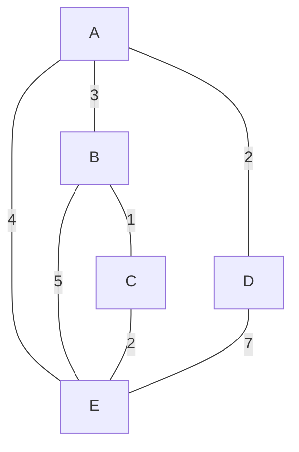
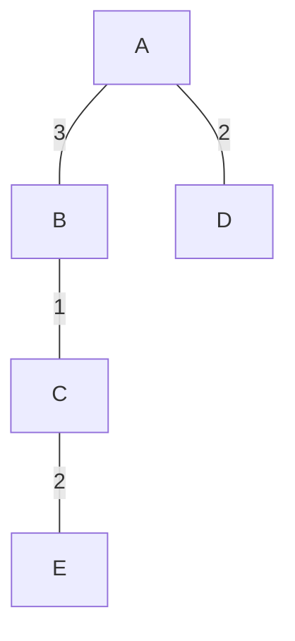

# Definición
Estos algoritmos resuelven rápidamente un problema, estos deben presentar un esquema de **subestructura óptima** -> una solución está compuesta por soluciones optimas, un caso es el ordenamiento
```java
1,2,3,4,5 //Es una secuencia ordenada
1,2    3,4,5 //Son dos secuencias ordenadas
```
Un ordenamiento tiene dentro de sí subsecuencias ordenadas.
## Ventajas
- Son rápidos
- Toman decisiones locales en lugar globales (sólo consideran el actual momento)
- Son relativamente fáciles de implementar
## Desventajas
- No garantizan una solución correcta u óptima
- Son difíciles de analizar en términos de su correctitud
- No indican si su solución es incorrecta

## Ejemplos
### Algoritmo de Kruskal


Es un algoritmo voraz para encontrar el árbol de peso mínimo, este algoritmo escoge las aristas de menor a mayor valor de peso siempre y cuando **no se generen ciclos** este es de los pocos algoritmos voraces que dan solución óptima

Este es el árbol de expansión mínima equivalente, porque escogimos primero las de 1 hasta las de mayor valor evitando ciclos

## Algoritmo de las dos pilas
Hay que tener presente ubicar las piedras en dos pilas de tal manera la diferencia sea la minima
- La estrategia consiste en ordenarlos de mayor a menor e ir tomando las piedras y ubicarlas en la pila que menor diferencia dé entre las dos.
- Funciona bastante bien en algunos casos
- Pero puede fallar dándonos una respuesta incorrecta

### Caso que funciona
5,8,27,13,14
1. Ordenamos 27,14,13,8,5
2. 27, --- //Diferencia es 27
3. 27,14 //Diferencia es 13
4. 27,14 13  //Diferencia es 0
5. 27 8 , 14 13 //Diferencia 8
6. 27 8,  14 13 5 //Diferencia 3
### Caso que no funciona
1. 9,9,8,6,4
2. 9, --- //9
3. 9, 9  // 0
4. 9 8, 9 // 8
5. 9 8, 9 6 // 2
6. 9 8, 9 6 4 //2
Pero este tiene una solución óptima que es 9 9 , 8 6 4 con diferencia 0
