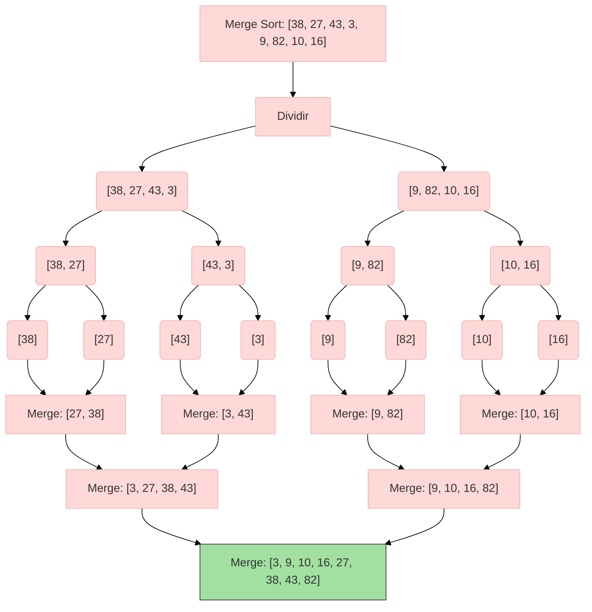

Es un algoritmo de divide y vencerás
1. Dividir hasta caso base, arreglo de tamaño 1 (está ordenado)
2. Conquistar bajo la idea de combinar dos arreglos ordenados, el costo es n y ahi está la ganancia
Este algoritmo opera bajo la idea de tener dos arreglos ordenados

## Ejemplo
Aquí tienes un diagrama **Mermaid** que muestra el proceso de **Merge Sort** para ordenar un arreglo de tamaño 8 (ejemplo con `[38, 27, 43, 3, 9, 82, 10, 16]`):

### **Explicación del diagrama:**
1. **Dividir (Split):**  
   - El arreglo original se divide recursivamente en mitades hasta obtener subarreglos de tamaño 1 (hojas del árbol).

2. **Merge (Combinar):**  
   - Los subarreglos se fusionan en orden ascendente:
     - `[38]` y `[27]` → `[27, 38]`  
     - `[43]` y `[3]` → `[3, 43]`  
     - Luego, `[27, 38]` y `[3, 43]` → `[3, 27, 38, 43]` (y así sucesivamente).

3. **Resultado final:**  
   - El último merge combina `[3, 27, 38, 43]` y `[9, 10, 16, 82]` para obtener el arreglo ordenado.

### **Características clave:**
- **Complejidad:** Siempre $O(n \log n)$ (estable en todos los casos).  
- **Espacio adicional:** Requiere memoria auxiliar para los subarreglos ($O(n)$).  

## Complejidad
Tenemos:
1. Se divide el problema en 2
2. Cada subproblema tiene tamaño n/2
3. Posteriormente combinar cuesta n

$$ T(n) = 2T(\frac{n}{2})+n$$

Al resolverla nos da $O(nlog(n))$ **método de árbol**