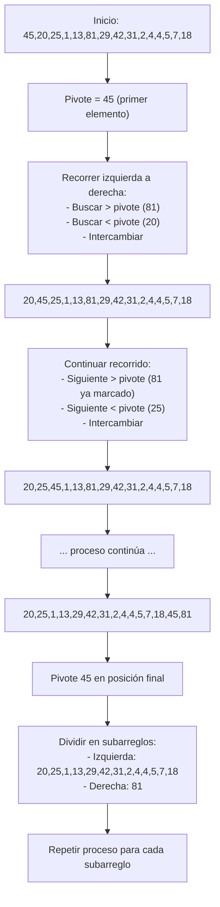
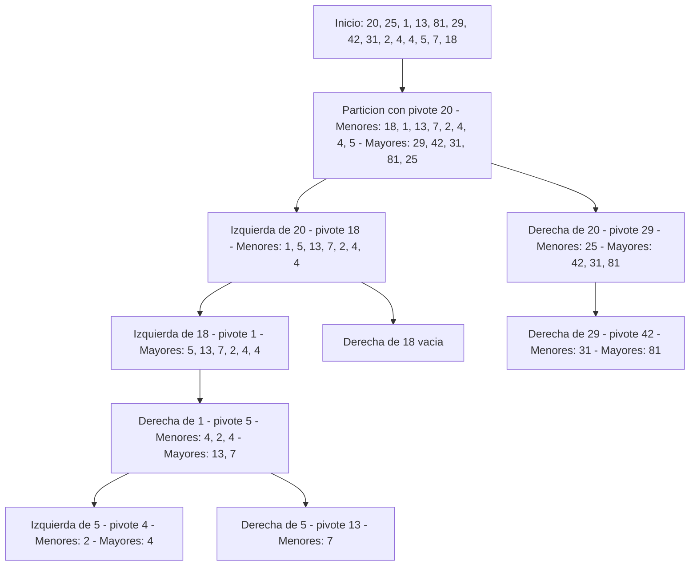

# Descripción
Es un algoritmo de divide y vencerás
- Se selecciona un pivote (puede ser el primer elemento, el ultimo, uno aleatorio, un promedio, etc)
- Se busca de izquierda (inicio) a derecha (final)
	- Un elemento que sea mayor que el pivote
	- Un elemento que sea menor que el pivote
	- Se intercambian
	- Se repite este proceso hasta que se llega al final de la división (indice final)
- Se intercambia el pivote con el último del arreglo de la izquierda
- Tener presente que cuando el arreglo tiene tamaño 1 es caso trivial (caso base) es decir está ordenado
**Importante:** Después de este proceso el pivote queda en su posición final (ordenado) a esto se le conoce como ordenamiento parcial (ganancia del algoritmo)

## Esquema particiones

## Ejemplo general

# Notas sobre complejidad

- El pivote debe ser cercano a la mediana (no es lo que promedio) para que queden dos arreglos de tamaño n/2, dando la misma complejidad del algoritmo merge sort O(nlog(n)) La mediana es el elemento que ordenando va en la mitad.
- El pero es caso es cuando nos quedan dos particiones
	- Una con n-1 elementos
	- Otra un elemento
	- $$T(n) = T(n-1) + O(n)$$
	- Resolver esto nos da $O(n^2)$