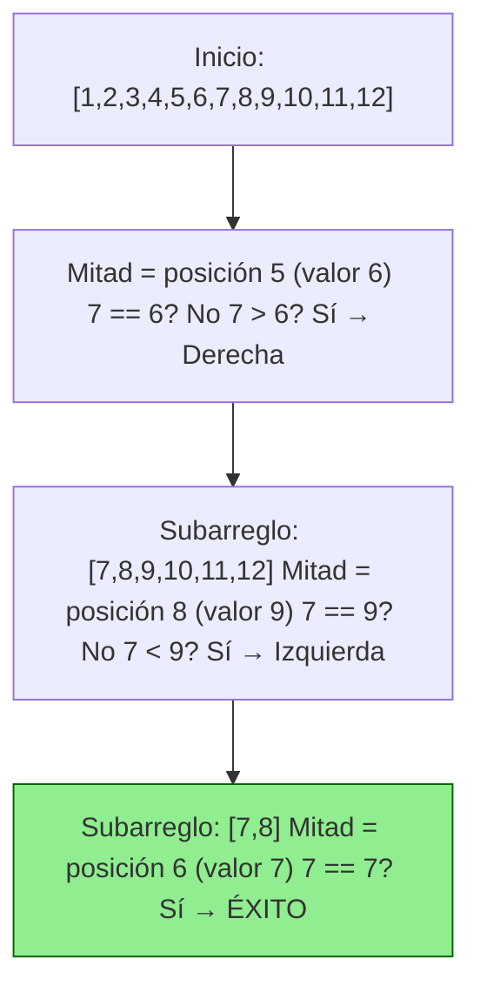
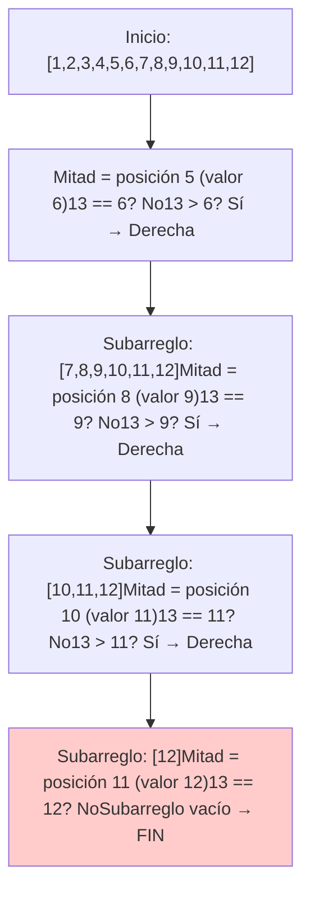

# Definición
Es encontrar un elemento en una estructura de datos
## Aplicaciones
- Bases de datos: Encontrar tuplas que cumplan un criterio SELECT * FROM .... WHERE
- Inteligencia artificial: dar una respuesta de acuerdo a la búsqueda (sistemas de recomendación => retorna recomendaciones, por ejemplo un computador que cumpla unos requerimientos)
- Compilación: Dar sentido a lo que el programador está escribiendo

# Búsqueda lineal
Busque el elemento empezando desde el inicio de la estructura
```java
int buscar(int[] arr, int val){
	for (int i = 0; i < arr.length; i++) {
		if (arr[i] == val) {
			return i;
		}
	}
	return -1;
}

```

**Ejemplo con el arreglo `[15, 7, 42, 9, 12]` buscando el valor `42`:**

### Paso a paso:
1. **Inicio:**  
   `i = 0`, `arr[0] = 15` → ¿15 == 42? **No** → sigue.  
2. **Iteración 1:**  
   `i = 1`, `arr[1] = 7` → ¿7 == 42? **No** → sigue.  
3. **Iteración 2:**  
   `i = 2`, `arr[2] = 42` → ¿42 == 42? **Sí** → retorna `2` (índice donde está 42).  

**Resultado:**  
```java
int[] arr = {15, 7, 42, 9, 12};
int pos = buscar(arr, 42); // Retorna 2
```

---

### Ejemplo con valor **no encontrado** (buscando `100`):
1. **Inicio:**  
   `i = 0`, `arr[0] = 15` → ¿15 == 100? **No** → sigue.  
2. **Iteración 1:**  
   `i = 1`, `arr[1] = 7` → ¿7 == 100? **No** → sigue.  
   ...  
3. **Iteración 4:**  
   `i = 4`, `arr[4] = 12` → ¿12 == 100? **No** → sigue.  
4. **Fin del arreglo:**  
   `i = 5` (fuera de rango, error si no se corrige `<=` por `<`).  

**Resultado:**  
```java
int pos = buscar(arr, 100); // Retorna -1 (no encontrado)
```

---


## Complejidad
- Mejor caso: Es el primero O(1)
- Peor caso: No está O(n) (debemos preguntar a todos)
- Caso promedio: Está en la mitad, que seria n/2 es O(n)

# Búsqueda binaria

- Trabaja sobre un arreglo ordenado
- Tomamos el elemento de la mitad y comparamos con el que buscamos, si el valor es menor, entonces buscamos a la izquierda, en caso contrario buscamos a la derecha
- Paulatinamente vamos haciendo esta división hasta que encontramos el valor o bien nos queda un arreglo de tamaño 1, el cual nos indica si está o no está

Aquí tienes dos diagramas Mermaid separados para búsqueda binaria, uno exitoso y otro no exitoso:

. Búsqueda Exitosa (valor `7` en `[1,2,3,4,5,6,7,8,9,10,11,12]`):


### 2. Búsqueda No Exitosa (valor `13` en `[1,2,3,4,5,6,7,8,9,10,11,12]`):


## Complejidad
Este algoritmo crea un solo subproblema de tamaño n/2, ¿porque? porque evalúa la mitad, es es mayor el valor escoge la mitad derecha, en caso contrario escoge la izquierda.

$$T(n) = T(\frac{n}{2})+O(1)$$

Al resolver por árbol nos da $O(log(n))$

