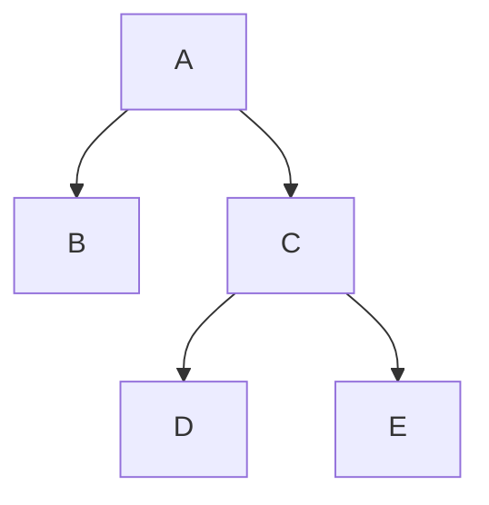
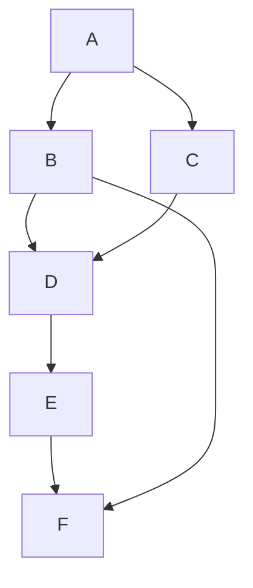

# Introducción
Permiten organizar información y permite acceder o modificar la información que contienen
- **Eficiencia**: Permitir un acceso rápido a los datos
- **Organización**: Ayuda a organizar los datos
- **Reutilización** y mantenimiento: Las estructuras de datos son fáciles de reutilizar y mantener
- **Resolución de problemas:** Son parte fundamental de los algoritmos
# Tipos
## Estructuras lineales
- Arreglos: Son estructuras de datos que son estáticas (no pueden cambiar de tamaño), el acceso es múy rápido

```java
int arreglo[] = new int[5];
arreglo[0]; // Primer posicion &arreglo + 0
arreglo[1]; // Segunda posicion &arreglo + 1
....
arreglo[0] = 5; //Cambiando un datos
```

- Pilas: LIFO ultimo en entrar, primero en salir
- Colas: FIFO primero en entrar, primero en salir
- Listas enlazadas: Estructura donde tenemos nodos interconectados de forma secuencial

## Estructuras de datos no lineales
- Arboles: Donde cada nodo tiene dos o mas hijos y no tiene ciclos: No se hay camino de vuelta a cualquiera de los nodos

- Grafos: Es un caso mas general de los arboles, dado que pueden tener ciclos o bucles

## Estructuras de datos especiales

- Tablas hash que relacionan clave, valor, es decir que cada elemento tiene asociado una llave que permite buscarlo
- Heaps o montículos que es una estructura de árbol que permite tener los elementos ordenados (el mayor siempre va estar de primero)