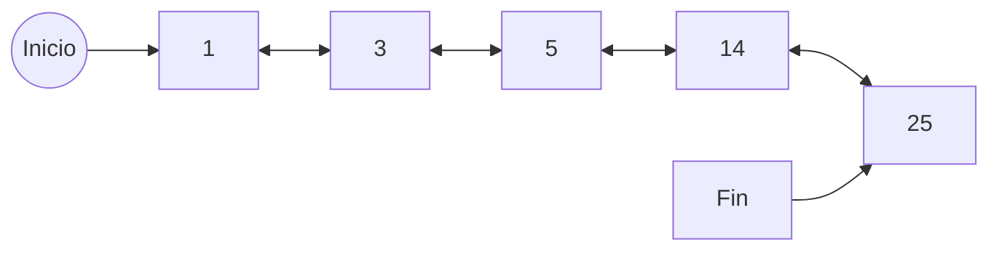

La lista doblemente enlazada tiene:
1. Un apuntador al inicio
2. Un apuntador al final
3. Los nodos contienen:
	1. Un apuntador al anterior
	2. Un apuntador al siguiente
	3. El valor

# Operaciones

- Busqueda:
	- Descendente: Parte de inicio y va tomando los siguientes hasta el ultimo
	- Ascendente: Parte de final y va tomando los anteriores hasta el primero
- Inserción
	- Si la lista esta vacia, tanto inicio como fin apuntan al elemento a insertar
	- Si está entre dos nodos y ninguno es nulo:
		- Siguiente del anterior va ser el nuevo
		- Anterior del actual va ser el nuevo
		- Anterior del nuevo va ser el anterior
		- Siguiente del nuevo va ser el actual
	- Si es el primero
		- Anterior del actual va ser el nuevo
		- El siguiente del nuevo va ser el actual
		- El puntero inicio apunta al nuevo
	- Si es el ultimo
		- Siguiente del anterior var ser el nuevo
		- El anterior del actual va ser el anterior
		- El puntero final va ser el nuevo
- Eliminación
	- Si es el único elemento entonces inicio y final apuntan a null
	- Si es el primer elemento
		- Anterior del siguiente del actual es null
		- Inicio apunta al siguiente del actual
	- Si es el ultimo elemento
		- Siguiente del anterior apunta a null
		- Fin apunta al anterior
	- Si está entre dos
		- Siguiente del anterior es el siguiente del actual
		- Anterior del siguiente del actual es el anterior
