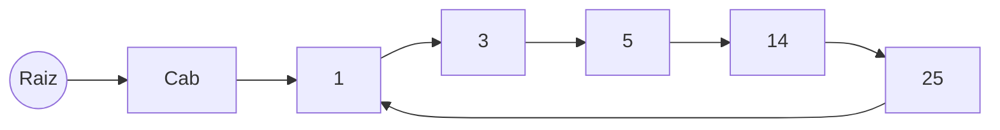

En esta lista enlazada simple el último elemento apunta al siguiente del primero. El primer elemento es un nodo vacío que apunta al primero de la lista enlazada.
- Al insertar el primer elemento, creamos dos nodos, la cabecera y el nodo a insertar. La cabecera es la raíz y a punta al nodo.
- Al insertar más elementos, siempre estamos entre dos nodos, anterior.sig = nuevo, nuevo.sig = actual
- Al eliminar tenemos dos caso
	- Tenemos sólo un nodo en la lista, eliminamos tanto la cabecera como el nodo
	- Tenemos que cambiar el siguiente del anterior al siguiente actual, para desconectar el actual, el recolector de basura de lenguajes como Java hará la gestión de memoria

