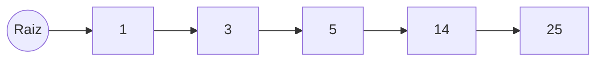

Una lista enlazada es un conjunto de nodos que tienen
- Valor (entero, string, objeto, etc)
- Uno o más punteros



Esta consiste en un elemento y un puntero para cada nodo, los cuales están interconectados de forma secuencial

# Implementación

Nodo, se encarga de representar los nodos

```java
//Archivo Nodo.java
public class Nodo {

  int dato;
  Nodo sig;

  Nodo(int dato) {
    this.dato = dato;
    this.sig = null;
  }
}
```

```java
//Clase ListaEnlazada.java
public class ListaEnlazada {

  private Nodo raiz;

  ListaEnlazada() {
    this.raiz = null;
  }

  void recorrido(){
    Nodo actual = raiz;

    while (actual!=null){
      System.out.println(actual.dato + "-->");
      actual = actual.sig;
    }
  }

  void insertar(int dato) {
    Nodo actual = raiz;
    Nodo anterior = null;
    Nodo nuevo = new Nodo(dato);
    //Si la lista esta vacia es el primer elemento
    if (actual == null) {
      this.raiz = nuevo;
    }
    else {
      while (actual != null && actual.dato < dato) {
        anterior = actual;
        actual = actual.sig;
      }

      //Si el actual es vacio es el ultimo elemento
      if (actual == null){
        anterior.sig = nuevo;
      }
      else{
        //Este caso es cuando se inserta de primero y este existe
        if (anterior == null) {
          nuevo.sig = actual;
          this.raiz = nuevo;
        }
        else{
          anterior.sig = nuevo;
          nuevo.sig = actual;
        }
      }

    }
  }
}
```

```java
//Clase Main
public class Main {
  public static void main(String[] args) {
    ListaEnlazada objLstEnlazada = new ListaEnlazada();
    objLstEnlazada.insertar(12);
    objLstEnlazada.insertar(14);
    objLstEnlazada.insertar(4);
    objLstEnlazada.insertar(24);
    objLstEnlazada.insertar(8);
    objLstEnlazada.insertar(1);
    objLstEnlazada.insertar(9);
    objLstEnlazada.insertar(12);
    objLstEnlazada.insertar(16);
    objLstEnlazada.insertar(94);
    objLstEnlazada.insertar(90);
    objLstEnlazada.insertar(10);
    objLstEnlazada.insertar(7);
    objLstEnlazada.recorrido();
  }
}
```


