Los objetos simples son una implementación basada en listas de partes, cada parte representa una clase en una cadena herencia, por ejemplo:

```scheme
class c1 extends object
	field x
	field y
	method initialize() 1
	
class c2 extends c1
	field z
	field w
	method initialize() 1
	
let
	o1 = new c1()
	o2 = new c2()
	in ??
```

Cuando es o1 se muestra

```scheme
(#(struct:a-part c1 #(0 0)))
```

Una parte contiene el nombre de la clase, y los valores de los campos

Cuando hago c2 observe que

```scheme
(#(struct:a-part c2 #(0 0)) #(struct:a-part c1 #(0 0)))

```
El primer elemento es la clase c2 y el segundo la clase c1, se asument object como la lista vacia.

```scheme
class c1 extends object
	field x
	field y
	method initialize() 1
	
class c2 extends c1
	field z
	field w
	method initialize() 1
	
class c3 extends c2
	field a
	field b
	method initialize() 1
let
	o3 = new c3()
	in o3
```

En este caso vemos

```scheme
(#(struct:a-part c3 #(0 0)) #(struct:a-part c2 #(0 0)) #(struct:a-part c1 #(0 0)))
```

Entonces nos va construir lo siguiente

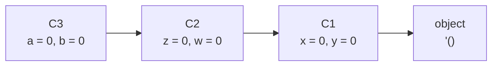

En este caso el primer elemento siempre va a ser la clase menor jerarquia y la lista vacia va a representar a object

Esta implementación es utiliza por C++ para representar los objetos.

```scheme
class p1 extends object
	field a
	field b
	method initialize(x,y)
		begin
			set a = x;
			set b = y
		end
	
	method sum(x)
		begin
			set a = +(a,1);
			+(a,b,x, send self m1())
		end
	method m1() 1

class p2 extends p1
	field c
	field d
	field e
	method initialize(x,y,z)
		begin
			super initialize(x,y);
			set c = +(x,1);
			set d = +(y,2);
			set e = z
		end
		
	method sum(s)
		+(c,d,e, send self m1()) 
	
class p3 extends p2
	field f
	field g
	method initialize(u)
		begin
			set f = u;
			set g = +(u,1);
			super initialize(u,+(u,1),+(u,2))
	end
	method sum(a)
		+(a, super sum(+(a,2)))
		
	method m1() 10

let
	o1 = new p1(2,3)
	o2 = new p2(3,4,5)
	o3 = new p3(6)
	in
		list(
			send o1 sum(2),
			send o2 sum(3),
			send o3 sum(4)
		)
	
```

Esto da
```scheme
(9 16 39)
```

Vamos a dibujar los ambientes de los llamados de los objetos, comenzamos con o1 en o1 = new p1(2,3)


```scheme
(#(struct:a-part p1 #(2 3)))
```

Vamos con o2 = new p2(3,4,5)

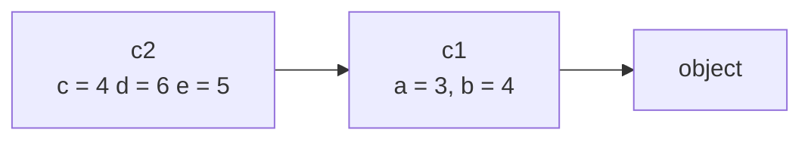
```scheme
(#(struct:a-part p2 #(4 6 5)) #(struct:a-part p1 #(3 4)))
```
Vamos con o3 = new p3(6)  

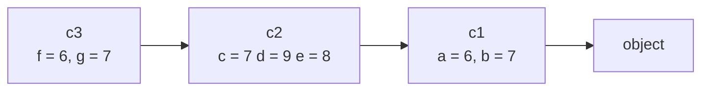

```scheme
(#(struct:a-part p3 #(6 7)) #(struct:a-part p2 #(7 9 8)) #(struct:a-part p1 #(6 7))
```

# Ejecución de metodos

Cuando se invoca un método se tiene un diagrama de clases independiente (propiedad en encapsulación), en este se tiene cada llamado es independiente, llamar dos métodos no se afectan entre a excepción si uno de ellos ha modificado los campos del objeto

## Llamado send o1 sum(2)

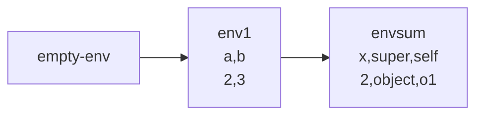

Sobre el ambiente envsum vamos a ejecutar

```scheme
		begin
			set a = +(a,1);
			+(a,b,x, send self m1())
		end
```
al hacer set x = +(x,1) cambia la representación del objeto
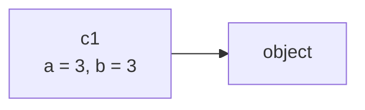

Cambia el ambiente env1


Cuando ejecutamos +(a,b,x, send self m1())

+(3,3,2, send o1 m1())

 send o1 m1()

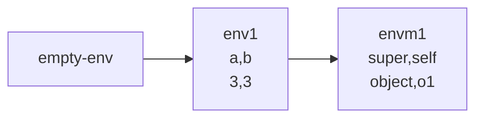
+(3,3,2,1) = 9

## Llamado send o2 sum(3),

Cuando invocamos este caso

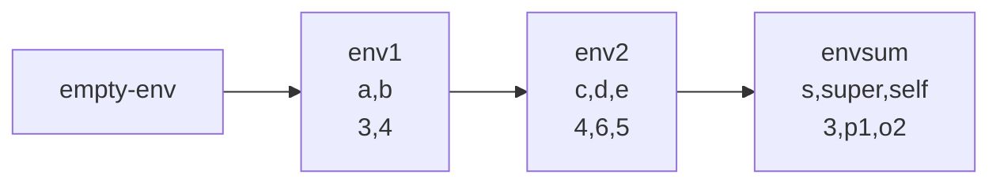
Ejecutamos en el ambiente envsum

```scheme
+(c,d,e, send self m1()) 
+(4,6,5, send o2 m1())
```

### send o2 m1()


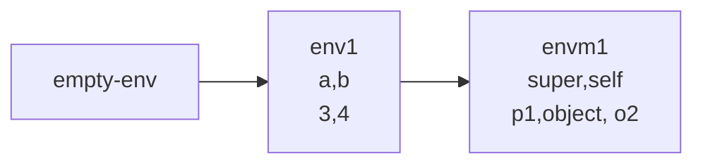

Aqui evaluo en el cuerpo la expresión 1

```scheme
+(4,6,5, 1)
16
```

## send o3 sum(4)

Para este caso caso tenemos que el diagrama de ambientes para sum de o3 es

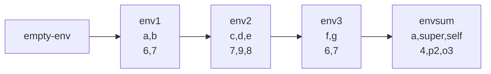

Vamos a ejecutar el cuerpo

```scheme
+(a, super sum(+(a,2)))
+(4, super sum(6))
```

## super sum(6)

Este se encuentra en p2

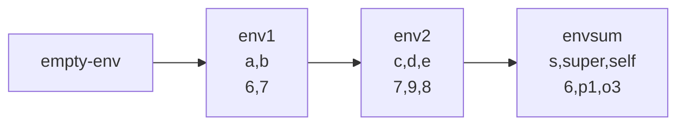
Sobre el ambiente envsum

```scheme
+(c,d,e, send self m1())
+(7,9,8, send o3 m1()) 
```

## send o3 m1()

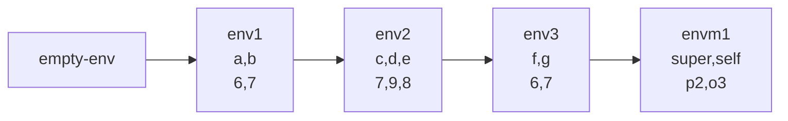

Bajo el ambiente envm1 voy a ejecutar

```scheme
10
```

Por lo que al evaluar

```
+(7,9,8, 10) 
34
+(4, 34)
38
```
