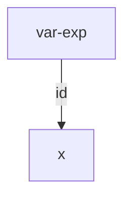
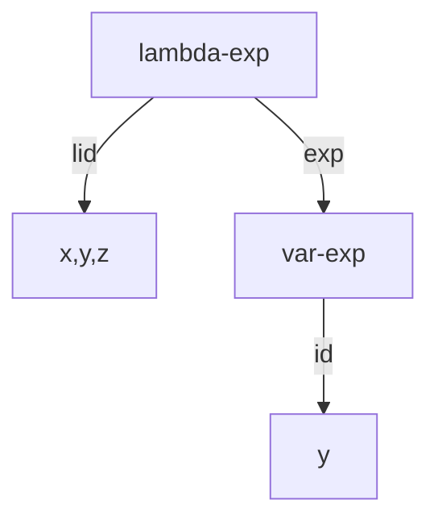
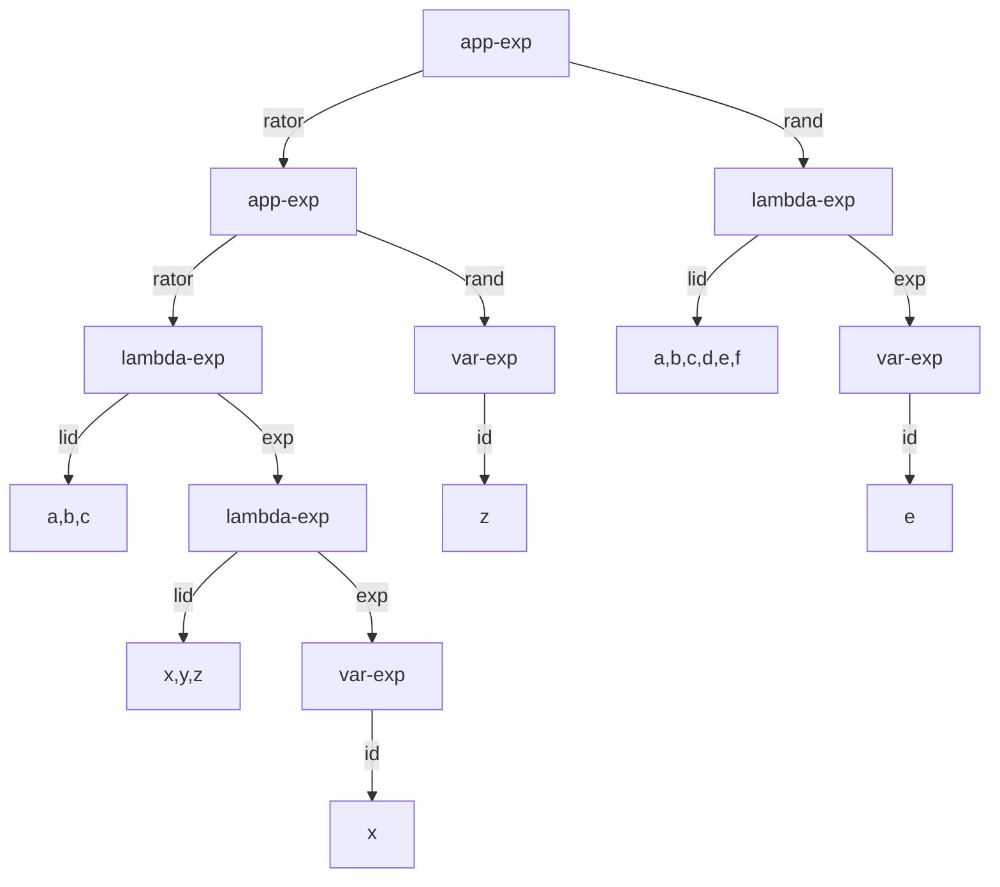
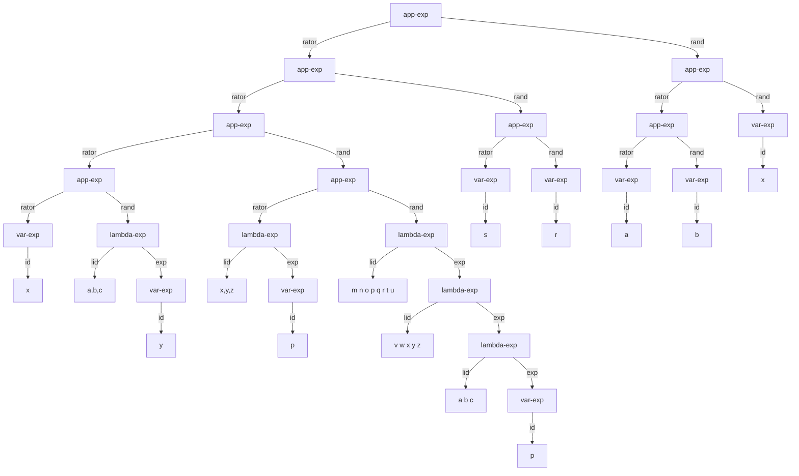

# Arboles de sintaxis abtracta

En este momento tenemos limitaciones con respecto a la presentación, vimos dos representaciones

1. Basada en listas
2. Basada en procedimientos

Sin embargo estamos limitados por el lenguaje de programación (Racket), vamos a utilizar los arboles de sintaxis abstracta

# ¿Que son?

Son represent
aciones desde la gramatica, donde relaciona la estructura del tipo de dato con respecto a su especificación

```
<lc-exp> ::= <identifier>
			var-exp(id)
		 ::= "lambda" "(" <identifier>* ")" <lc-exp>
		  lambda-exp(lid, exp)
		 ::= "(" <lc-exp> <lc-exp> ")"
		  app-exp(rator, rand)
```

Usando los constructores var-exp, lambda-exp y app-exp

```lisp
(var-exp 'x)
```

```lisp
(lambda-exp (list x y z) (var-exp 'y))
```

```lisp
(app-exp
	(app-exp 
		(lambda-exp  '(a b c) (lambda '(x y z) (var-exp 'x)))
		(var-exp 'z)
	)
	(lambda-exp '(a b c d e f) (var-exp 'e))
)
```


Esta representación permite

1. Saber si el código fuente está bien escrito
2. Representar los datos de una forma independiente de los lenguajes de programación


```lisp
(app-exp
	(app-exp
		(app-exp
			(app-exp
				(var-exp 'x)
				(lambda-exp '(a b c) 
					(var-exp 'y)
				)
			)
			(app-exp
				(lambda '(x y z) (var-exp 'p))
				(lambda '(m n o p q r t u)
					(lambda '(v w x y z)
						(lambda
							 '(a b c)
							 (var-exp 'p)
						)
					)
				)
			)
		)
		(app-exp
			(var-exp 's)
			(var-exp 'r)
		)
	)
	(app-exp
		(app-exp
			(var-exp 'a)
			(var-exp 'b)
		)
		(var-exp 'x)
	)
)
```


