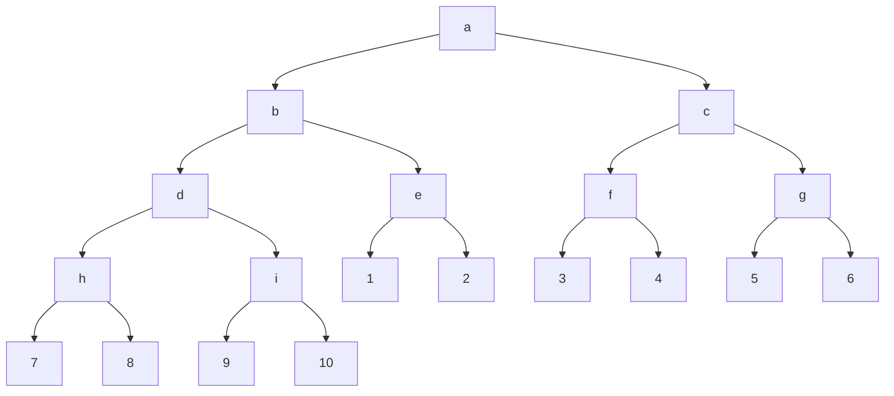

# Definiciones

1. La idea es seperar la implementación de la programación, a través de la interfaz proveer métodos para el uso de los TAD
2. Para esto vamos a utilizar una metodologia que consiste en implementar los TAD de esta forma:
	1. Realizar los procedimientos constructores: Instanciar un tipo de dato perteneciente al TAD

	
	dasdasd2. Realizar los procedimientos observadores: 
		1. Predicados: Es una función que permite saber si un dato pertenece a una variante del TAD
		2. Extractores: Extraen las partes que tiene un TAD

# Ejemplo



Funcion para hacer recorridos:

1. Recorrido preorden: R-I-D  a b d h 7 8 i 9 10 e 1 2 c f 3 4 g 5 6
2. Recorrido inorden: I-R-D 7 h 8 d 9 i 10 b 1 e 2 a 3 f 4 c 5 g 6
3. Recorrido posorden: I-D-R 7 8 h 9 10 i d 1 2 e b 3 4 f 5 6 g c a

## Implementación basada en listas

```lisp
#lang eopl
#|
<tree> ::= <int>
            leaf(datum)
       ::= <symbol> <tree> <tree>
            node(key, left, right)

|#

;; COnstructores

(define leaf
  (lambda (datum)
    (list 'leaf datum)))

(define node
  (lambda (key left right)
    (list 'node key left right)
    )
  )
;; Observadores

;; Predicados
(define leaf?
  (lambda (tree)
    (equal? (car tree) 'leaf)
    )
  )

(define node?
  (lambda (tree)
    (equal? (car tree) 'node)
    )
  )

;; Extractores
(define leaf->datum
  (lambda (tree)
    (cadr tree)
    )
  )


(define node->key
  (lambda (tree)
    (cadr tree)
    )
  )

(define node->left
  (lambda (tree)
    (caddr tree)
    )
  )

(define node->right
  (lambda (tree)
    (cadddr tree)
    )
  )

;; Area del programador

(define treeA
  (node 'a
        (node 'b
              (node 'd
                   (node 'h (leaf 7) (leaf 8))
                   (node 'i (leaf 9) (leaf 10))
               )
              (node 'e (leaf 1) (leaf 2))
        )
        (node 'c
              (node 'f (leaf 3) (leaf 4) )
              (node 'g (leaf 5) (leaf 6) )
              )
        )
  )

;; preorder: tree -> lista
(define preorder
  (lambda (tree)
    (cond
      [(leaf? tree) (list (leaf->datum tree))]
      [(node? tree)
       (append
        (list (node->key tree))
        (preorder (node->left tree))
        (preorder (node->right tree))
        )
       ]
      [else (eopl:error "No es un árbol")]
      ))
  )

(display (preorder treeA))
(display "\n")

(define inorder
  (lambda (tree)
    (cond
      [(leaf? tree) (list (leaf->datum tree))]
      [(node? tree)
       (append
        (inorder (node->left tree))
        (list (node->key tree))
        (inorder (node->right tree))
        )
       ]
      [else (eopl:error "No es un árbol")]
      ))
  )

(display (inorder treeA))
(display "\n")


(define posorder
  (lambda (tree)
    (cond
      [(leaf? tree) (list (leaf->datum tree))]
      [(node? tree)
       (append
        (posorder (node->left tree))
        (posorder (node->right tree))
        (list (node->key tree))

        )
       ]
      [else (eopl:error "No es un árbol")]
      ))
  )


(display (posorder treeA))
(display "\n")
```
## Implementación basada en procedimientos
```lisp
#lang eopl
#|
<tree> ::= <int>
            leaf(datum)
       ::= <symbol> <tree> <tree>
            node(key, left, right)

|#

;; COnstructores

(define leaf
  (lambda (datum)
    (lambda (s)
      (cond
        [(= s 0) 'leaf]
        [(= s 1) datum]
        [else (eopl:error "Error en leaf")]
        )
      )
    )
  )

(define node
  (lambda (key left right)
    (lambda (s)
      (cond
        [(= s 0) 'node]
        [(= s 1) key]
        [(= s 2) left]
        [(= s 3) right]
        [else (eopl:error "Error en node")]
        )
      )
    )
  )

;; Observadores

;; Predicados
(define leaf?
  (lambda (tree)
    (equal? (tree 0) 'leaf)
    )
  )

(define node?
  (lambda (tree)
    (equal? (tree 0) 'node)
    )
  )

;; Extractores
(define leaf->datum
  (lambda (tree)
    (tree 1)
    )
  )


(define node->key
  (lambda (tree)
    (tree 1)
    )
  )

(define node->left
  (lambda (tree)
    (tree 2)
    )
  )

(define node->right
  (lambda (tree)
    (tree 3)
    )
  )

;; Area del programador


(define treeA
  (node 'a
        (node 'b
              (node 'd
                   (node 'h (leaf 7) (leaf 8))
                   (node 'i (leaf 9) (leaf 10))
               )
              (node 'e (leaf 1) (leaf 2))
        )
        (node 'c
              (node 'f (leaf 3) (leaf 4) )
              (node 'g (leaf 5) (leaf 6) )
              )
        )
  )

;; preorder: tree -> lista
(define preorder
  (lambda (tree)
    (cond
      [(leaf? tree) (list (leaf->datum tree))]
      [(node? tree)
       (append
        (list (node->key tree))
        (preorder (node->left tree))
        (preorder (node->right tree))
        )
       ]
      [else (eopl:error "No es un árbol")]
      ))
  )

(display (preorder treeA))
(display "\n")

(define inorder
  (lambda (tree)
    (cond
      [(leaf? tree) (list (leaf->datum tree))]
      [(node? tree)
       (append
        (inorder (node->left tree))
        (list (node->key tree))
        (inorder (node->right tree))
        )
       ]
      [else (eopl:error "No es un árbol")]
      ))
  )

(display (inorder treeA))
(display "\n")


(define posorder
  (lambda (tree)
    (cond
      [(leaf? tree) (list (leaf->datum tree))]
      [(node? tree)
       (append
        (posorder (node->left tree))
        (posorder (node->right tree))
        (list (node->key tree))

        )
       ]
      [else (eopl:error "No es un árbol")]
      ))
  )


(display (posorder treeA))
(display "\n")

```

# Conclusión 

Para diseñar tipos abstractos de datos (TAD):

1. Desarrollar los constructores para cada variante del TAD (leaf y node)
2. Desarrollar los observadores
	1. Predicados  leaf? node? para saber a que tipo de dato pertenece un TAD
	2. Extractores leaf->datum, node->key, node->left y node->right para extraer las partes del tipo de dato

