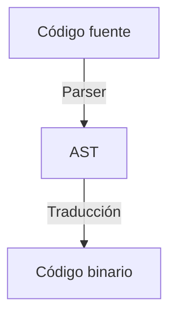
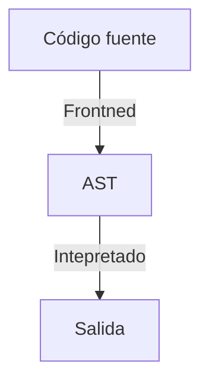
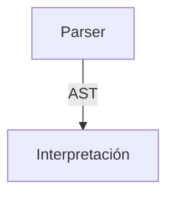

# Compilados

Son aquellos que transforman el código en código máquina, directamente se ejecuta sobre la CPU. O bien genera un código binario que puede ejecutar un programa (Maquina Virtual del Lenguaje)

Este codigo usualmente pasa por varias de etapas de optimización para buscar ejecutar el código lo más rapido posible.

En el proceso de traducción el AST es transformado a código binario para el CPU o para un programa que lo ejecute (Máquina Virtual de Java)

## Ventajas y desventajas de los lenguajes compilados

Al no tener intermediaros con la CPU se ejecuta más rapidamente.

La sintaxis suele ser más cerca al lenguaje máquina (C++)

# Interpretados

Un lenguaje interpretado es aquel cuyas instrucciones son leidas por otro programa llamado el interprete.

¿Alguna vez notaste que cuando habia un error de sintaxis en Java no ejecutaba nada y en Python ejecutaba hasta el error?

El interprete lee las instrucciones linea por linea, esto quiere decir que el código fuente es traducido por otro programa que le envia las instrucciones a la CPU, existe un intermediario.

El proceso de AST es realizado por un componente que se llama Frontend

El parser puede enviar el AST directamente al interprete, o bien generar código en un lenguaje intermedio el cual es interpretado. Permite realizar optimizaciones.

# Resumen

| **Aspecto**               | **Lenguajes Compilados**                                        | **Lenguajes Interpretados**                                                          |
| ------------------------- | --------------------------------------------------------------- | ------------------------------------------------------------------------------------ |
| **Ejecución**             | Se ejecuta directamente en la CPU o en una máquina virtual      | Requiere un intérprete que lee y ejecuta línea por línea                             |
| **Velocidad**             | Mayor rendimiento (sin intermediarios)                          | Menor rendimiento (hay overhead del intérprete)                                      |
| **Detección de errores**  | Errores detectados en tiempo de compilación (antes de ejecutar) | Errores detectados en tiempo de ejecución (hasta la línea fallida)                   |
| **Portabilidad**          | Depende de la arquitectura (requiere recompilación)             | Más portables (el mismo código fuente corre en múltiples plataformas con intérprete) |
| **Optimización**          | Optimizaciones agresivas en tiempo de compilación               | Optimizaciones limitadas (en tiempo de ejecución o con JIT)                          |
| **Flexibilidad**          | Menos flexible (cambios requieren recompilación)                | Más flexible (cambios en código fuente effectivos inmediatamente)                    |
| **Ejemplos típicos**      | C, C++, Rust, Go                                                | Python, JavaScript, Ruby, PHP                                                        |
| **Proceso de traducción** | Código fuente → AST → Código binario                            | Código fuente → AST → Interpretación línea por línea                                 |
| **Uso de recursos**       | Menor uso de memoria en ejecución (estático)                    | Mayor uso de memoria (por el intérprete y entorno runtime)                           |
| **Depuración**            | Más difícil (depuración a nivel de binario)                     | Más fácil (depuración a nivel de código fuente)                                      |

### Notas clave:
- Los lenguajes compilados generan código binario optimizado para la CPU o una máquina virtual (ej: JVM para Java).
- Los lenguajes interpretados dependen de un intérprete que traduce y ejecuta instrucciones en tiempo real.
- Muchos lenguajes modernos usan enfoques híbridos (ej: Java compila a bytecode que luego es interpretado/JIT-compilado).
- La elección entre compilado e interpretado depende del equilibrio entre rendimiento, portabilidad y flexibilidad.

