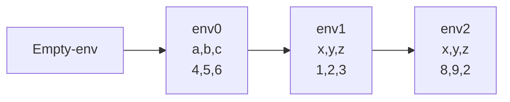
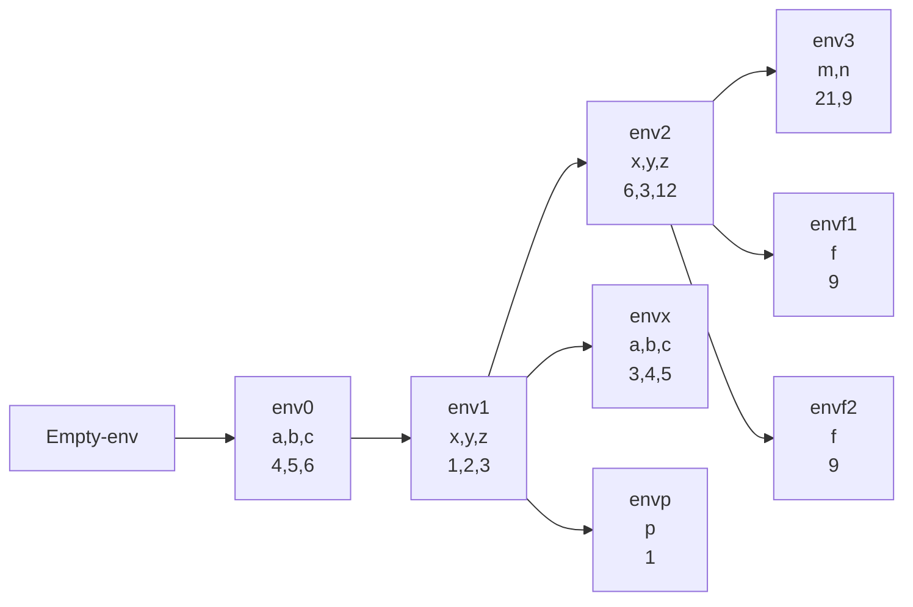

Las ligaduras locales permiten introducir nuevas ligaduras, teniendo en su alcance léxico, se entiende que las ligaduras del ambiente inicial tiene alcance global, sin embargo, pueden ser ocultadas o shadowing con ligaduras locales

```scheme
let
	x = 8
	y = 9
	z = +(x,1)
	in
		+(x,y,z)
```
Tener en cuenta que el let tiene dos areas

1. Area de declaracion identifier = expression, aqui se toma el ambiente anterior
2. El area del let (despúes del in) a partir de este punto empiezan a existir las ligaduras declaradas

# Concepto

Al crear una ligadura local, se debe extender el ambiente actual incluyendo las nuevas ligaduras

Para el ejemplo que tenemos



# Modificación a gramática
```scheme
    (expression ("let" (arbno identifier "=" expression)
                       "in" expression) let-exp)
```

# Modificación a eval-expression

```scheme
      (let-exp (lid lexpr expr)
               (let
                   (
                    (vexpr (map (lambda (x) (eval-expression x env)) lexpr))
                    )
                 (eval-expression expr
                                     (extend-env lid vexpr env))
                 )
               )
```

# Ejemplos

Suponiendo el ambiente inicial (extend-env '(x,y,z) '(1,2,3) (extend-env '(a,b,c) '(4,5,6) (empty-env)))
# Ejemplo 1

```scheme
let
	x = let a = 3 b = 4 c = 5 in +(x,y,z)
	y = +(y,x)
	z = *(z, let p = x in +(p,z))
	in
		let
			m = let f = let f = +(x,y) in f
				 in +(f,z)
		    n = +(a,b)
		    in
			    +(x,y,z,m,n)
```
Da 51




