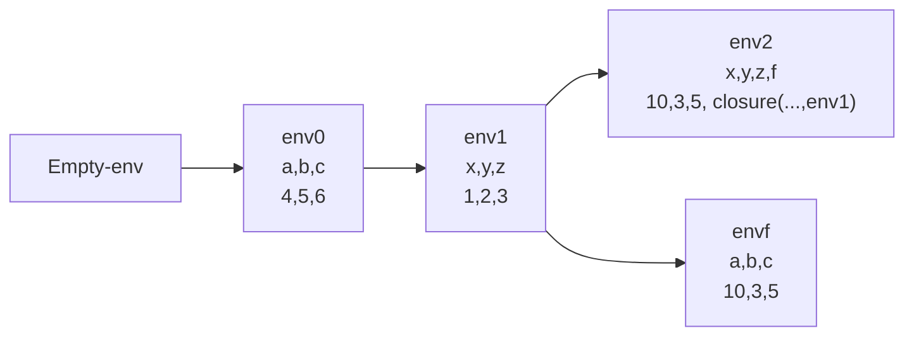

 Los procedimientos son parte elemental de los lenguajes de programación, permiten ejecutar código que se repite.

Para implementar lo procedimientos vamos a incluir en la gramática lo siguiente:

```bnc
<expression> ::= "proc" "(" (<identifier>* (,)) <expression> (proc-exp)
			::= "(" <expression> <expression>* ")" (app-exp)
```

De acuerdo a esto vamos a poder ejecutar cosas como

```scheme
let
	f = proc(x,y) +(x,y)
	in
	 +((f 1 2), (f 1 3)) ; 7
```

Esto permite ejecutar procedimientos los cuales permiten reutilizar código de tal forma enviamos los parámetros, sin embargo tenemos un problema

```scheme
let
	f = proc(a,b) +(a,b,x)
	in
		let
			y = (f 1 2) ; +(1,2,1) = 4
			x = 12
			in
				(f 1 2) ; (1,2,12) = 15
```

Para resolver esto introducimos el concepto de la **clausura** o **procVal**

Esto permite representar un procedimiento como un valor, la clausura contiene:

1. Los identificadores del procedimiento
2. El cuerpo del procedimiento
3. El ambiente **donde fue creado** para garantizar consistencia

```scheme
(define-datatype procVal procVal
	(closure
		(lid (list-of symbol?))
		(exp expression?)
		(old-env environment?)
		)
	)
)
```
Esto hace que nuestro lenguaje cambie un poco

1. **Valores denotados** Numeros + Booleanos + Procval
2. **Valores expresados** Numeros + Booleanos + Procval
```scheme
; Closure
; Representación de los procedimientos
(define-datatype procVal procVal?
  (closure
   (lid (list-of symbol?))
   (exp expression?)
   (old-env enviroment?)
   ))
```
# Modificaciones a la gramática

```scheme
    (expression ("proc" "(" (separated-list identifier ",") ")" expression) proc-exp)
    (expression ("(" expression (arbno expression) ")") app-exp)
```

# Modificaciones a eval-expression

```scheme
      (proc-exp (lid exp)
                (closure lid exp env))
      (app-exp (rator rands)
               (let
                   (
                    (procv (eval-expression rator env))
                    (vrands (map (lambda (x) (eval-expression x env)) rands))
                    )
                 (if
                  (and
                   (procVal? procv)
                   (= (length (procVal->lid procv))
                      (length vrands))
                   )
                  (cases procVal procv
                    (closure
                     (lid exp old-env)
                     (eval-expression exp
                                      (extend-env lid vrands old-env))))
                  (eopl:error "Not a procedure or incorrect of number of args"))
                 )
               )
```

# Ejemplo

Suponiendo el ambiente del interpretador

```scheme
let
	x = 10
	y = +(x,y)
	z = +(z,y)
	f = proc(a,b,c) +(a,*(b,c))
	in
		(f x y z)
```
Esto da 25
