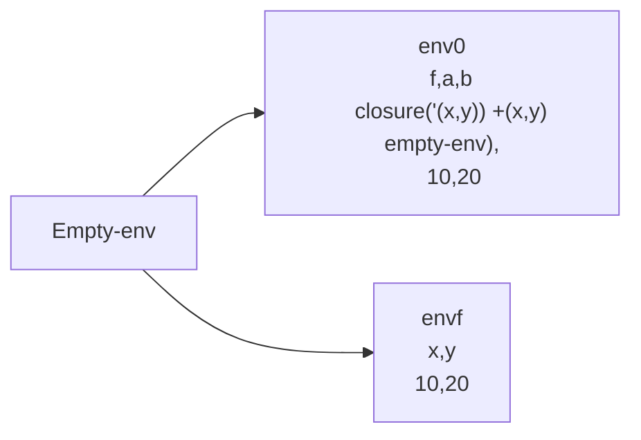
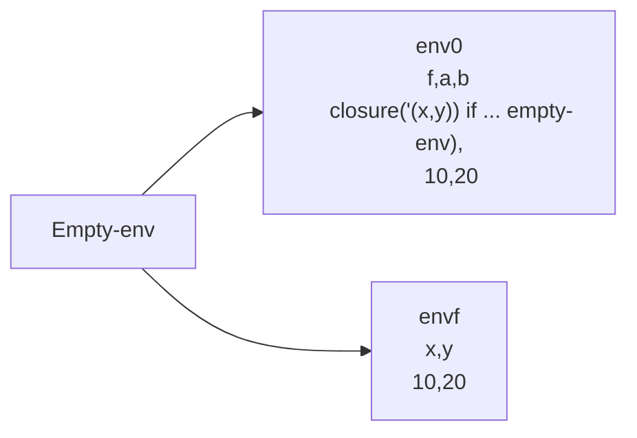

# Preambulo

Los procedimientos actualmente no se pueden conocer a sí mismos, dado que almacena el ambiente donde fueron creados, es el ambiente anterior al ambiente se definieron

```scheme
let
	f = proc(x,y) +(x,y)
	a = 10
	b = 20
	in (f 10 20)
```



```scheme
let
	f = if >(x,0) then (f -(x,1) y) else y
	a = 10
	b = 20
	in (f 10 20)
```



El cuerpo de f se evalua en env
```scheme
if >(x,0) then (f -(x,1) y) else y
if >(10,0) then (f -(x,1) y) else y
if true then (f -(x,1) y) else y
(f -(x,1) y)

```
Al intentar buscar $f$ no lo va encontrar y por ende va fallar.


# Objetivos

1. Entender como se implementan los procedimientos recursivos
2. Entender el alcance léxico y la forma de trabajar los ambientes recursivos en un lenguaje de programación

# Temas
1. [Implementación de procedimientos recursivos I](Implementación%20de%20procedimientos%20recursivos%20I.md)
2. [Implementación de procedimientos recursivos II](Implementación%20de%20procedimientos%20recursivos%20II.md)
3. [Evaluación procedimiento recursivos](Evaluación%20procedimiento%20recursivos.md)
4. [Ejercicio](Ejercicio.md)
5. [Resumen](Resumen.md)


# Intreprete

```scheme
#lang eopl  ; Lenguaje Essentials of Programming Languages

; Definición de la gramática en comentario (BNF extendido)
#|
<expression> ::= <identifier>
                 var-exp(id)
             ::= <number>
                 lit-exp(dat)
             ::= "true"
                 true-exp()
             ::= "false"
                 false-exp()
             ::= <primitive> "(" <expression>* (,) ")"
                 prim-exp(prim, rands)
            "if" <expresion> "then" <expresion> "else" <expresion>      
<primitive>
            if-exp(cond, true-exp, false-exp)
            ::= "+" plus-prim()
            ::= "-" sub-prim()
            ::= "*" times-prim()
            ::= "/" div-prim()
            ::= "and" and-prim()
            ::= "or" or-prim()
            ::= ">" more-prim()
            ::= ">=" moreeq-prim()
            ::= "<" less-prim()
            ::= "<=" lesseq-prim()
|#

; Especificación léxica: define tokens y patrones regex
(define lexical
  '(
    (comment ("%" (arbno (not #\newline))) skip)  ; Comentarios: % hasta newline (se ignoran)
    (whitespace (whitespace) skip)                ; Espacios en blanco (se ignoran)
    (number (digit (arbno digit)) number)         ; Números positivos: dígitos
    (number ("-" digit (arbno digit)) number)     ; Números negativos: - seguido de dígitos
    (identifier (letter (arbno (or letter digit))) symbol) ; Identificadores: letra seguida de letras/dígitos
    ))

; Gramática para el parser (producciones y constructores del AST)
(define grammar
  '(
    (program (expression) a-program)              ; Programa: una expresión
    (expression (identifier) var-exp)             ; Expresión: variable
    (expression (number) lit-exp)                 ; Expresión: literal numérico
    (expression ("true") true-exp)                ; Expresión: booleano true
    (expression ("false") false-exp)              ; Expresión: booleano false
    (expression (primitive "(" (separated-list expression ",") ")") prim-exp) ; Expresión primitiva con argumentos
    (expression ("if" expression "then" expression "else" expression) if-exp)
    (expression ("let" (arbno identifier "=" expression)
                       "in" expression) let-exp)
    (expression ("proc" "(" (separated-list identifier ",") ")" expression) proc-exp)
    (expression ("letrec" (arbno
                           identifier "(" (separated-list identifier ",") ")"
                           "=" expression)
                          "in"
                          expression) letrec-exp)
    (expression ("(" expression (arbno expression) ")") app-exp)
    (primitive ("+") add-prim)                    ; Primitiva: suma
    (primitive ("-") sub-prim)                    ; Primitiva: resta
    (primitive ("*") prod-prim)                   ; Primitiva: multiplicación
    (primitive ("/") div-prim)                    ; Primitiva: división
    (primitive ("and") and-prim)                  ; Primitiva: and lógico
    (primitive ("or") or-prim)                    ; Primitiva: or lógico
    (primitive ("<") less-prim)                   ; Primitiva: menor que
    (primitive ("<=") lesseq-prim)                ; Primitiva: menor o igual
    (primitive (">") more-prim)                   ; Primitiva: mayor que
    (primitive (">=") moreeq-prim)                ; Primitiva: mayor o igual
    (primitive ("==") eq-prim)                    ; Primitiva: igualdad
    (primitive ("!=") neq-prim)                   ; Primitiva: desigualdad
    )
  )

;; Generar datatypes automáticamente a partir de lexical/grammar
(sllgen:make-define-datatypes lexical grammar)

; Scanner: convierte string en lista de tokens
; scanner -> string -> lista de tokens
(define scanner
  (lambda (program)
    ((sllgen:make-string-scanner lexical grammar) program)))

; Parser: convierte string en AST usando la gramática
; parser: string -> ast
(define parser
  (lambda (program)
    ((sllgen:make-string-parser lexical grammar) program)))

; Definición del entorno (environment) como estructura de datos
(define-datatype environment environment?
  (empty-env)  ; Entorno vacío
  (extend-env  ; Extender entorno con nuevos bindings
   (lid (list-of symbol?))     ; Lista de identificadores
   (lval (list-of value?))     ; Lista de valores
   (old-env environment?)); Entorno anterior
  (extend-recursively-env
   (procname (list-of symbol?))
   (argss (list-of (list-of symbol?)))
   (bodies (list-of expression?))
   (old-env environment?))   
  )     
; Predicado value?: cualquier valor es válido (implementación simplificada)
(define value?
  (lambda (v)
    #T))

; Aplicar entorno: busca un símbolo en el entorno y retorna su valor
; apply-env: environment -> value
(define apply-env
  (lambda (env var)
    (cases environment env
      (empty-env () (eopl:error "Variable not found" var)) ; Error si no se encuentra
      (extend-env (lid lval old-env)
                  (letrec
                      ((search-var ; Búsqueda recursiva en la lista de bindings
                        (lambda (lid lval)
                          (cond
                            [(null? lid) (apply-env old-env var)] ; Buscar en entorno anterior
                            [(equal? (car lid) var) (car lval)]   ; Encontrado
                            [else (search-var (cdr lid) (cdr lval))]) ; Continuar búsqueda
                        )))
                    (search-var lid lval)))
      (extend-recursively-env
       (procnames llargs bodies old-env)
       (letrec
           (
            (search-proc
             (lambda (procs args bodies)
               (cond
                 [(null? procs) (apply-env old-env var)]
                 [(eqv? (car procs) var)
                  (closure (car args)
                           (car bodies)
                           env)]
                 [else (search-proc (cdr procs) (cdr args) (cdr bodies))]
                 )
               )
             )
            )
         (search-proc procnames llargs bodies)
         )
       )
      )
    )
  )

; Evaluar programa: punto de entrada, evalúa la expresión del programa
; eval-program: program -> value
(define eval-program
  (lambda (pgm)
    (cases program pgm
      (a-program (exp) (eval-expression exp init-env)) ; Evalúa la expresión con entorno inicial
      )
    ))

; Entorno inicial predefinido (variables x,y,z y a,b,c con valores numéricos)
(define init-env
  (extend-env '(x y z) '(1 2 3)
              (extend-env '(a b c) '(4 5 6) (empty-env))))

; Evaluar expresión: recursivamente evalúa según el tipo de expresión
; eval-expression: expression -> value
(define eval-expression
  (lambda (exp env)
    (cases expression exp
      (var-exp (id) (apply-env env id))      ; Variable: busca en entorno
      (lit-exp (datum) datum)                ; Literal: retorna el número
      (true-exp () #t)                       ; True: retorna #t
      (false-exp () #f)                      ; False: retorna #f
      (prim-exp (prim lrands)                ; Primitiva: evalúa argumentos y aplica
                (let ((values (map (lambda (x) (eval-expression x env)) lrands)))
                  (apply-primitive prim values)))
      (if-exp (cond-exp true-exp false-exp)
               (let
                   (
                    (cond-value (eval-expression cond-exp env))
                    )
                 (if (boolean? cond-value)
                     (if
                      cond-value
                      (eval-expression true-exp env)
                      (eval-expression false-exp env)
                      )
                     (eopl:error "The condition must be a boolean " cond-exp)
                     )
                 )
               )
      (let-exp (lid lexpr expr)
               (let
                   (
                    (vexpr (map (lambda (x) (eval-expression x env)) lexpr))
                    )
                 (eval-expression expr
                                     (extend-env lid vexpr env))
                 )
               )
      (proc-exp (lid exp)
                (closure lid exp env))
      (app-exp (rator rands)
               (let
                   (
                    (procv (eval-expression rator env))
                    (vrands (map (lambda (x) (eval-expression x env)) rands))
                    )
                 (if
                  (and
                   (procVal? procv)
                   (= (length (procVal->lid procv))
                      (length vrands))
                   )
                  (cases procVal procv
                    (closure
                     (lid exp old-env)
                     (eval-expression exp
                                      (extend-env lid vrands old-env))))
                  (eopl:error "Not a procedure or incorrect of number of args"))
                 )
               )

      ;; Manejo de expresiones letrec en eval-expression
      (letrec-exp
       (procnames llargs bodies expn)     ; Componentes de la expresión letrec
       (eval-expression
        expn                             ; Expresión del cuerpo principal (después de "in")
        (extend-recursively-env          ; Extender el ambiente con definiciones recursivas
         procnames                       ; Lista de nombres de procedimientos
         llargs                          ; Lista de listas de argumentos (parámetros formales)
         bodies                          ; Lista de cuerpos de los procedimientos
         env)))                          ; Ambiente actual (base para la extensión)
      (else "Not implemeted yet")))) ; Default (no debería ocurrir)

; Operación genérica: aplica una función binaria acumulativa a una lista
; operation: (T,T)->T, lista de valores, T -> value
(define operation
  (lambda (f lst acc)
    (cond
      [(null? lst) acc] ; Caso base: retorna acumulador
      [else (operation f (cdr lst) (f (car lst) acc))] ; Aplica f y acumula
      )))

; Aplicar primitiva: ejecuta la operación correspondiente sobre los valores
; apply-primitive: primitive, lista valores -> value
(define apply-primitive
  (lambda (prim values)
    (cases primitive prim
      (add-prim () (operation + values 0))        ; Suma acumulativa
      (sub-prim () (- (car values) (operation + (cdr values) 0))) ; Resta (first - sum(rest))
      (prod-prim () (operation * values 1))       ; Producto acumulativo
      (div-prim () (/ (car values) (operation * (cdr values) 1))) ; División (first / product(rest))
      (and-prim () (operation (lambda (a b) (and a b)) values #t)) ; AND acumulativo
      (or-prim () (operation (lambda (a b) (or a b)) values #f))   ; OR acumulativo
      (less-prim () (< (car values) (cadr values)))     ; < (2 args)
      (lesseq-prim () (<= (car values) (cadr values)))  ; <= (2 args)
      (more-prim () (> (car values) (cadr values)))     ; > (2 args)
      (moreeq-prim () (>= (car values) (cadr values)))  ; >= (2 args)
      (eq-prim () (= (car values) (cadr values)))       ; == numérico (2 args)
      (neq-prim () (not (= (car values) (cadr values)))) ; != numérico (2 args)
      )))

; Intérprete interactivo: loop de lectura-evaluación-impresión
(define interpreter
  (sllgen:make-rep-loop
   "-->"          ; Prompt
   eval-program   ; Función de evaluación
   (sllgen:make-stream-parser lexical grammar) ; Parser para input stream
   ))

; Closure
; Representación de los procedimientos
(define-datatype procVal procVal?
  (closure
   (lid (list-of symbol?))
   (exp expression?)
   (old-env environment?)
   ))

;;Extractor para lid en un closure
(define procVal->lid
  (lambda (cls)
    (cases procVal cls
      (closure (lid exp old-env)
               lid))))

; Iniciar el intérprete
(interpreter)
```
