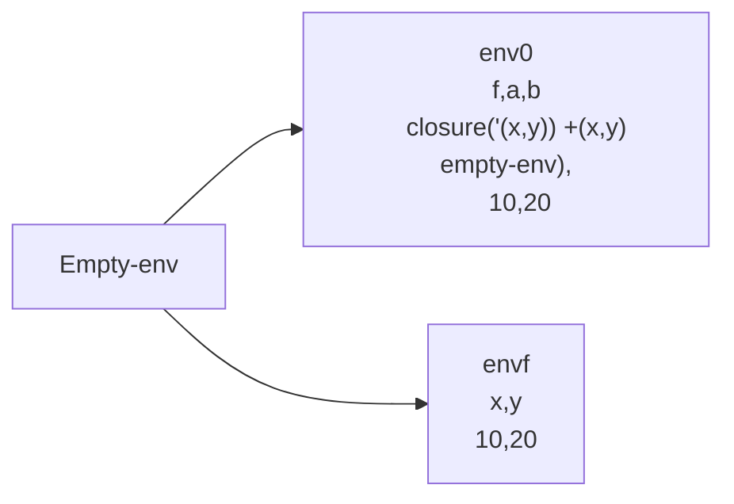
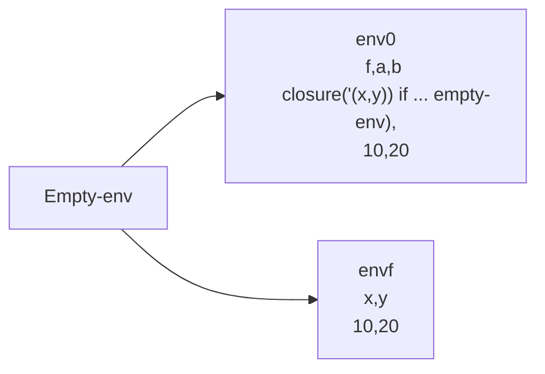

# Preambulo

Los procedimientos actualmente no se pueden conocer a sí mismos, dado que almacena el ambiente donde fueron creados, es el ambiente anterior al ambiente se definieron

```scheme
let
	f = proc(x,y) +(x,y)
	a = 10
	b = 20
	in (f 10 20)
```



```scheme
let
	f = if >(x,0) then (f -(x,1) y) else y
	a = 10
	b = 20
	in (f 10 20)
```



El cuerpo de f se evalua en env
```scheme
if >(x,0) then (f -(x,1) y) else y
if >(10,0) then (f -(x,1) y) else y
if true then (f -(x,1) y) else y
(f -(x,1) y)

```
Al intentar buscar $f$ no lo va encontrar y por ende va fallar.


# Objetivos

1. Entender como se implementan los procedimientos recursivos
2. Entender el alcance léxico y la forma de trabajar los ambientes recursivos en un lenguaje de programación

# Temas
1. [Implementación de procedimientos recursivos I](Implementación%20de%20procedimientos%20recursivos%20I.md)
2. [Implementación de procedimientos recursivos II](Implementación%20de%20procedimientos%20recursivos%20II.md)
3. [Evaluación procedimiento recursivos](Evaluación%20procedimiento%20recursivos.md)
4. [Ejercicio](Ejercicio.md)
5. [Resumen](Resumen.md)
