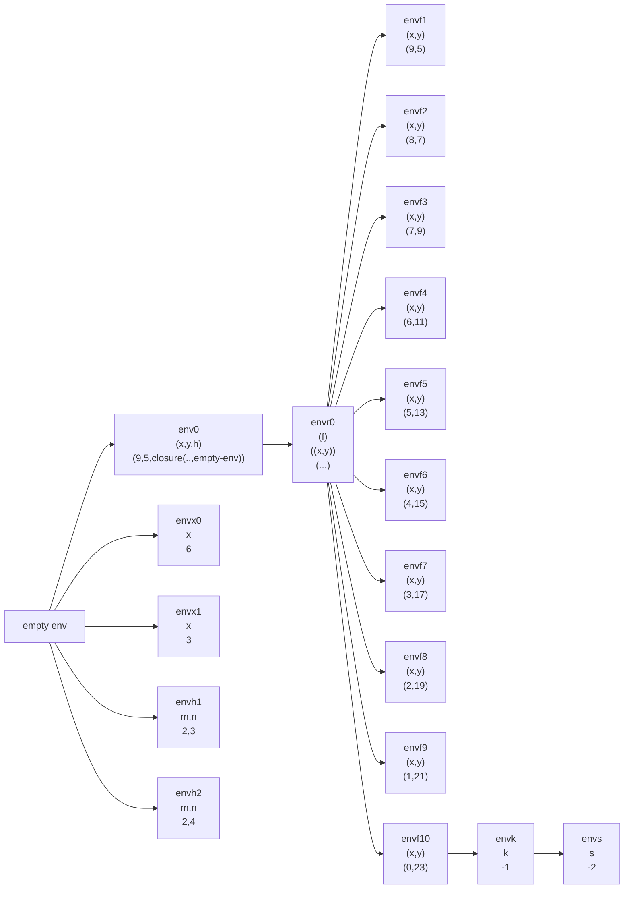

,
```scheme
let
	x = let x = let x = 3 in +(x,3)
						 in +(x,3)
	y = 5
	h = proc(m,n) if >(m,n) 
					then +(m,n) 
					else -(m,n)
	in
		letrec
			f(x,y) = if >(x,0) then
						+(y, (f -(x,1) +(y,2)))
					else
						let k = (h 2 3) in
							let s = (h 2 4)
								in +(k,s)
		in
			(f x y)
```
Da 114	



1. Envr0 (f x y) (f 9 5)
2. Al evaluar (f 9 5) genera una clausura que hereda de envr0
3. envf1 >(9,0) THEN +(5, (f 8 7))
4. envf2 >(8,0) THEN +(7, (f 7 9))
5. enf3,4,5,6,7,8,10 +(5,+(7, +(9, +
6. (11, +(13, +(15, +(17,+(19, +(21 (f 0 23)))))))))
7. envf10 x = 0 y = 23 >(x,0) NO
```scheme
						let k = (h 2 3) in
							let s = (h 2 4)
								in +(k,s)
```
El cuerpo de h es
```scheme
	 if >(m,n) 
					then +(m,n) 
					else -(m,n)
```
- -(2,3) = -1
- >(2,4) --> -(2,4) = -2
8. envs --> +(k,s) -->+(-1,-2) = -3
9. +(5, +(7,  +(9, (11, +(13, +(15, +(17,+(19, +(21 -3)))))))
	1.  +(5, +(7,  +(9, (11, +(13, +(15, +(17,+(19, 18))))))
	2. +(5, +(7,  +(9, (11, +(13, +(15, +(17,37)))))
	3. +(5, +(7,  +(9, (11, +(13, +(15, 54))))
	4. +(5, +(7,  +(9, (11, +(13, 69)))
	5. (11, 82))
	6. +(5, +(7,  +(9, 93)))
	7. +(5, +(7,  102))
	8. +(5, 109)
	9. 114