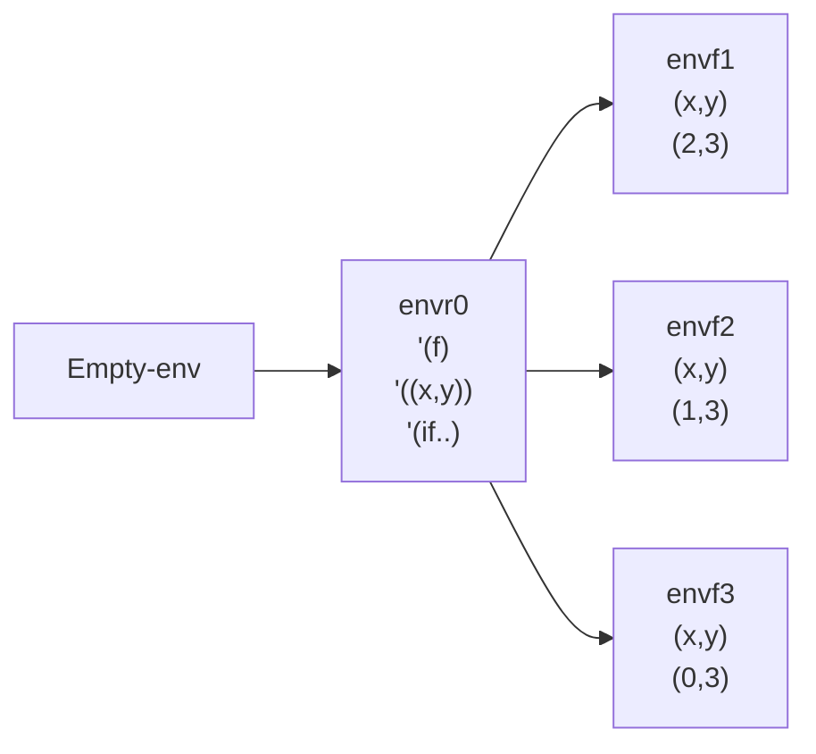
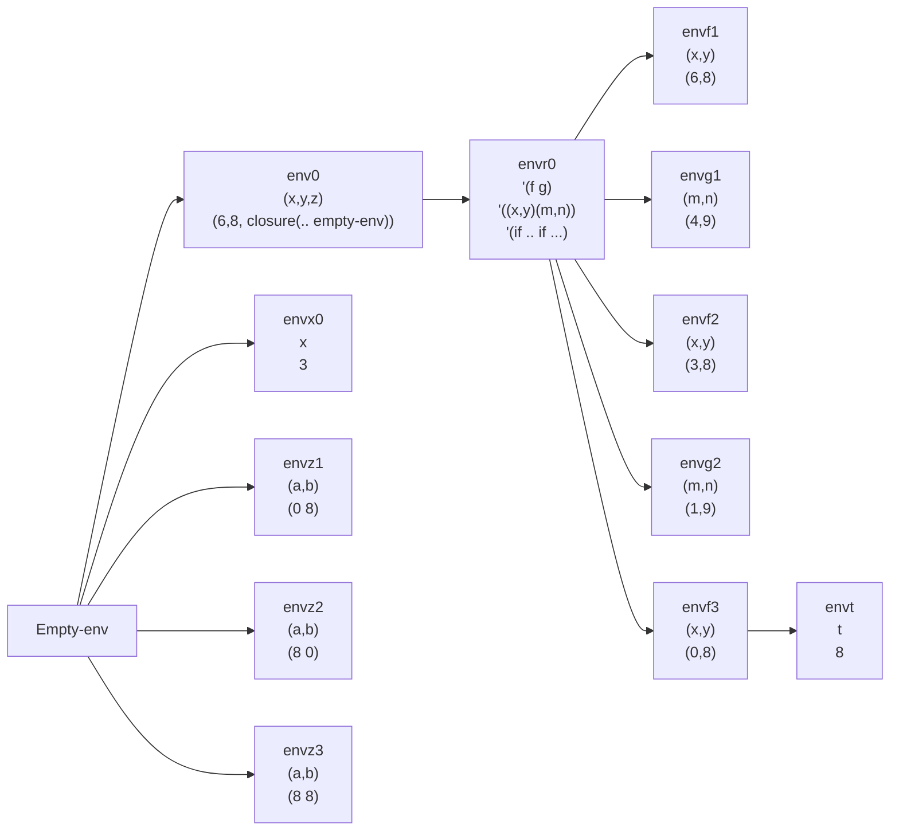

```scheme
letrec f(x,y) = if >(x,0) then +(y, (f -(x,1) y)) else y
in (f 2 3)
```



1. Envf1 if >(x,0) then +(y, (f -(x,1) y)) else y  queda  if >(2,0) then +(3, (f 1 3)) 
2. Enfv2  if >(x,0) then +(y, (f -(x,1) y))  queda if >(1,0)  entonces +(3, (f 0 3))
3. Envf3 if >(x,0) then +(y, (f -(x,1) y)) else y entonces >(0,0) ejecuta else y, retorna 3

Observe la suma acumulada
 1. +(3, (f 1 3))
 2.  +(3, +(3, (f 0 3))) 
 3. +(3, +(3, 3)) = 9 

```scheme
let
	x = let x = 3 in +(x,3)
	y = 8
	z = proc(a,b) if >(a,b) then a else b
	in
		letrec
			f(x,y) = if >(x,0) then
					+(y, (g -(x,2) +(y,1)))
					else
					let
						t = (z (z x y) (z y x))
						in +(t,1)
			g(m,n) = if >(m,0) then
						*(n, (f -(m,1) -(n,1)))
						else
						n
			in
				(f x y)

```

Resultado es 809




1. Envr0 (f x y) --> (f 6 8) f = closure((x,y) if .. envR0)
2. Envf1 if >(x,0) --> >(6,0) SI +(8, (g 4 9))
3. Envg1 if >(m,0) -> >(4,0) SI x(9, (f 3 8))
4. Envf2 if >(x,0) -> (3,0) SI +(8, (g 1 9))
5. Envg2 if >(m,0) -> (1,0) SI x(9, (f 0 8))
6. Envf3 if >(x,0) -> (0,0) ELSE  t = (z (z 0 8) (z 8 0))
   (z 8 (z 8 0)) -> (z 8 8) -> 8
	1. Envz1 if >(a,b) then a else b >(0,8) ELSE 8
	2. Envz2 if >(a,b) then a else b >(8,0)THEN a 8
	3. Envz3 if >(a,b) then a else b >(8,8) ELSE 8
	4. Envt Retorna 9

Evaluación total

1. +(8, (g 4 9))
2. +(8, x(9, (f 3 8)))
3. +(8, x(9, +(8, (g 1 9))))
4. +(8, x(9, +(8, x(9, (f 0 8)))))
5.  +(8, x(9, +(8, x(9, 9)))) -> +(8, x(9, +(8, 81))) -> +(8, x(9, 89)) ->+(8, 801) -> 809 