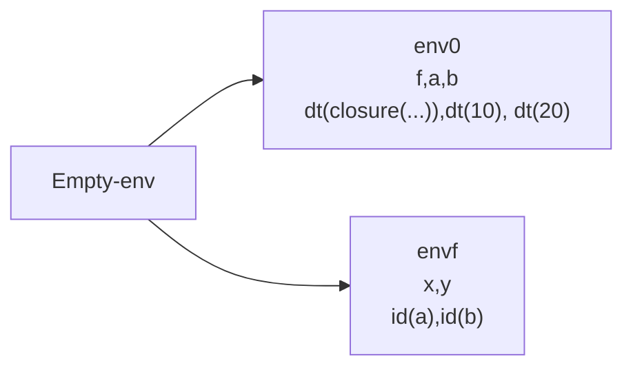
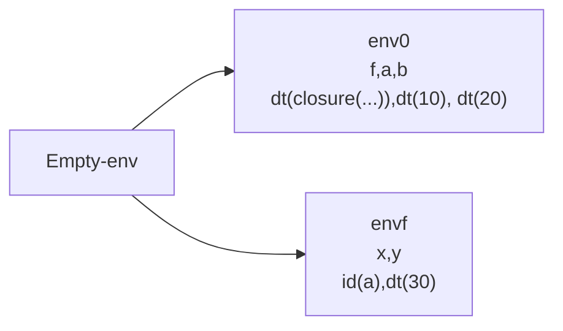
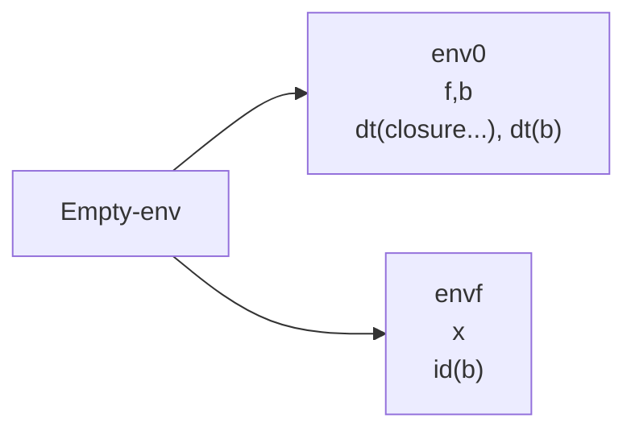
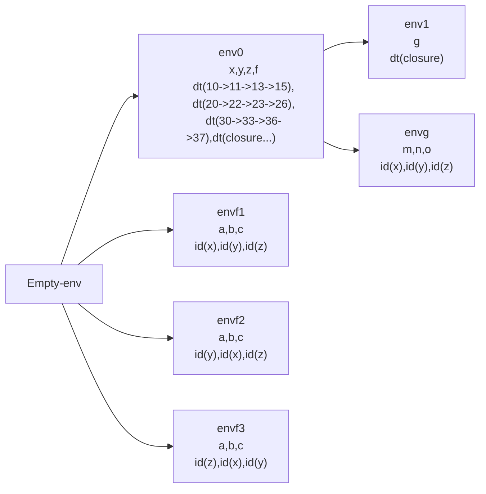

Paso por valor cuando evaluamos un procedimiento con variables en sus argumentos, hacemos una copia de la referencia que es independiente de la original

```scheme
let
	f = proc(x,y) 
		begin
			set x = +(x,1);
			set y = +(y,1);
			+(x,y)
		end
	a = 10
	b = 20
	in
	 (f a b)
```


En este caso a vale 10 y b vale 20

En este caso x es una nueva referencia y y tambien lo es.

# Paso por referencia

Al pasar las variables estas deben de cambiar si dentro del procedimiento se hacen los cambios

```scheme
let
	f = proc(x,y) 
		begin
			set x = +(x,1);
			set y = +(y,1);
			+(x,y)
		end
	a = 10
	b = 20
	in
	 (f a b)
```

En este caso a es 11 y b es 21

# Implementación

1. Valores expresados: Numero, booleanos y procVal
2. Valores denotado: Referencia a valor expresado

La implementación tiene un cambio fundamental, cuando tenemos:

1. Blanco directo: Es una referencia normal (valor)
2. Blanco indirecto: Es cuando pasamos una variable a un procedimiento

```scheme
let
	f = proc(x,y) 
		begin
			set x = +(x,1);
			set y = +(y,1);
			+(x,y)
		end
	a = 10
	b = 20
	in
	 (f a b)
```


Los targets indirectos permiten relacionar las variables del llamado de f con las que se evaluan dentro del procedimiento.

```scheme
let
	f = proc(x,y) 
		begin
			set x = +(x,1);
			set y = +(y,1);
			+(x,y)
		end
	a = 10
	b = 20
	in
	 (f a +(a,b))
```



Cuando evaluamos un procedimiento, se genera

1. Target directo si pasamos un valor (se genera una nueva referencia)
2. Target indirecto si pasamos una variable (conectamos)

En paso por referencia cuando enviamos una variable, no enviamos su valor, si no su referencia, para que cualquier efecto que se hace en la variable se vea reflejado en la variable original.


Generamos la función eval-rand cuando recibe un valor distinto a una variable, genera un direct-target y cuando recibe una variable, si esta es un direct-target genera un indirect-target que contiene la referencia, y si esta es un indirect-target toma la referencia contenida y la envia, esto evita target indirectos hacia targets indirectos
```scheme
(define eval-rand
  (lambda (rand env)
    (cases expression rand
      (var-exp (id)
               (let
                   (
                    (ref (apply-env-ref env id))
                    )
                 (indirect-target
                  (cases target (primitive-deref ref)
                   (direct-target (e) ref)
                   (indirect-target (ref1) ref1))
                  )
                 )
               )
      (else
       (direct-target (eval-expression rand env)))
      )
     )
  )

```

# Ejemplos

```scheme
let 
	f = proc(x) begin 
					set x = +(x,10); 
					x 
				end 
	b = 20
	in
	begin
		(f b);
	b
	end
```

Esto retorna 30



```scheme
let
	x = 10
	y = 20
	z = 30
	f = proc(a,b,c)
		begin
			set a = +(a,1);
			set b = +(b,2);
			set c = +(c,3);
			+(a,b,c)
		end
	in
		let
			g = proc(m,n,o)
				begin
					(f m n o);
					(f n m o);
					(f o m n);
					+(x,y,z)
				end
				in
					(g x y +(z,2))
```

Analizamos

1. (g x y z) m = x n = y o = z
2. (f m n o) x = 11 y = 22 z = 33
3. (f n m o) y = 23 x = 13 z = 36
4. (f o m n) z = 37 x = 15 y = 26  -> 78



