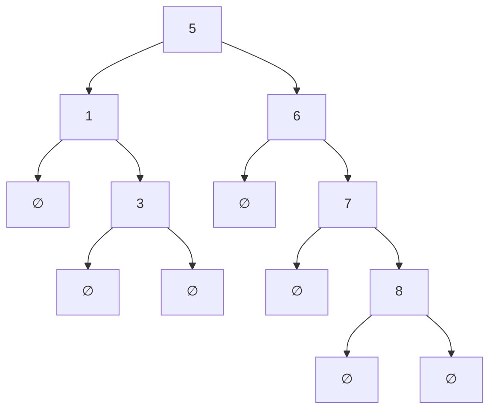
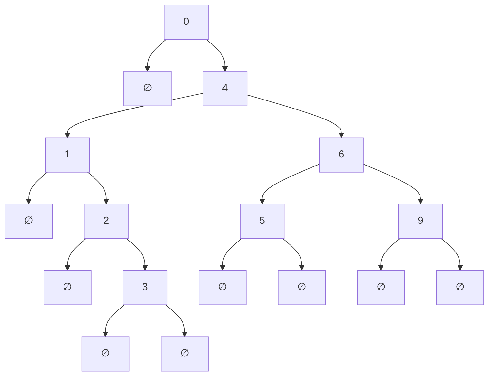
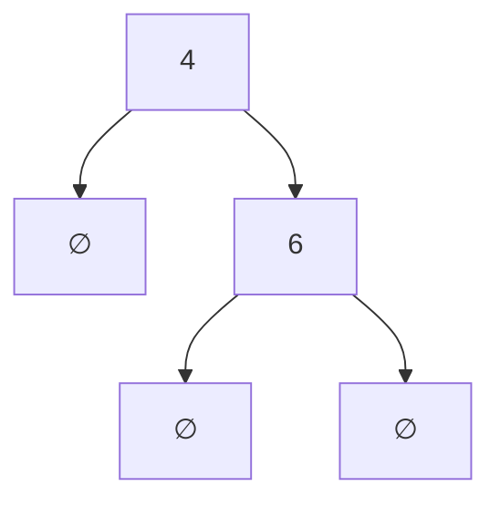
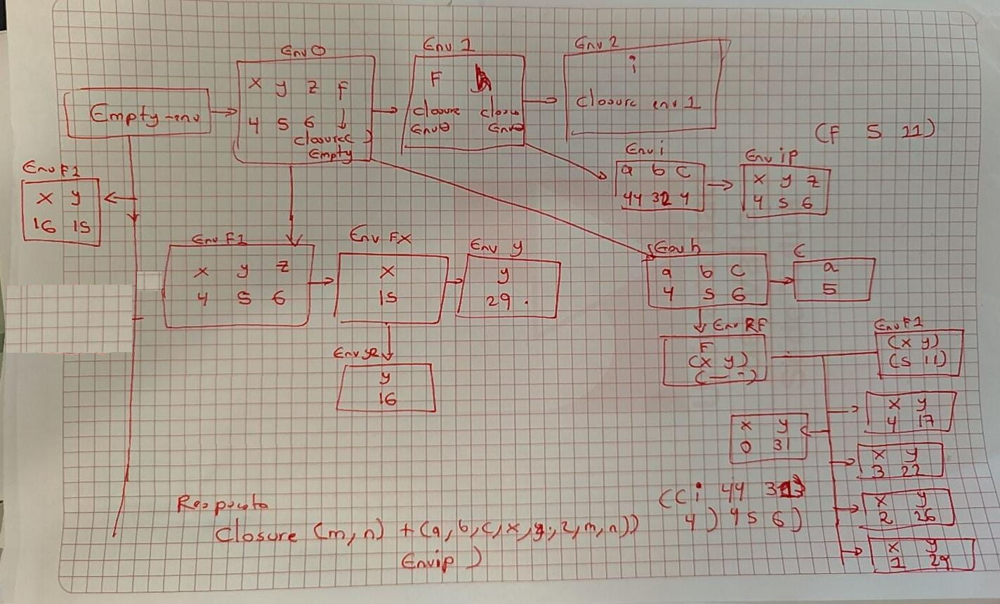

# Punto 1 Abstracción de datos

**Nota** Para resolver este punto se uso el intereprete de recursivos disponible en el campus virtual. Así mismo, las operaciones de unión e intersección la hago para $n$ conjuntos, pero bastaba con dos en el exámen.

Revisar interprete opcional:
[Interprete](attachments/InterpreteOpcional.rkt)

## Enunciado

Se desea implementar en el intérprete un nuevo tipo de dato llamado **conjunto de números**, el cual internamente está representado como un árbol binario de búsqueda (ABB).  
En este árbol, cada nodo contiene un valor entero: los hijos izquierdos almacenan valores menores y los hijos derechos valores mayores.  
De esta forma, no se permiten valores repetidos en el conjunto.

Para implementar el árbol que representa el conjunto, utilice `define-datatype`.

Para ello, debemos realizar las siguientes modificaciones a la gramática:

```abnf
<expression> ::= "set" "(" (<expression> (,))* ")" (set-expr)

<primitive> ::= "insert" (insert-prim)
              ::= "contains" (contains-prim)
              ::= "union" (union-prim)
              ::= "intersection" (intersection-prim)
```

---

### 1. (10 puntos)

Indique en código qué expresiones se agregan a la gramática existente.

---

### 2. (20 puntos)

Indique en código la modificación que se realiza en la función `eval-expression` para soportar la nueva expresión de conjunto.  
Esta debe incluir la creación del ABB a partir de la lista de enteros dada.

---

### 3. (30 puntos)

Indique la modificación en código que se realiza en la función `apply-primitive` para soportar las nuevas primitivas de conjunto.  
Debe incluir la lógica para insertar un elemento en el ABB, verificar si un elemento está contenido en él, y realizar la unión e intersección de dos ABB.

---

Si quieres, puedo generar la plantilla de código completa para Racket con `define-datatype`, `cases`, la representación del árbol y las funciones auxiliares.

## Solución

Primero creamos la representación de conjuntos como arbol ABB y sus operaciones como TAD

```scheme
(define-datatype set set?
  (empty-set)
  (non-empty-set
   (value number?)
   (left set?)
   (right set?)
   ))
   
;;Definimos las operaciones
;;insert-set: set,number -> set
(define insert-set
  (lambda (s n)
    (cases set s
      (empty-set () (non-empty-set n (empty-set) (empty-set)))
      (non-empty-set (v l r)
                     (cond
                       ;;Si es mayor insertar a la derecha
                       [(> n v) (non-empty-set
                                 v
                                 l
                                 (insert-set r n))]
                       ;;Si es menor insertar a la izquierda
                       [(< n v)(non-empty-set
                                 v
                                 (insert-set l n)
                                 r)]

                       ;;Si es igual no hacer nada
                       [else s]
                       )
                     )
      )
    )
  )

;;insert-sets:  set,list of number -> set
(define insert-sets
  (lambda (s l)
    (cond
      [(null? l) s]
      [else
       (insert-sets (insert-set s (car l)) (cdr l))])))
       
       ;; Para trabajar los conjuntos es conveniente convertir a listas
;; Podemos hacerlo con recorrido preorden, inorden o posorden
;; Para conservar estructura usaremos preorden
;; set->list set -> lista de numeros
(define set->list
  (lambda (s)
    (cases set s
      (empty-set () '())
      (non-empty-set (v l r)
                     (append
                      (list v)
                      (set->list l)
                      (set->list r)
                      )
                     )
      )
    )
  )
```

Ahora modificamos la gramática

```scheme
    ;;Examen opcional
    ;;*******************************
    (expresion ("set" "(" (separated-list expresion ",") ")") set-exp)
    ;;*********************************
        ;;Primitivas set
    (primitiva ("union") union-prim)
    (primitiva ("contains") contains-prim)
    (primitiva ("intersection") intersection-prim)
```

Y la función evaluar expresion

```scheme
      ;;set
      (set-exp (rands)
               (insert-sets (empty-set) (map (lambda (x) (evaluar-expresion x amb)) rands)))
```

En la función evaluar primitiva

```scheme
      (union-prim () (union->sets lval))
      (contains-prim () (contains? (set->list (car lval)) (cadr lval)))
      (intersection-prim () (insert-sets (empty-set) (intersection->sets lval) ))
```

La idea de la intersección es trabajar con listas y mirar los comunes y después crear un nuevo conjunto

Tenemos funciones auxiliares para la primitiva

```scheme
;;Operaciones primitivas de lista

;;contains: list de numeros -> booleano
(define contains?
  (lambda (l v)
    (cond
      [(null? l) #F]
      [(= (car l) v) #T]
      [else
       (contains? (cdr l) v)])))

;;union->sets > list of set -> set
;; la idea es tomar los sets y transformarlo en listas de numeros
;; cuando se tenga el ultimo set, este se retorna
;; este va ser el set al que se le van a insertar los demas numeros
(define union->sets
  (lambda (lset)
    (cond
      [(null? (cdr lset)) (car lset)]
      [else
       (insert-sets (union->sets (cdr lset)) (set->list (car lset)))])))


;intersection->sets: list of sets -> set
;;Idea transformar a listas los set
;; Transformamos el primer conjunto a lista
;; Transformamos el resto a una lista de lista de numeros
;;Retornar lo que cumplan esa condición
(define intersection->sets
  (lambda (lset)
    (filtro-elementos (set->list (car lset))
                      (map set->list (cdr lset)))))


;;filtro-elementos: list of number, list of list of number -> list of number
(define filtro-elementos
  (lambda (lset llset)
    (cond
      [(null? lset) '()]
      [(is-in-all? (car lset) llset)
       (cons (car lset) (filtro-elementos (cdr lset) llset))]
      [else
       (filtro-elementos (cdr lset) llset)])))

;;is-in-all?: number, list of list number
;;Verifique que un numero esté en todas las listas
(define is-in-all?
  (lambda (n ll)
    (cond
      [(null? ll) #T]
      [(is-in? n (car ll)) (is-in-all? n (cdr ll))]
      [else #F])))

;;is-in? number, list of number
;;Verifica que un numero este en una lista
(define is-in?
  (lambda (n l)
    (cond
      [(null? l) #F]
      [(eqv? n (car l)) #T]
      [else (is-in? n (cdr l))])))

```
## Ejemplos

### Creación y representación

Para el caso

```scheme
set(5,6,7,8,7,7,7,1,3)
```
Obtenemos

```scheme
#(struct:non-empty-set 5 #(struct:non-empty-set 1 #(struct:empty-set) #(struct:non-empty-set 3 #(struct:empty-set) #(struct:empty-set))) #(struct:non-empty-set 6 #(struct:empty-set) #(struct:non-empty-set 7 #(struct:empty-set) #(struct:non-empty-set 8 #(struct:empty-set) #(struct:empty-set)))))
```

Observe que no tenemos elementos repetidos



### Contains

```scheme
-->contains(set(4,5,2,1,2,1,3),0)
#f
-->contains(set(4,5,2,1,2,1,3),3)
#t
```

### Union

```scheme
union(set(1,2,3), set(5,5,6), set(9,9,1), set(0,4,6))
#(struct:non-empty-set 0 #(struct:empty-set) #(struct:non-empty-set 4 #(struct:non-empty-set 1 #(struct:empty-set) #(struct:non-empty-set 2 #(struct:empty-set) #(struct:non-empty-set 3 #(struct:empty-set) #(struct:empty-set)))) #(struct:non-empty-set 6 #(struct:non-empty-set 5 #(struct:empty-set) #(struct:empty-set)) #(struct:non-empty-set 9 #(struct:empty-set) #(struct:empty-set)))))
```




### Intersección

```bash
intersection(set(1,2,3,4,5,6,7), set(0,2,4,6,8), set(4,5,6,7,8), set(4,6,11,12))
#(struct:non-empty-set 4 #(struct:empty-set) #(struct:non-empty-set 6 #(struct:empty-set) #(struct:empty-set)))
```
Observe que 4 y 6 son los comunes



# Punto 2 Evaluación de expresiones

## Enunciado

Considere la siguiente expresión en el lenguaje visto en el curso (procedimientos), con ambiente inicial  
_env0_ que contiene los identificadores **(x y z f)** y los valores **(4 5 6 (closure'(x,y) +(x,-(y,2)) empty-env))**:

```scheme
let
   f = proc(x,y,z) let x = +(x,y,z) in 
                   let y = let y = +(x,1) in (f y x) 
                   in +(x,y)
    h = proc(a,b,c) letrec f(x,y) = if <(x,0) 
                                      then y 
                                      else (f -(x,1) +(y,x,1)) 
                    in (f let a = 5 in a +(b,c))
   in
      let
        i = proc(a,b,c) proc(x,y,z) proc(m,n) +(a,b,c,x,y,z,m,n)
   	    in
        ((i (f x y z) (h x y z) x) x y z)
```

1. **(5 puntos)** Indique el valor de la expresión.
    
2. **(35 puntos)** Dibuje los ambientes que se generan y muestre mediante flechas de qué ambientes se extienden.
## Solución

## Valor expresión

```scheme
#(struct:closure (m n) 

#(struct:prim-exp #(struct:sum-prim) (#(struct:var-exp a) #(struct:var-exp b) #(struct:var-exp c) #(struct:var-exp x) #(struct:var-exp y) #(struct:var-exp z) #(struct:var-exp m) #(struct:var-exp n))) #


(struct:ambiente-extendido (x y z) (4 5 6) #(struct:ambiente-extendido (a b c) (44 32 4) #(struct:ambiente-extendido (f h) (closure ....) #(struct:ambiente-extendido (x y z f) (4 5 6 #(struct:closure (x y) ....) #(struct:ambiente-vacio))))))))
```

El procedimiento que retorna es 

```scheme
closure (n,m) ... envif
```

## Diagrama de ambientes

