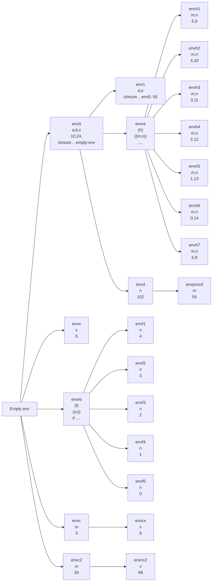

(35 puntos) Dibuje los ambientes generados por la siguiente expresión, suponga como ambiente inicial el vacío.

```scheme
let 
  a = let x = 5 in *(2,x)
  b = letrec f(n) = if <(n,1) then 1 else *(n, (f -(n,1))) in (f 4)
  c = proc (m) let x = *(m,2) in +(x,m)
  in
      let
        d = proc (n) proc (m ) +(n,m)
        e = letrec h(n,m) = if >(n,0) then +(m, (h -(n,1)  +(m,1))) else 0 in (h 5 (c 3))
        in
          ((d (c +(a, b))) e)

```

Los ambientes generados son:



En total 102 + 55 = 157
