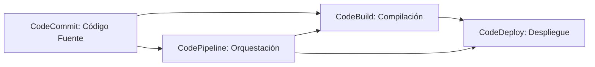

El equivalente en Azure en Devops.

Aquí tienes una ampliación de los conceptos con ejemplos y una tabla descriptiva:

---

### **Ampliación de conceptos AWS Developer Tools**

#### **1. AWS CodeCommit**
**Definición ampliada:**  
Servicio de control de versiones Git totalmente administrado que almacena repositorios privados en la nube de AWS. Ofrece seguridad integrada (IAM, cifrado), escalabilidad y compatibilidad con herramientas Git estándar.

**Ejemplo de uso:**  
- Un equipo de desarrollo colabora en un proyecto backend usando CodeCommit como repositorio central.  
- Integración con AWS CodeBuild para CI/CD: cada `git push` dispara una construcción automática.  

---

#### **2. AWS CodeBuild**  
**Definición ampliada:**  
Servicio de compilación completamente administrado que compila código fuente, ejecuta pruebas y produce paquetes listos para despliegue. Soporta múltiples entornos (Docker, Linux, Windows) y lenguajes (Java, Python, Node.js, etc.).

**Ejemplo de uso:**  
- Configurar un `buildspec.yml` para compilar una aplicación Node.js, ejecutar pruebas unitarias con Jest y generar un artefacto ZIP para CodeDeploy.  

---

#### **3. AWS CodeDeploy**  
**Definición ampliada:**  
Automatiza despliegues en instancias EC2, Lambda, ECS o servidores on-premises. Soporta estrategias como **Blue/Green** y **Rolling Updates** para minimizar downtime.

**Ejemplo de uso:**  
- Desplegar una nueva versión de una API en un Auto Scaling Group, verificando health checks antes de finalizar el despliegue.  

---

#### **4. AWS CodePipeline**  
**Definición ampliada:**  
Orquesta flujos de trabajo de CI/CD en múltiples etapas (fuente, construcción, pruebas, despliegue). Se integra con herramientas externas (GitHub, Jenkins) y servicios AWS (CloudFormation, EKS) o Terraform.

**Ejemplo de uso:**  
- Pipeline para infraestructura como código:  
  1. **Fuente**: Cambios en un repositorio de Terraform.  
  2. **Construcción**: Validación con `terraform validate`.  
  3. **Despliegue**: Aplicar cambios en VPCs con aprobación manual.  

---

### **Tabla Comparativa**  

| Servicio       | Función Principal                     | Integración Clave               | Ventajas                                  |
|----------------|---------------------------------------|----------------------------------|-------------------------------------------|
| **CodeCommit** | Repositorios Git privados             | CodeBuild, CodePipeline         | Seguridad IAM, cifrado en reposo/tránsito|
| **CodeBuild**  | Compilación y pruebas automatizadas   | Lambda, S3, ECR                 | Escalable, pago por uso                   |
| **CodeDeploy** | Despliegue automático                 | EC2, Lambda, ECS                | Estrategias de despliegue avanzadas       |
| **CodePipeline**| Orquestación de CI/CD                | CloudFormation, GitHub Actions  | Visualización de flujos end-to-end        |

---

### **Diagrama Conceptual**  

¿Necesitas profundizar en algún servicio en particular?