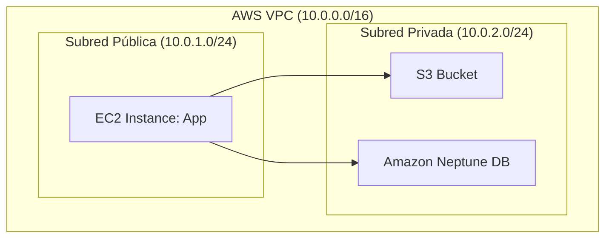
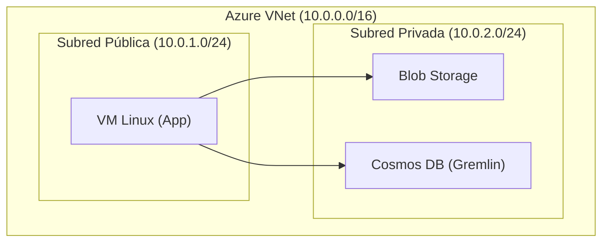

## Introducción  
Terraform es una herramienta de Infraestructura como Código (IaC) que permite definir, gestionar y versionar infraestructura en múltiples proveedores de nube mediante un enfoque declarativo. Este taller aborda los fundamentos para implementar recursos básicos en AWS y Azure.

# Ejemplo de infraestructura como código


  
## Parte 1: Implementación en AWS  
### Configuración Inicial  
Instalación de Terraform:  https://developer.hashicorp.com/terraform/install

Instalar AWS CLI https://aws.amazon.com/cli/ 

### Estructura
```bash
aws/
├── main.tf
├── variables.tf
├── outputs.tf
└── ec2_user_data.sh

```
  
### Creación de Recursos  
Archivo *main.tf*:  

#### Proveedor

```hcl  
provider "aws" {
  region = "us-east-1"
}

resource "aws_vpc" "main" {
  cidr_block = "10.0.0.0/16"
}

resource "aws_internet_gateway" "gw" {
  vpc_id = aws_vpc.main.id
}

resource "aws_subnet" "public" {
  vpc_id                  = aws_vpc.main.id
  cidr_block              = "10.0.1.0/24"
  map_public_ip_on_launch = true
}

resource "aws_subnet" "private" {
  vpc_id     = aws_vpc.main.id
  cidr_block = "10.0.2.0/24"
}

resource "aws_route_table" "public" {
  vpc_id = aws_vpc.main.id

  route {
    cidr_block = "0.0.0.0/0"
    gateway_id = aws_internet_gateway.gw.id
  }
}

resource "aws_route_table_association" "public_assoc" {
  subnet_id      = aws_subnet.public.id
  route_table_id = aws_route_table.public.id
}
 
```  
  
#### EC2 (Subred publica) 

```hcl
  resource "aws_security_group" "ec2_sg" {
  name        = "ec2_sg"
  description = "Allow SSH and HTTP"
  vpc_id      = aws_vpc.main.id

  ingress {
    from_port   = 22
    to_port     = 22
    protocol    = "tcp"
    cidr_blocks = ["0.0.0.0/0"]
  }

  ingress {
    from_port   = 80
    to_port     = 80
    protocol    = "tcp"
    cidr_blocks = ["0.0.0.0/0"]
  }

  egress {
    from_port   = 0
    to_port     = 0
    protocol    = "-1"
    cidr_blocks = ["0.0.0.0/0"]
  }
}

resource "aws_instance" "app" {
  ami           = "ami-0c55b159cbfafe1f0" # Amazon Linux 2
  instance_type = "t2.micro"
  subnet_id     = aws_subnet.public.id
  security_groups = [aws_security_group.ec2_sg.name]

  user_data = file("ec2_user_data.sh")

  tags = {
    Name = "AppInstance"
  }
}

```
#### S3 y Neptune

```hcl
resource "aws_s3_bucket" "private_data" {
  bucket = "mi-bucket-privado-terraform"
  force_destroy = true
}
resource "aws_security_group" "neptune_sg" {
  name   = "neptune_sg"
  vpc_id = aws_vpc.main.id

  ingress {
    from_port       = 8182
    to_port         = 8182
    protocol        = "tcp"
    security_groups = [aws_security_group.ec2_sg.id]
  }

  egress {
    from_port   = 0
    to_port     = 0
    protocol    = "-1"
    cidr_blocks = ["0.0.0.0/0"]
  }
}

resource "aws_neptune_subnet_group" "neptune_subnet_group" {
  name       = "neptune-subnet-group"
  subnet_ids = [aws_subnet.private.id]
}

resource "aws_neptune_cluster" "neptune" {
  cluster_identifier      = "neptune-cluster"
  engine                  = "neptune"
  neptune_subnet_group_name = aws_neptune_subnet_group.neptune_subnet_group.name
  vpc_security_group_ids  = [aws_security_group.neptune_sg.id]
}

resource "aws_neptune_cluster_instance" "neptune_instance" {
  count              = 1
  identifier         = "neptune-instance-${count.index}"
  cluster_identifier = aws_neptune_cluster.neptune.id
  instance_class     = "db.r5.large"
  apply_immediately  = true
}

```

### Archivos de configuración
Archivo *ec2_user_data.sh*:  
```bash
#!/bin/bash
yum update -y
yum install -y python3 zip unzip awscli
pip3 install gremlinpython boto3

# Variables de entorno
export REGION=us-east-1
export S3_BUCKET=mi-bucket-privado-terraform

# Archivo de prueba
echo "Consulta de prueba a Neptune y resultado guardado" > resultado.txt

# Subir a S3
aws s3 cp resultado.txt s3://$S3_BUCKET/

```
### Variables
Archivo *variables.tf*:  
```hcl
variable "aws_region" {
  description = "Región de AWS donde se desplegará la infraestructura"
  type        = string
  default     = "us-east-1"
}

variable "vpc_cidr" {
  description = "CIDR de la VPC principal"
  type        = string
  default     = "10.0.0.0/16"
}

variable "public_subnet_cidr" {
  description = "CIDR de la subred pública"
  type        = string
  default     = "10.0.1.0/24"
}

variable "private_subnet_cidr" {
  description = "CIDR de la subred privada"
  type        = string
  default     = "10.0.2.0/24"
}

variable "ec2_instance_type" {
  description = "Tipo de instancia EC2"
  type        = string
  default     = "t2.micro"
}

variable "ec2_ami_id" {
  description = "AMI ID para la instancia EC2 (Amazon Linux 2)"
  type        = string
  default     = "ami-0c55b159cbfafe1f0"
}

variable "s3_bucket_name" {
  description = "Nombre del bucket S3 privado"
  type        = string
  default     = "mi-bucket-privado-terraform"
}

variable "neptune_instance_class" {
  description = "Clase de instancia para Neptune"
  type        = string
  default     = "db.r5.large"
}

```
### Archivos de debugging
Archivo *outputs.tf*:  
```hcl
output "vpc_id" {
  description = "ID de la VPC creada"
  value       = aws_vpc.main.id
}

output "public_subnet_id" {
  description = "ID de la subred pública"
  value       = aws_subnet.public.id
}

output "private_subnet_id" {
  description = "ID de la subred privada"
  value       = aws_subnet.private.id
}

output "ec2_public_ip" {
  description = "IP pública de la instancia EC2"
  value       = aws_instance.app.public_ip
}

output "s3_bucket_name" {
  description = "Nombre del bucket S3 privado"
  value       = aws_s3_bucket.private_data.bucket
}

output "neptune_endpoint" {
  description = "Endpoint del clúster de Neptune"
  value       = aws_neptune_cluster.neptune.endpoint
}

output "neptune_reader_endpoint" {
  description = "Reader endpoint del clúster de Neptune"
  value       = aws_neptune_cluster.neptune.reader_endpoint
}

```

### Ejecución de Comandos  
```bash  

terraform init  
terraform plan  
terraform apply  # Confirmar con 'yes'  
```  
  
### Limpieza de Recursos  
```bash  
terraform destroy  # Confirmar con 'yes'  
```  
  
## Parte 2: Implementación en Azure  
### Recursos
1. Instalación Azure CLI  https://learn.microsoft.com/en-us/cli/azure/?view=azure-cli-latest 
2. Loguearse con *az login*

### Estructura
```bash
azure/
├── main.tf
├── variables.tf
├── outputs.tf
└── vm_user_data.sh

```


### `main.tf`
```hcl
provider "azurerm" {
  features {}
}

resource "azurerm_resource_group" "main" {
  name     = "rg-gremlin-app"
  location = var.location
}

resource "azurerm_virtual_network" "vnet" {
  name                = "vnet-app"
  address_space       = [var.vnet_cidr]
  location            = var.location
  resource_group_name = azurerm_resource_group.main.name
}

resource "azurerm_subnet" "public" {
  name                 = "public-subnet"
  resource_group_name  = azurerm_resource_group.main.name
  virtual_network_name = azurerm_virtual_network.vnet.name
  address_prefixes     = [var.public_subnet_cidr]
}

resource "azurerm_subnet" "private" {
  name                 = "private-subnet"
  resource_group_name  = azurerm_resource_group.main.name
  virtual_network_name = azurerm_virtual_network.vnet.name
  address_prefixes     = [var.private_subnet_cidr]
}

resource "azurerm_network_interface" "vm_nic" {
  name                = "vm-nic"
  location            = var.location
  resource_group_name = azurerm_resource_group.main.name

  ip_configuration {
    name                          = "vm-ipconfig"
    subnet_id                     = azurerm_subnet.public.id
    private_ip_address_allocation = "Dynamic"
    public_ip_address_id          = azurerm_public_ip.vm_public_ip.id
  }
}

resource "azurerm_public_ip" "vm_public_ip" {
  name                = "vm-public-ip"
  location            = var.location
  resource_group_name = azurerm_resource_group.main.name
  allocation_method   = "Dynamic"
}

resource "azurerm_linux_virtual_machine" "vm" {
  name                = "app-vm"
  resource_group_name = azurerm_resource_group.main.name
  location            = var.location
  size                = var.vm_size
  admin_username      = var.admin_username
  network_interface_ids = [
    azurerm_network_interface.vm_nic.id
  ]

  admin_ssh_key {
    username   = var.admin_username
    public_key = file(var.public_key_path)
  }

  os_disk {
    caching              = "ReadWrite"
    storage_account_type = "Standard_LRS"
  }

  source_image_reference {
    publisher = "Canonical"
    offer     = "UbuntuServer"
    sku       = "20_04-lts-gen2"
    version   = "latest"
  }

  custom_data = filebase64("vm_user_data.sh")
}

resource "azurerm_storage_account" "private_storage" {
  name                     = var.storage_account_name
  resource_group_name      = azurerm_resource_group.main.name
  location                 = var.location
  account_tier             = "Standard"
  account_replication_type = "LRS"
}

resource "azurerm_storage_container" "private_container" {
  name                  = "private-container"
  storage_account_name  = azurerm_storage_account.private_storage.name
  container_access_type = "private"
}

resource "azurerm_cosmosdb_account" "gremlin" {
  name                = var.cosmosdb_account_name
  location            = var.location
  resource_group_name = azurerm_resource_group.main.name
  offer_type          = "Standard"
  kind                = "GlobalDocumentDB"

  consistency_policy {
    consistency_level = "Session"
  }

  geo_location {
    location          = var.location
    failover_priority = 0
  }

  capabilities {
    name = "EnableGremlin"
  }
}

```

### Variables.tf

```hcl
variable "location" {
  default = "East US"
}

variable "vnet_cidr" {
  default = "10.0.0.0/16"
}

variable "public_subnet_cidr" {
  default = "10.0.1.0/24"
}

variable "private_subnet_cidr" {
  default = "10.0.2.0/24"
}

variable "vm_size" {
  default = "Standard_B1s"
}

variable "admin_username" {
  default = "azureuser"
}

variable "public_key_path" {
  description = "Path to your public SSH key"
  default     = "~/.ssh/id_rsa.pub"
}

variable "storage_account_name" {
  default = "privatestorageacc123"
}

variable "cosmosdb_account_name" {
  default = "gremlinaccount123"
}

```
### Outputs.tf
```hcl
output "vm_public_ip" {
  value = azurerm_public_ip.vm_public_ip.ip_address
}

output "storage_account_name" {
  value = azurerm_storage_account.private_storage.name
}

output "cosmosdb_endpoint" {
  value = azurerm_cosmosdb_account.gremlin.endpoint
}

```
### vm_user_data.sh
```bash
#!/bin/bash
sudo apt-get update -y
sudo apt-get install -y python3-pip
pip3 install azure-storage-blob gremlinpython

# Simula una consulta y escribe a blob
echo "Consulta de prueba a Cosmos DB" > result.txt

```