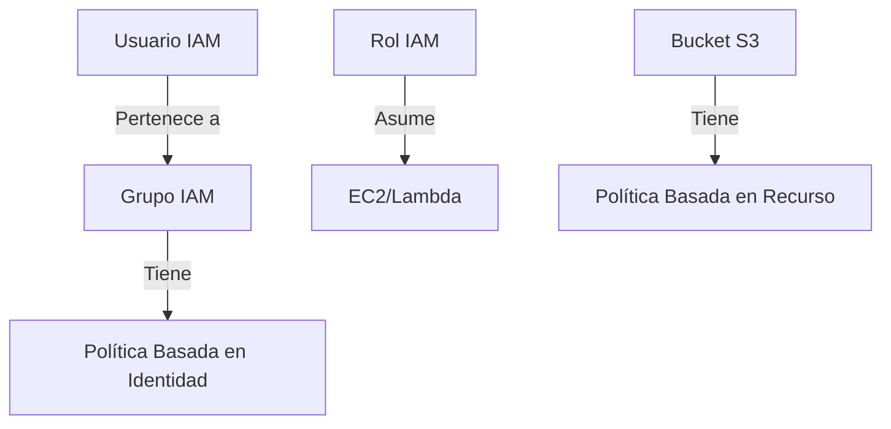

# Definiciones
1. Administra el acceso a los recursos de AWS (Cuenta AWS; Recurso)
2. Define:
	1. Quien pueden acceder al recurso
	2. A que recursos se puede obtener acceso y que se pueden hacer con ellos
	3. Como se puede obtener acceso a los recursos

# Componentes
1. **Usuario de IAM:** Persona o aplicación
2. **Grupos de IAM:** Colecciones de usuarios de IAM
3. **Política de IAM:** Es un document que define a que nivel se puede acceder a los recursos
4. Rol de IAM: Mecanismo para conceder un grupo de permisos (Autorización temporal)


# Usuarios
- SDK o CLI: ID de la clave y secret ket
- Consola de administración: ID o Alias de la cuenta, nombre de usuarios y contraseña. Se recomienda usar MFA (Autenticación de multiple factor)

# Políticas
- Principio de mínimo privilegio: Dé acceso únicamente a lo que se necesita
- Implícitamente todo está negado
- Si algo está negado nunca se permite

## Políticas basadas en identidad
1. Asocian una política a un cualquier entidad de IAM (Usuario, grupo o rol)
2. Las políticas especifican que se puede hacer y que no se puede hacer
3. Una sola política se puede asociar con varias entidades
4. Una sola entidad puede tener varias políticas asociadas a ella

## Políticas basadas en recursos

Están asociadas a un recurso.
- Quien tiene acceso al recurso y que puede hacer con el.
- Las políticas por recursos se insertan más se administran
- Sólo algunos servicios las permiten.

# Grupo IAM

1. Es un conjunto de usuarios de IAM
2. Un grupo se puede usar para conceder permisos a usuarios
3. Un usuario puede pertenecer varios grupos, tener cuidado porque si se niega algo de un grupo y en otro se permite, por el principio de denegación, se va a negar
4. No hay grupo predeterminado
5. No se aceptan anidaciones (grupos dentro de grupos)

# Roles de IAM

- Es un entidad con permisos especificos
- Es diferente que un usuario de IAM, está diseñado para que un persona, aplicación o servicio (cuenta de IAM o servicios) lo puedan asumir, por ejemplo darle a una instancia de EC2 permisos para escribir un bucket S3


# Resumen
IAM es el servicio de AWS que **controla el acceso seguro a los recursos**, definiendo:  
✅ **Quién** puede acceder (usuarios, roles, servicios).  
✅ **A qué recursos** (S3, EC2, etc.) y **qué acciones** pueden realizar (leer, escribir, eliminar).  
✅ **Cómo** se accede (consola web, CLI, SDK).  

---

### **Conceptos Clave**  

#### **1. Usuarios de IAM**  
- Representan personas o aplicaciones.  
- Tienen credenciales:  
  - **Consola AWS**: Nombre de usuario + contraseña + MFA (recomendado).  
  - **CLI/SDK**: Access Key ID + Secret Access Key.  

#### **2. Grupos de IAM**  
- Agrupan usuarios para asignar permisos en masa.  
- **Reglas clave**:  
  - Un usuario puede estar en varios grupos.  
  - No hay grupos anidados (no se pueden crear subgrupos).  
  - Si un permiso es denegado en un grupo, prevalece sobre los permisos permitidos en otros (*deny overrides allow*).  

#### **3. Políticas de IAM**  
- Documentos JSON que definen permisos.  
- **Tipos**:  
  - **Basadas en identidad**: Asignadas a usuarios/grupos/roles (ej: permitir escribir en S3).  
  - **Basadas en recursos**: Asignadas directamente a un recurso (ej: política de bucket S3).  
- **Principio de mínimo privilegio**: Otorgar solo los permisos necesarios.  

#### **4. Roles de IAM**  
- Permisos temporales para servicios o cuentas externas.  
- **Ejemplo típico**: Una instancia EC2 asume un rol para acceder a un bucket S3 sin credenciales fijas.  

---

### **Ejemplo Práctico**  
**Contexto**: Una empresa quiere que su equipo de desarrollo pueda leer/escribir en un bucket S3, pero solo los administradores puedan borrar archivos.  

#### **Implementación con IAM**:  
1. **Crear Grupos**:  
   - `DevGroup` (permisos: `s3:GetObject`, `s3:PutObject`).  
   - `AdminGroup` (permisos: `s3:*`).  

2. **Asignar Usuarios**:  
   - Usuario `dev1` → Grupo `DevGroup`.  
   - Usuario `admin1` → Grupo `AdminGroup`.  

3. **Política Ejemplo (JSON) para DevGroup**:  
   ```json
   {
     "Version": "2012-10-17",
     "Statement": [
       {
         "Effect": "Allow",
         "Action": ["s3:GetObject", "s3:PutObject"],
         "Resource": "arn:aws:s3:::mi-bucket/*"
       }
     ]
   }
   ```

4. **Uso de Roles**:  
   - Si una aplicación en EC2 necesita acceso a S3, se crea un rol con permisos S3 y se asocia a la instancia (sin almacenar credenciales).  

---

### **Diagrama Mermaid (Relación IAM)**  


**Conclusión**: IAM es la base de la seguridad en AWS. Su correcta configuración evita accesos no autorizados y sigue el principio de *mínimo privilegio*. 🚀