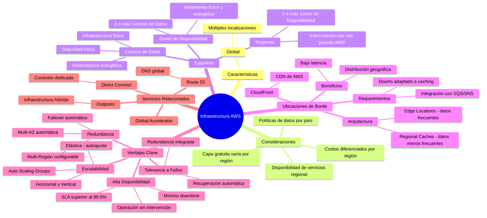

# Infraestructura
Amazon tiene una infraestructura global en varias localizaciones alrededor del mundo
https://aws.amazon.com/about-aws/global-infrastructure/
Tener en cuenta
1. La ubicación de la región hace que las políticas sobre datos y otros aspectos legales dependan del pais donde está alojado.
2. La capa gratuita varía por región
3. La disponibilidad de los servicio también varia
4. Los costos son diferentes por región
# Esquema
- Regiones: Están ubicadas en diferentes localizaciones y estas están compuestas por dos o más zona de disponibilidad
- Zonas de disponibilidad. Estructuras o particiones aisladas que constan de 3 o más centros de datos
- Centros de datos: Son ubicaciones físicas que cuenta con seguridad, redundancia de alimentación eléctrica.

Las regiones se encuentran interconectadas entre sí por la red propia de AWS.

## Ventajas
- Redundancia de datos entre los centros de datos de una zona de disponibilidad, por ejemplo, si uno falla entonces otro responde
- Algunos servicios o configuraciones de estos permiten tener redundancia en diferentes zonas de disponibilidad (Multi AZ)
- Los usuarios pueden tener redundancia en diferentes regiones (costo)

## Ubicaciones de borde
- Permiten desplegar contenido en diferentes localizaciones geográficas a través del servicio de Cloud front
- Esto me permite ofrecer servicios con baja latencia
- Usualmente se maneja
	- En la ubicación de borde están los datos más frecuentes
	- Y cerca a esta una cache de datos menos frecuentes
	- Los desarrolladores y empresas deben adaptar sus aplicaciones a este esquema, ya que requiere el uso de servicios como SQS

# Ventajas de la infraestructura de AWS

- **Elasticidad y escalabilidad**
	- Infraestructura elástica; adaptación dinámica de la capacidad
	- Infraestructura escalable; se adapta para crecer
- **Tolerancia a errores**
	- Continúa funcionando correctamente en presencia de un error
	- Redundancia integrada entre los componentes
- **Alta disponibilidad**
	- Alto nivel de rendimiento operativo (baja latencia)
	- Minimizar tiempo de inactividad
	- Sin intervención humana (Ofrecer un servicio automáticamente)

