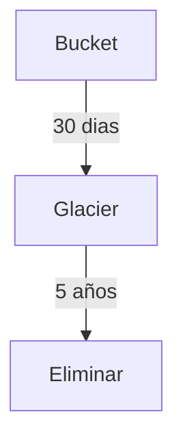
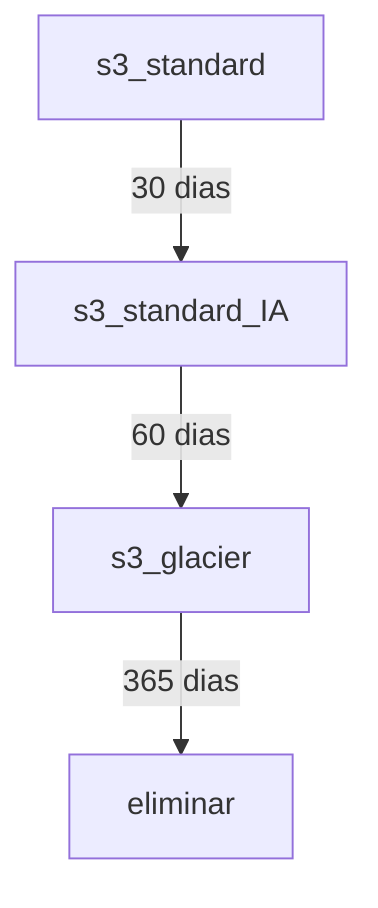

Servicio pensado para almacenar datos a largo plazo. Permite cifrado de datos en reposo y en tránsito.

Se pueden diseñar políticas para los objetos en s3

Se pueden diseñar políticas entre diferentes tipos de s3

# Características

Aquí tienes la tabla comparativa entre Amazon S3 y Amazon S3 Glacier:

| Característica | Amazon S3 | Amazon S3 Glacier |
|----------------|-----------|-------------------|
| **Volumen de datos** | Sin límite | Sin límite |
| **Latencia media** | Milisegundos | Minutos/Horas |
| **Tamaño máximo de objeto** | 5 TB | 40 TB |
| **Costo por GB/mes** | Costo más alto | Costo más bajo |
| **Solicitudes facturadas** | PUT, COPY, POST, LIST, GET | SUBIR y recuperar |
| **Precios de recuperación** | ¢ Por solicitud | ¢¢ Por solicitud y por GB |

**Notas:**
- S3 es ideal para datos de acceso frecuente con baja latencia
- Glacier está optimizado para archivado a largo plazo con menor costo pero mayor latencia
- Glacier permite objetos más grandes (40 TB vs 5 TB)
- Los costos de recuperación son más complejos en Glacier (cobro por solicitud + por GB recuperado)

# Politicas

Aquí tienes la información organizada en español:

## Amazon S3 Glacier - Conceptos Clave

### **Términos Fundamentales**

| Término | Descripción |
|---------|-------------|
| **Archive** | Objeto almacenado (foto, video, archivo, documento). Unidad base de almacenamiento con ID único y descripción opcional |
| **Vault** | Contenedor para almacenar archives. Se define por nombre y región |
| **Vault Access Policy** | Política que determina quién puede acceder a los datos y qué operaciones pueden realizar |
| **Vault Lock Policy** | Política que bloquea el vault para evitar modificaciones (una por vault) |

### **Opciones de Recuperación**

| Tipo de Recuperación | Tiempo | Costo |
|----------------------|--------|-------|
| **Expedited (Expedita)** | 1-5 minutos | Más alto |
| **Standard (Estándar)** | 3-5 horas | Intermedio |
| **Bulk (Masiva)** | 5-12 horas | Más bajo |

### **Características Importantes**
- **Tiempo de recuperación**: Varias horas en la mayoría de casos
- **Cada vault** puede tener una política de acceso y una política de bloqueo
- **Las políticas de bloqueo** protegen el vault contra modificaciones
- **Las recuperaciones bulk** son la opción más económica para grandes volúmenes de datos
