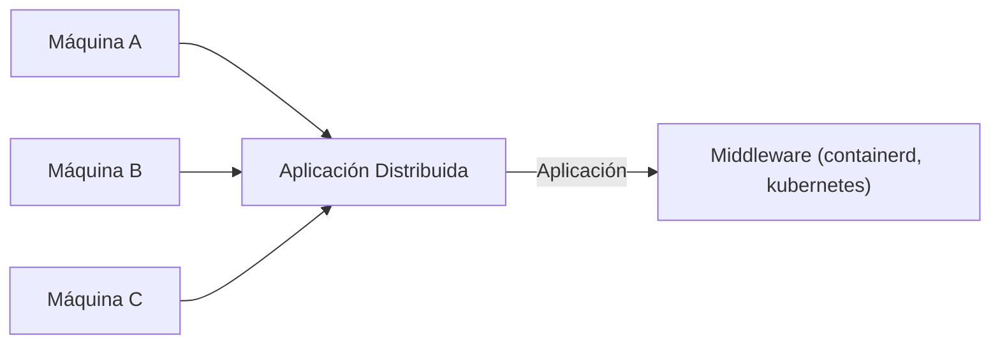

# Introducción a los Sistemas Distribuidos

## Del Paralelismo a la Distribución

Hemos explorado la **paralelización**, que consiste en aprovechar la capacidad de un **sistema individual** para ejecutar múltiples tareas simultáneamente. 

Los **sistemas distribuidos** llevan este concepto más allá: permiten que las tareas paralelas se ejecuten en **diferentes sistemas** conectados mediante una red, coordinando sus esfuerzos para resolver problemas complejos.

La esencia de los sistemas distribuidos radica en **sincronizar un conjunto de tareas** que se ejecutan en múltiples máquinas, integrando sus **resultados parciales** para obtener una solución completa.

## Escalabilidad: Dos Enfoques Fundamentales

### 🔼 Escalabilidad Vertical
- **Concepto**: Aumentar la capacidad de un único computador
- **Ejemplo**: Agregar más RAM, procesadores más potentes, o discos más rápidos a un servidor existente

### ↔️ Escalabilidad Horizontal  
- **Concepto**: Agregar capacidad de cómputo mediante más servidores
- **Ejemplo**: Un sitio web que maneja más tráfico añadiendo servidores web adicionales

## Tolerancia a Fallos: Resiliencia en Acción

Un **cluster de múltiples máquinas** es inherentemente más resistente a errores que un único nodo de cómputo.

**Ventaja clave**: Al distribuir la ejecución de programas o tareas entre varios computadores, si uno falla, el **sistema puede recuperarse fácilmente** y continuar operando. En contraste, los sistemas con un solo servidor representan un **punto único de fallo** - si ese servidor falla, todo el software deja de funcionar.

**Ejemplo práctico**: Un servicio de streaming que sigue disponible incluso cuando algunos de sus servidores experimentan problemas técnicos.

## Teorema CAP: El Trilema de los Sistemas Distribuidos

Este teorema fundamental establece que un sistema distribuido **no puede garantizar simultáneamente** las tres propiedades siguientes:

### 1. 🎯 Consistencia (Consistency)
Cada lectura recibe la escritura más reciente. Las respuestas se entregan en el orden de llegada.

**Ejemplo**: En un sistema bancario distribuido, todos los nodos muestran exactamente el mismo saldo después de una transacción.

### 2. ⚡ Disponibilidad (Availability)  
Cada solicitud recibe una respuesta, sin garantizar que sea la más reciente.

**Ejemplo**: Una red social que siempre responde, incluso si muestra información ligeramente desactualizada.

### 3. 🛡️ Tolerancia a Particiones (Partition Tolerance)
El sistema continúa funcionando a pesar de fallos en la red.

**Ejemplo**: Un servicio de mensajería que sigue operando cuando hay problemas de conectividad entre sus centros de datos.

### Escenarios del Teorema CAP:

- **Consistencia + Tolerancia a Particiones**: Al fallar un nodo, algunas solicitudes pueden perderse y el cliente debe reenviarlas
- **Disponibilidad + Tolerancia a Particiones**: Durante fallos, el sistema responde pero con posible información desactualizada
- **Consistencia + Disponibilidad**: Solo funciona en redes perfectamente estables

## Modelo BASE: Una Alternativa Práctica

### Básicamente Disponible (Basically Available)
- **El sistema siempre responde**, incluso durante condiciones de fallo

### Estado Suave (Soft State)  
- **El sistema puede cambiar** incluso sin nuevas entradas externas
- **Ejemplo**: Una caché distribuida que expira entradas automáticamente

### Consistencia Eventual (Eventual Consistency)
- **Con el tiempo, el sistema alcanzará la consistencia**
- **Ejemplo**: Una aplicación de notas que eventualmente sincroniza todos los cambios entre dispositivos

**Filosofía del modelo BASE**: Priorizar la **disponibilidad inmediata** sobre la consistencia perfecta, confiando en que el sistema se estabilizará con el tiempo, incluso si temporalmente muestra información no completamente consistente durante la recuperación de fallos.