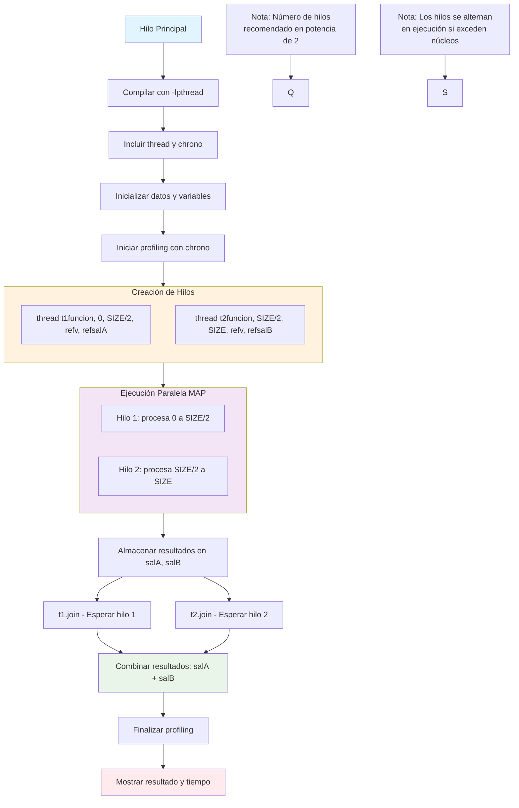

# Compilación con lpthreads

```bash
# Compilación correcta para programas multi-hilo
g++ -o programa programa.cpp -lpthread
# -std=c++11: Necesario para thread y chrono
# -lpthread: Enlaza la biblioteca de hilos POSIX
```

# Ejemplo

```c++
#include <iostream>
#include <vector>
#include <thread>
#include <chrono>

using namespace std;
using namespace std::chrono;

void funcion(int ini, int fin, const vector<int> &v, long &salida) {
    for(int i = ini; i < fin; i++) {
        salida += v[i] * v[i];  // Ejemplo: suma de cuadrados
    }
}

int main() {
    const int SIZE = 1000000;
    vector<int> datos(SIZE, 1);  // Vector de 1's para prueba
    
    // Crear hilos y variables de resultado
    long salA = 0, salB = 0;
    
    // Iniciar medición de tiempo
    auto inicio = high_resolution_clock::now();
    
    // Crear hilos (forma recomendada)
    thread t1(funcion, 0, SIZE/2, ref(datos), ref(salA));
    thread t2(funcion, SIZE/2, SIZE, ref(datos), ref(salB));
    
    // Esperar a que los hilos terminen
    t1.join();
    t2.join();
    
    // Combinar resultados
    long resultado = salA + salB;
    
    // Finalizar medición de tiempo
    auto fin = high_resolution_clock::now();
    auto duracion = duration_cast<milliseconds>(fin - inicio);
    
    cout << "Resultado: " << resultado << endl;
    cout << "Tiempo de ejecución: " << duracion.count() << " ms" << endl;
    
    return 0;
}
```

## Flujo del ejemplo



## Puntos Clave Adicionales:

1. **`std::ref()`**: Es crucial para pasar variables por referencia a los hilos
2. **`.join()`**: Bloquea el hilo principal hasta que el hilo secundario termine
3. **Potencia de 2**: Óptimo para balance de carga en particiones
4. **Chrono profiling**: Esencial para medir ganancias de performance
5. **Gestión de recursos**: Más hilos que núcleos causan *time-slicing* (alternancia)

## Recomendación de Número de Hilos:

```c++
// Óptimo: número de núcleos del sistema
unsigned int num_cores = thread::hardware_concurrency();
vector<thread> hilos(num_cores);
```

Esta implementación te permite medir exactamente la mejora de performance que obtienes con la paralelización.