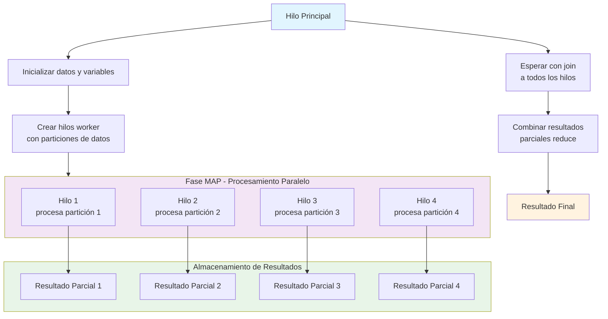

## Explicación de Paralelización en C++

El enfoque **map-reduce** que describes es excelente para paralelizar operaciones sobre colecciones de datos. En C++ esto se implementa típicamente con la biblioteca `<thread>`.

### Estructura del Código

```c++
#include <vector>
#include <thread>
#include <iostream>

void funcion(int ini, int fin, const std::vector<int>& v, long& salida) {
    for(int i = ini; i < fin; i++) {
        salida += v[i];  // Operación de "map"
    }
}

int main() {
    std::vector<int> datos = {1, 2, 3, 4, 5, 6, 7, 8, 9, 10};
    const int num_hilos = 4;
    const int elementos_por_hilo = datos.size() / num_hilos;
    
    std::vector<std::thread> hilos;
    std::vector<long> resultados_parciales(num_hilos, 0);
    
    // Fase MAP: Crear y ejecutar hilos
    for(int i = 0; i < num_hilos; i++) {
        int inicio = i * elementos_por_hilo;
        int fin = (i == num_hilos - 1) ? datos.size() : inicio + elementos_por_hilo;
        
        hilos.emplace_back(funcion, inicio, fin, std::ref(datos), 
                          std::ref(resultados_parciales[i]));
    }
    
    // Fase REDUCE: Esperar y combinar resultados
    long resultado_final = 0;
    for(int i = 0; i < num_hilos; i++) {
        hilos[i].join();  // Esperar a que cada hilo termine
        resultado_final += resultados_parciales[i];  // Combinar resultados
    }
    
    std::cout << "Resultado final: " << resultado_final << std::endl;
    return 0;
}
```

## Diagrama de Flujo de Hilos



## Puntos Clave del Diagrama:

1. **Hilo Principal**: Inicializa todo y coordina el proceso
2. **Fase MAP**: Los hilos trabajan en paralelo sobre diferentes particiones de datos
3. **Join**: El hilo principal espera a que todos los hilos terminen
4. **Fase REDUCE**: Se combinan todos los resultados parciales
5. **Resultado Final**: El producto de la operación paralelizada

Este enfoque es eficiente porque maximiza el uso de CPU mientras mantiene la simplicidad del modelo map-reduce.