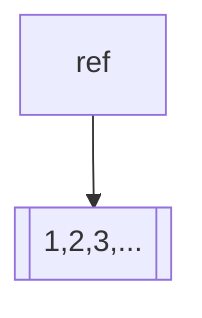
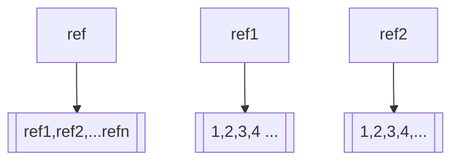

En python tenemos como base las listas, que son listas enlazadas cuya complejidad de recorrido $O(n)$

Podemos aprovechar las ventajas de C++ en el cual los arreglos son un puntero hacia una reserva de memoria

Cuando son matrices son una referencia a una reserva de memoria que tiene **punteros** que a su vez apuntan a otras reservas de memoria


El proceso

1. Genere una referencia hacia una reserva de memoria (int, bool o bien punteros)
2. El espacio de memoria va a contener el dato que usted necesita (primitivo o un puntero a una reserva memoria)
3. Este mecanismo hace que la indexación sea una operación de suma y por eso indexamos desde 0

# Instrucciones AVX

En el caso de librerias de algebra en python (numpy, tensorflow) hacer operaciones con listas, son costosas para esto vamos a utilizar una interfaz con C++, la idea es transformar código en Python a código en C++ y lo podemos hacer con la interfaz de la libreria

**Precaución** Evitar utilizar elementos python nativos como la indexación o los ciclos for para estructuras de las librerías como el caso de numpy, porque internamente se manejan como código Python
```python
import numpy as np
arr = np.ones(100)
suma = 0
for i in range(0,100):
	suma+=arr[i]
```
Este código es ineficiente, porque estamos forzando a que se haga a nivel de listas
```python
```python
import numpy as np
arr = np.ones(100)
suma = np.sum(arr)
```
Internamente np.sum genera un código en C++ optimizada para la tarea

# Compilación
Para activar el emsamblador (codigo de maquina) de las instrucciones AVX debo agregar la flag -maxv

```bash
g++ -o exe archivo.cpp -maxv
```
Esta flag le indica al compilador que debe utilizar las instrucciones AVX del procesador
# Ejemplos

## Ejemplo 1
Crear un arreglo de 100 unos
```python
import numpy as np

arr = np.ones((100))
print(arr)
```
Equivale a
```C++
#include <iostream>
#include <vector>
#include <numeric> // for std::fill

int main() {
    // Declare a vector of 100 doubles
    std::vector<double> arr(100);
    
    // Initialize the vector with ones
    std::fill(arr.begin(), arr.end(), 1.0);
    
    // Print the elements (optional)
    for (double val : arr) {
        std::cout << val << " ";
    }
    
    std::cout << std::endl;
    
    return 0;
}
```

## Ejemplo

Producto punto entre dos vectores

```python
import numpy as np

arr1 = np.array([1.0, 2.0, 3.0, 4.0])
arr2 = np.array([5.0, 6.0, 7.0, 8.0])
result_arr = arr1 + arr2

print("Array 1:", arr1)
print("Array 2:", arr2)
print("Result:", result_arr)
```

Equivale a

```cpp
#include <iostream>
#include <vector>

int main() {
	std::vector<double> arr1 = {1.0, 2.0, 3.0, 4.0};
	std::vector<double> arr2 = {5.0, 6.0, 7.0, 8.0};
	std::vector<double> result_arr(arr1.size());
	
	for(size_t i=0;i<arr1.size();++i){
	result_arr[i]=arr1[i]+arr2[i];
	}
	
	std::cout<<"Array 1: ";
	for(double val:arr1){
	std::cout<<val<<" ";
	}
	std::cout<<std::endl;
	
	std::cout<<"Array 2: ";
	for(double val:arr2){
	std::cout<<val<<" ";
	}
	std::cout<<std::endl;
	
	std::cout<<"Result: ";
	for(double val:result_arr){
	std::cout<<val<<" ";
	}
	std::cout<<std::endl;
	
	return 0;
}
```
Observese el uso de iteradores para los prints, que es una forma evitar los problemas de los for clásicos. El operador + en python es azucar sintáctico de np.sum

## Ejemplo 3

Ahora vamos a analizar con tipos de datos provistos directamente por las instrucciones AVX

Esto nos provee tipos de datos provistos por AVX, como el caso de los double de 256 bits.

```c
#include <immintrin.h>
#include <cstdio>

int main() {
    __m256 a = _mm256_set_ps(4.0, 3.0, 2.0, 1.0, 8.0, 7.0, 6.0, 5.0);
    __m256 b = _mm256_set_ps(8.0, 7.0, 6.0, 5.0, 4.0, 3.0, 2.0, 1.0);
    __m256 result = _mm256_add_ps(a, b);

    float* res = (float*)&result;
    for (int i = 0; i < 8; i++) {
        printf("%f ", res[i]);
    }
    printf("\n");

    return 0;
}
```

### **__m256 y su comparativa con tipos primitivos**

El tipo `__m256` es un tipo de dato vectorial intrínseco de AVX que representa un registro de 256 bits capaz de almacenar:

- 8 valores de punto flotante de 32 bits (float)
- 4 valores de punto flotante de 64 bits (double) cuando se usa `__m256d`

**Comparativa de tipos AVX vs tipos primitivos:**

| Tipo AVX | Ancho (bits) | Capacidad | Tipo primitivo equivalente | Operaciones vectoriales |
|----------|-------------|-----------|----------------------------|-------------------------|
| `__m128` | 128 | 4 floats | `float[4]` | SSE |
| `__m128d` | 128 | 2 doubles | `double[2]` | SSE2 |
| `__m128i` | 128 | enteros (16x8b, 8x16b, 4x32b, 2x64b) | varios tipos enteros | SSE2/SSE4.1 |
| `__m256` | 256 | 8 floats | `float[8]` | AVX |
| `__m256d` | 256 | 4 doubles | `double[4]` | AVX |
| `__m256i` | 256 | enteros (32x8b, 16x16b, 8x32b, 4x64b) | varios tipos enteros | AVX2 |

**Ventajas de __m256 sobre double:**
- **Paralelismo**: Opera con 8 floats simultáneamente (vs 1 double a la vez)
- **Rendimiento**: Hasta 8x más rápido en operaciones vectorizables
- **Ancho de banda**: Mejor utilización de la memoria caché
- **Instrucciones especializadas**: Operaciones matemáticas optimizadas (_mm256_add_ps, _mm256_mul_ps, etc.)

**Limitaciones:**
- Requiere alineación de memoria específica (32 bytes para AVX)
- Mayor complejidad de programación
- Portabilidad limitada (requiere hardware compatible con AVX)

El código que proporcionaste usa `__m256` para sumar 8 valores float simultáneamente, demostrando el paralelismo a nivel de datos que ofrece AVX.
