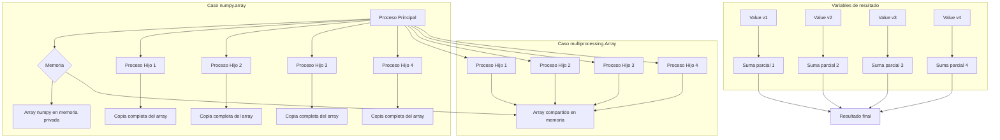

La limitación de los multiprocesos es que **no comparten contexto** por lo que no se pueden comunicar directamente o compartir variables, es equivalente a lanzar el programa de nuevo muchas veces. Dado que no comparten contexto no se puede comunicar directamente entre si

Cuando tenemos variables que compartimos como las listas, cuando se pasan a los procesos se replican, lo que es costoso en memoria, para esto multiprocessing nos ofrece
Value y Array, Value nos permite compartir valores y Array nos permitir compartir arreglos.
Z

```python
"""
Autor: Carlos A Delgado
Fecha: 23 de Septiembre 2025
Ejemplo de multiprocessing en Python
"""

import time
from multiprocessing import Process
from multiprocessing import Array
from multiprocessing import Value


def suma_lista(ini, fin, l, v):
    suma = 0
    for i in range(ini, fin):
        suma += l[i]  # Suma elementos del segmento asignado
    v.value = suma  # Almacena resultado en variable compartida


def inicializar(ini, fin, l):
    for i in range(ini, fin):
        l[i] = i  # Inicializa array con valores secuenciales


def main():
    size = 10_000_000
    l = Array("l", size)  # Crea array compartido de tipo long
    inicializar(0, size, l)
    print(l[:20])  # Muestra primeros 20 elementos
    
    # Ejecución secuencial
    ini = time.time()
    print(sum(l))  # Suma usando función built-in de Python
    fin = time.time()
    print("El tiempo secuencial es seg " + str(fin - ini))

    # Ejecución paralela
    ini = time.time()
    v1 = Value("l")  # Variable compartida tipo long para proceso 1
    v2 = Value("l")  # Variable compartida tipo long para proceso 2
    v3 = Value("l")  # Variable compartida tipo long para proceso 3
    v4 = Value("l")  # Variable compartida tipo long para proceso 4
    
    # Divide el trabajo en 4 segmentos iguales
    p1 = Process(target=suma_lista, args=(0, size // 4, l, v1))
    p2 = Process(target=suma_lista, args=(size // 4, 2 * size // 4, l, v2))
    p3 = Process(target=suma_lista, args=(2 * size // 4, 3 * size // 4, l, v3))
    p4 = Process(target=suma_lista, args=(3 * size // 4, size, l, v4))

    p1.start()
    p2.start()
    p3.start()
    p4.start()

    p1.join()
    p2.join()
    p3.join()
    p4.join()

    fin = time.time()
    print(v1.value + v2.value + v3.value + v4.value)  # Combina resultados
    print("El tiempo en 4 procesos en s es " + str(fin - ini))


if __name__ == "__main__":
    main()
```



**Diferencia entre numpy.array y multiprocessing.Array:**

- **numpy.array**: Cada proceso hijo recibe una copia completa del array en memoria separada, consumiendo 4× la memoria original y requiriendo serialización/deserialización
- **multiprocessing.Array**: Todos los procesos acceden al mismo array en memoria compartida, evitando duplicación y permitiendo acceso concurrente sincronizado

El código usa Array("l", size) para crear un array compartido de tipo long, donde "l" indica el tipo de dato. Los procesos acceden directamente a los mismos datos en memoria, optimizando el uso de recursos. Las variables Value("l") almacenan los resultados parciales de forma compartida, permitiendo la combinación final sin necesidad de comunicación adicional.
