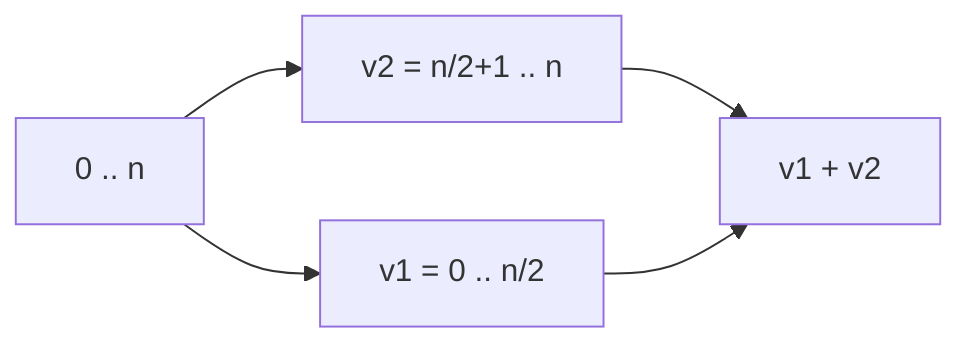

# Abstracción parallel

Esta abstracción toma dos tareas (expresiones) $e_1$ y $e_2$, las computa en **paralelo** y devuelve una pareja con los resultados.

Para el curso se encuentra la librería `common` ubicada en:
`/app/src/main/scala/common/package.scala`

Para usarla se requiere:
```scala
import common._
```

Existen dos versiones principales:
1. `parallel(A, B)` - recibe dos tareas
2. `parallel(A, B, C, D)` - recibe cuatro tareas

Se pueden implementar más versiones siguiendo el mismo patrón.


## Ejemplo: Suma de potencias

Para la sumatoria:
$$\sum \limits_{i=0}^{n} ar^i$$

Se puede dividir en **intervalos disyuntos** cuya unión sea igual al conjunto original. Esta estrategia se conoce como **separación por segmentos**.

```scala
package taller
import common._

object App {

  def sumaParcial(r: Int, a: Int, ini: Int, fin: Int): Long = {
    (ini to fin).foldLeft(0L)((acc: Long, i: Int) => (acc + a * Math.pow(r, i).toLong))
  }

  def main(args: Array[String]): Unit = {
    val r = 2 
    val a = 3 
    val n = 50
    
    // Versión con 2 hilos
    val (v1, v2) = parallel(
      sumaParcial(r, a, 0, n/2),
      sumaParcial(r, a, n/2 + 1, n)
    )
    println(v1 + v2)
    println(sumaParcial(r, a, 0, n))
    println((a * Math.pow(r, n + 1) - a) / (r - 1))

    // Versión con 4 hilos
    val (v3, v4, v5, v6) = parallel(
      sumaParcial(r, a, 0, n/4),
      sumaParcial(r, a, n/4 + 1, n/2),
      sumaParcial(r, a, n/2 + 1, 3 * n/4),
      sumaParcial(r, a, 3 * n/4 + 1, n)
    )
    println(v3 + v4 + v5 + v6)
  }
}
```

## Estrategia de división



La operación de **dividir** se llama **map (paralelo)** y la de **juntar resultados** se llama **join/reduce**.

El objetivo es trabajar mediante **índices**, donde las colecciones no se dividen físicamente, sino que se realiza una división **lógica** utilizando los índices.