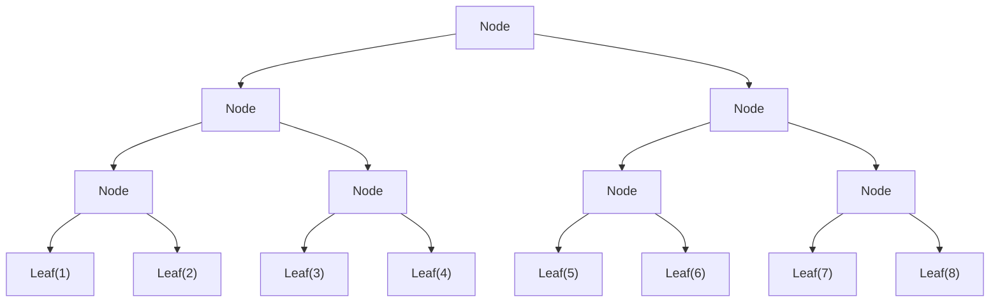
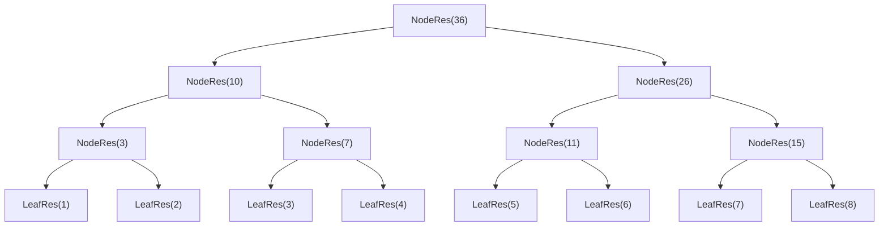
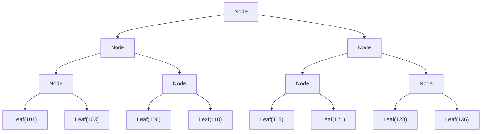

El scan es una operación de acumulación de resultados

```scala
scala> List(1,2,3).scan(0)((acc,x)=> acc + x)
val res0: List[Int] = List(0, 1, 3, 6)
/*
((0 + 1) + 2) + 3))
```

- scanLeft asocia por la izquierda
- scanRight asocia por la derecha
```scala
scala> List(1,2,3).scanRight(0)((acc,x)=> acc + x)
val res1: List[Int] = List(6, 5, 3, 0)
/*
(1 2 3)
( 1 +  (2 + (3  + 0)))
```

Al implementar el scanleft se tiene el siguiente código

```scala
  def scanLeft(a: Array[Int], acc:Int, f:(Int,Int)=>Int, sal:Array[Int]): Unit = {
    sal(0) = acc
    for (i <- 1 to a.length) {
      sal(i) = f(sal(i - 1), a(i-1))
    }

  } 

```

Se observa que hay una dependencia entre sal(i-1) con sal(i)

# Implementación usando árboles


Construir un arbol de valores

```scala

sealed abstract class Tree[A]
case class Leaf[A](value: A) extends Tree[A] {
  override def toString: String = s"Leaf($value) "
}
case class Node[A](left: Tree[A], right: Tree[A]) extends Tree[A] {
  override def toString: String = s"Node($left, $right)"
}
```

El cual vamos a construir nuestro dato inicial y vamos a recibir el resultado final, por ejemplo para la coleccion (1,2,3,4,5,6,7,8) tenemos

```scala
    val t:Tree[Int] = Node(
        Node(
          Node( Leaf(1), Leaf(2)),
          Node( Leaf(3), Leaf(4))
        ),
        Node(
          Node( Leaf(5), Leaf(6)),
          Node( Leaf(7), Leaf(8))
        )
    )
```
Corresponde a:




Ahora vamos a construir un árbol de resultados parciales, que vamos a usar como acumulador para calcular el resultado final, esto con el fin de romper las dependencias

```scala
  def reduceRes[A](t: Tree[A], f : (A,A) => A): TreeRes[A] = {
    t match {

      case Leaf(v) => LeafRes(v)
      case Node(l, r) => {
        val (lr, rr) = parallel(
          reduceRes(l, f), 
          reduceRes(r, f)
        )
        NodeRes(lr, f(lr.res, rr.res), rr)
      }
    }
  }


```

Este procedimiento nos construye un arbol resultados parciales (acumuladores parciales)


```

```




Y ahora vamos a calcular el arbol final, la idea es usar el acumulador a la izquierda y la derecha usar el acumulador obtenido de resultado de la izquierda

```scala
  def llenarBajando[A](t: TreeRes[A], acc:A, f:(A,A)=>A): Tree[A] = {
    t match {
      case LeafRes(v) => Leaf(f(acc, v))
      case NodeRes(l, v, r) => {
        val (ll, rr) = parallel(
          llenarBajando[A](l, acc, f),
          llenarBajando[A](r, f(acc, l.res), f)
        )
        Node(ll, rr)
      }
    }
  }
```


Voy a mostrar el paso a paso de la ejecución de `llenarBajando` con el árbol de resultados proporcionado.

**Árbol de entrada:**
```
NodeRes(
  NodeRes(
    NodeRes(LeafRes(1), 3, LeafRes(2)), 
    10, 
    NodeRes(LeafRes(3), 7, LeafRes(4))
  ), 
  36, 
  NodeRes(
    NodeRes(LeafRes(5), 11, LeafRes(6)), 
    26, 
    NodeRes(LeafRes(7), 15, LeafRes(8))
  )
)
```

**Llamada inicial:**
`llenarBajando(tr, 100, (acc:Int, x:Int) => acc + x)`

---

### **Paso 1: Nivel raíz**
- `t = NodeRes(l, 36, r)` donde `l.res = 10`, `r.res = 26`
- `acc = 100`
- Se llama en paralelo:
  - `llenarBajando(l, 100, +)` → izquierda
  - `llenarBajando(r, f(100, 10) = 110, +)` → derecha

---

### **Paso 2: Subárbol izquierdo (l)**
`NodeRes(NodeRes(LeafRes(1), 3, LeafRes(2)), 10, NodeRes(LeafRes(3), 7, LeafRes(4)))`

- `acc = 100`
- Se llama en paralelo:
  - `llenarBajando(NodeRes(LeafRes(1), 3, LeafRes(2)), 100, +)`
  - `llenarBajando(NodeRes(LeafRes(3), 7, LeafRes(4)), f(100, 3) = 103, +)`

#### **Paso 2.1: Subárbol izquierdo-izquierdo**
`NodeRes(LeafRes(1), 3, LeafRes(2))`

- `acc = 100`
- Se llama en paralelo:
  - `llenarBajando(LeafRes(1), 100, +)` → `Leaf(100 + 1) = Leaf(101)`
  - `llenarBajando(LeafRes(2), f(100, 1) = 101, +)` → `Leaf(101 + 2) = Leaf(103)`
- Resultado: `Node(Leaf(101), Leaf(103))`

#### **Paso 2.2: Subárbol izquierdo-derecho**
`NodeRes(LeafRes(3), 7, LeafRes(4))`

- `acc = 103`
- Se llama en paralelo:
  - `llenarBajando(LeafRes(3), 103, +)` → `Leaf(103 + 3) = Leaf(106)`
  - `llenarBajando(LeafRes(4), f(103, 3) = 106, +)` → `Leaf(106 + 4) = Leaf(110)`
- Resultado: `Node(Leaf(106), Leaf(110))`

**Resultado subárbol izquierdo:** `Node(Node(Leaf(101), Leaf(103)), Node(Leaf(106), Leaf(110)))`

---

### **Paso 3: Subárbol derecho (r)**
`NodeRes(NodeRes(LeafRes(5), 11, LeafRes(6)), 26, NodeRes(LeafRes(7), 15, LeafRes(8)))`

- `acc = 110`
- Se llama en paralelo:
  - `llenarBajando(NodeRes(LeafRes(5), 11, LeafRes(6)), 110, +)`
  - `llenarBajando(NodeRes(LeafRes(7), 15, LeafRes(8)), f(110, 11) = 121, +)`

#### **Paso 3.1: Subárbol derecho-izquierdo**
`NodeRes(LeafRes(5), 11, LeafRes(6))`

- `acc = 110`
- Se llama en paralelo:
  - `llenarBajando(LeafRes(5), 110, +)` → `Leaf(110 + 5) = Leaf(115)`
  - `llenarBajando(LeafRes(6), f(110, 5) = 115, +)` → `Leaf(115 + 6) = Leaf(121)`
- Resultado: `Node(Leaf(115), Leaf(121))`

#### **Paso 3.2: Subárbol derecho-derecho**
`NodeRes(LeafRes(7), 15, LeafRes(8))`

- `acc = 121`
- Se llama en paralelo:
  - `llenarBajando(LeafRes(7), 121, +)` → `Leaf(121 + 7) = Leaf(128)`
  - `llenarBajando(LeafRes(8), f(121, 7) = 128, +)` → `Leaf(128 + 8) = Leaf(136)`
- Resultado: `Node(Leaf(128), Leaf(136))`

**Resultado subárbol derecho:** `Node(Node(Leaf(115), Leaf(121)), Node(Leaf(128), Leaf(136)))`

---

### **Resultado final:**
```
Node(
  Node(
    Node(Leaf(101), Leaf(103)),
    Node(Leaf(106), Leaf(110))
  ),
  Node(
    Node(Leaf(115), Leaf(121)),
    Node(Leaf(128), Leaf(136))
  )
)
```

**Valores en orden:**
- 101, 103, 106, 110, 115, 121, 128, 136

Esto corresponde al scan left con acumulador inicial 100:
```
100 + 1 = 101
101 + 2 = 103  
103 + 3 = 106
106 + 4 = 110
110 + 5 = 115
115 + 6 = 121
121 + 7 = 128
128 + 8 = 136
```



A medida que el algoritmo avanza

- Subarbol izquierdo: Toma el acumulador normalmente
- Subarbol derecho: Toma el acumulador y lo suma con el resultado parcial de su hermano izquierdo

Esto rompe la dependencia entre los valores y podemos paralelizar.