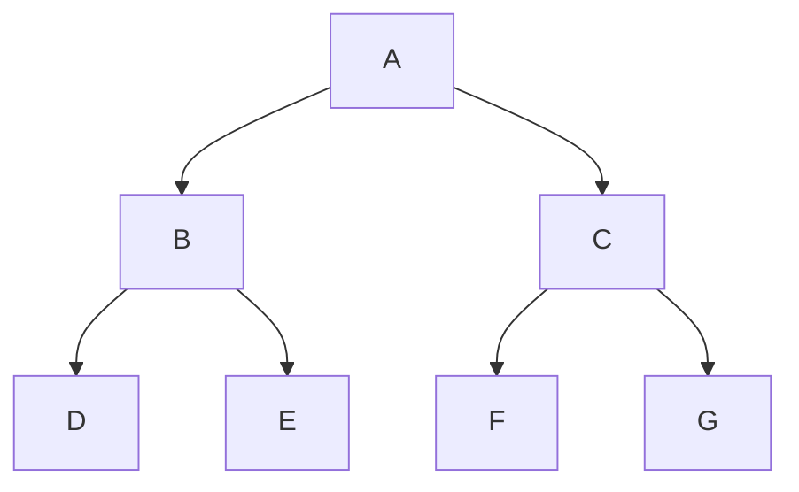

Vamos a estudiar en qué condiciones podemos hacer paralelismo.

1. Sobre las propiedades de las colecciones
2. Propiedades de las operaciones: Asociativas e independientes

# Operaciones en Programación Funcional (PF)

```scala
scala> val l = List(4,5,6)
val l: List[Int] = List(4, 5, 6)

// Map: aplica una función a cada elemento de la lista
scala> l.map(x => 2*x)
val res0: List[Int] = List(8, 10, 12)

// FoldLeft: acumula valores de izquierda a derecha
scala> l.foldLeft(0)((acc,x) => acc + x)
val res1: Int = 15

// Scan: similar a fold pero devuelve todos los resultados intermedios
scala> l.scan(0)((acc,x) => acc + x)
val res2: List[Int] = List(0, 4, 9, 15)
```

Estas operaciones las podemos paralelizar siempre y cuando las funciones que estemos aplicando sean asociativas. La asociatividad permite que las operaciones se puedan dividir y combinar sin importar el orden de ejecución.

# Estructuras de datos

## List

Esta estructura no es apropiada para paralelizar. Está compuesta de una cabeza y cola. Al intentar dividir una lista debemos tener en cuenta que cada elemento requiere que se hayan recorrido los anteriores, esto hace que trabajar con listas sea **ineficiente** para paralelismo debido a su naturaleza secuencial.

```scala
// Construcción de lista usando el operador cons (::)
1 :: 2 :: 3 :: Nil
```

## Vector y Array

Los vectores y los arrays son fácilmente paralelizables, ya que se acceden por índice, lo que facilita dividirlos o combinarlos, ya que para acceder a un elemento sólo requerimos su posición.

1. Vector es una colección que optimiza la inserción de los elementos
2. Array es una colección que optimiza el acceso a los elementos

**Concepto teórico adicional:** Las estructuras de acceso aleatorio como Vector y Array permiten dividir el trabajo en chunks de tamaño similar, lo que facilita la distribución equitativa de carga entre diferentes hilos de ejecución.

# Árboles

Los árboles son naturalmente paralelizables, dado que se puede procesar cada vértice de forma independiente. Esta estructura jerárquica permite aplicar el principio "divide y vencerás" de manera eficiente.



En este caso cuando trabajamos con el vértice A podemos trabajar de forma paralela al vértice B y al vértice C. Cada subárbol puede procesarse independientemente y luego combinar los resultados.

**Concepto teórico adicional:** En programación paralela, los árboles permiten implementar algoritmos como Map-Reduce de manera natural, donde el mapeo se realiza en cada nodo del árbol y la reducción combina los resultados de los subárboles.