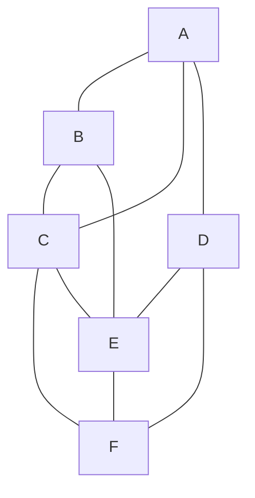

Tenemos dos estrategias búsqueda por amplitud (BFS) y búsqueda por profundidad (DFS) ambas funciones en grafos desde un nodo inicial.



La busqueda por amplitud mirar los vecinos en un orden $n$, en orden 1 son los vértices adyacentes al vertice inicial, orden 2, son los vertices adyacentes a estados (distancia 2)

Partiendo de A, entonces

```java
Cola = {}
VIsitados = {A}

Cola = {B,C,D}
Visitados = {A}

Cola = {C,D,E}
Visitados = {A,B}

Cola = {D,E,F}
Visitados = {A,B,C}

Cola = {E,F}
Vistados = {A,B,C,D}

Cola = {F}
Visitados = {A,B,C,D,E}

Cola = {}
Visitados = {A,B,C,D,E,F}
----

```

En la busqueda por profundidad es el mismo mecanismo pero usamos una pila, eso quiere decir que vamos a expandir los nodos desde el último que agregue

```java
Pila = {A}
Visitados = {}

Pila = {D,C,B}
Visitados = {A}

Pila = {F,E,C,B}
Visitados = {A,D}

Pila = {E,C,B}
Visitados = {A,D,F}

Pila = {C,B}
Visitados = {A,D,F,E}

Pila = {B}
Visitados = {A,D,F,E,C}

Pila = {}
Visitados = {A,D,F,E,C,B}
----

```

La busqueda por profundidad es dirigda, esto quiere decir que voy a preferir cierta direccion y esto es la base de algoritmos IA como la busqueda avara y el algoritmo A*