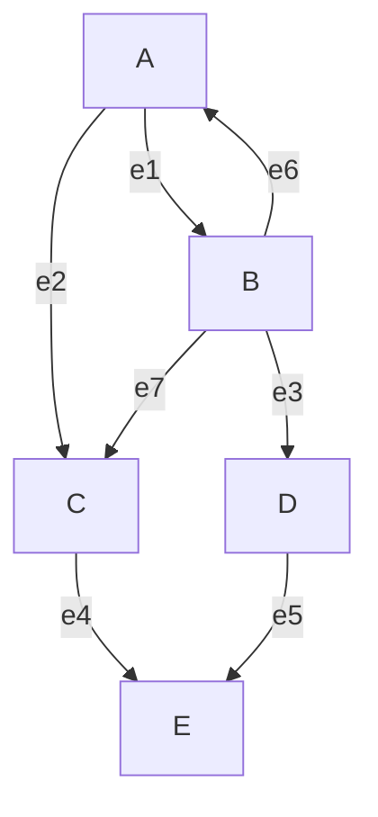

# Representaciones de grafos dirigidos

## Matriz de adyacencia

Los grafos dirigidos son aquellos donde las aristas tienen dirección, es decir, $(A,B)$ no es lo mismo que $(B,A)$.

En la matriz de adyacencia para grafos dirigidos, el vértice de salida corresponde a la fila $i$ y el vértice de entrada a la columna $j$.

$$
\begin{bmatrix}
- & A & B & C & D & E \\
A & 0 & 1 & 1 & 0 & 0\\
B & 1 & 0 & 1 & 1 & 0\\
C & 0 & 0 & 0 & 0 & 1\\
D & 0 & 0 & 0 & 0 & 1\\
E & 0 & 0 & 0 & 0 & 0\\
\end{bmatrix}
$$

En este caso no hay simetría triangular como en los grafos no dirigidos, ya que $M[i,j]$ puede ser diferente de $M[j,i]$.

## Matriz de incidencia

No es posible representar la dirección usando solo 0 y 1 como en grafos no dirigidos. Por esta razón se crea el siguiente esquema:

Para una arista dirigida de $i$ a $j$, en la posición $i$ colocamos 1 (vértice de salida) y en la posición $j$ colocamos -1 (vértice de entrada).

$$
\begin{bmatrix}
- & e1 & e2 & e3 & e4 & e5 & e6 & e7 \\
A & -1 & -1 & 0 & 0 & 0 & 1 & 0\\
B & 1 & 0 & -1 & 0 & 0 & -1 & -1\\
C & 0 & 1 & 0 & -1 & 0 & 0 & 1\\
D & 0 & 0 & 1 & 0 & -1 & 0 & 0\\
E & 0 & 0 & 0 & 1 & 1 & 0 & 0\\
\end{bmatrix}
$$

## Lista de aristas

Funciona de manera similar a los grafos no dirigidos, pero $(A,B)$ es diferente de $(B,A)$ debido a la dirección de la arista.

## Conceptos teóricos adicionales

### Grafos dirigidos (digrafos)
Un grafo dirigido $G = (V, E)$ consiste en un conjunto de vértices $V$ y un conjunto de aristas dirigidas $E$, donde cada arista es un par ordenado $(u,v)$ con $u, v \in V$ y $u \neq v$. La arista $(u,v)$ indica una relación direccional de $u$ a $v$.

### Propiedades de la matriz de adyacencia en digrafos
1. **No simétrica**: En general, $M[i,j] \neq M[j,i]$
2. **Suma de filas**: La suma de los elementos de la fila $i$ representa el grado de salida del vértice $i$
3. **Suma de columnas**: La suma de los elementos de la columna $j$ representa el grado de entrada del vértice $j$
4. **Caminos dirigidos**: $M^k[i,j]$ indica el número de caminos dirigidos de longitud $k$ desde $i$ hasta $j$

### Propiedades de la matriz de incidencia en digrafos
1. **Representación de dirección**: Cada columna tiene exactamente un 1 (salida) y un -1 (entrada)
2. **Suma por columna**: La suma de cada columna es 0
3. **Interpretación**: Los 1 indican vértices de salida, los -1 indican vértices de entrada

### Grado en grafos dirigidos
- **Grado de entrada (in-degree)**: Número de aristas que llegan a un vértice
- **Grado de salida (out-degree)**: Número de aristas que salen de un vértice
- **Grado total**: Suma del grado de entrada y salida

## Tabla de resumen

| Representación | Dimensión | Espacio | Características clave | Ventajas | Desventajas |
| -------------- | --------- | ------- | --------------------- | -------- | ----------- |
| Matriz de adyacencia | $n \times n$ | $O(n^2)$ | - No simétrica - $M[i,j]=1$ si hay arista de $i$ a $j$ - Fila $i$: grado de salida - Columna $j$: grado de entrada | - Verificación rápida de adyacencia ($O(1)$) - Cálculo eficiente de caminos ($M^k$) - Fácil implementación | - Consumo alto de memoria - Ineficiente para grafos dispersos |
| Matriz de incidencia | $n \times m$ | $O(n \times m)$ | - 1 para vértice de salida - -1 para vértice de entrada - Suma por columna = 0 - Cada columna tiene un 1 y un -1 | - Representa explícitamente dirección - Útil para problemas de flujo - Fácil identificación de fuentes y sumideros | - Mayor consumo que lista de aristas - Menos eficiente para consultas de adyacencia |
| Lista de aristas | $m$ pares ordenados | $O(m)$ | - Pares ordenados $(u,v)$ - $(u,v) \neq (v,u)$ - Representación compacta | - Muy eficiente en espacio - Simple de implementar - Fácil iteración sobre aristas | - Verificación de adyacencia ineficiente ($O(m)$) - No facilita acceso rápido a vecinos salientes/entrantes |

## Comentarios adicionales

1. **Fuentes y sumideros**: En un grafo dirigido, un vértice fuente tiene grado de entrada 0, mientras que un sumidero tiene grado de salida 0. Estas propiedades son fáciles de identificar en la matriz de adyacencia (columna/suma de filas).

2. **Ciclos dirigidos**: La existencia de ciclos dirigidos puede detectarse mediante potencias de la matriz de adyacencia. Si $M^k[i,i] > 0$ para algún $k$, existe un ciclo que incluye al vértice $i$.

3. **Grafos acíclicos dirigidos (DAG)**: Son grafos dirigidos sin ciclos. En un DAG, es posible ordenar topológicamente los vértices de modo que todas las aristas apunten en una dirección consistente.

4. **Transpuesta de un grafo dirigido**: La transpuesta $G^T$ de un grafo dirigido $G$ se obtiene invirtiendo la dirección de todas las aristas. En la matriz de adyacencia, esto corresponde a la matriz transpuesta $M^T$.

5. **Aplicaciones**: Los grafos dirigidos modelan relaciones asimétricas como:
   - Dependencias entre tareas (ordenamiento topológico)
   - Redes de flujo (tráfico, datos, fluidos)
   - Relaciones jerárquicas (organigramas)
   - Máquinas de estado finito

6. **Representación alternativa - Listas de adyacencia**: Aunque no se cubre aquí, las listas de adyacencia son muy utilizadas para grafos dirigidos, manteniendo listas separadas para vecinos salientes y entrantes, ofreciendo un buen equilibrio entre espacio y tiempo de consulta.