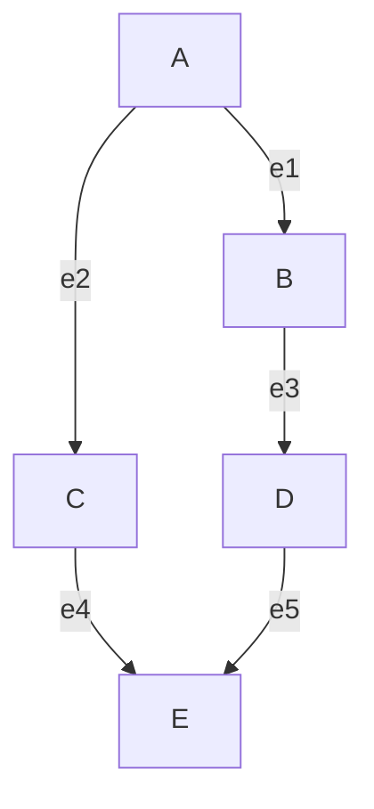

# Representaciones de grafos no dirigidos

## Matriz de adyacencia

La matriz de adyacencia $M[i,j]$ es una matriz cuadrada de tamaño $n \times n$, donde $n$ es el número de vértices del grafo. Cada entrada $M[i,j]$ toma el valor 1 si existe una arista entre los vértices $i$ y $j$, y 0 en caso contrario.

La matriz de adyacencia correspondiente al grafo anterior es:

$$
\begin{bmatrix}
- & A & B & C & D & E \\
A & 0 & 1 & 1 & 0 & 0\\
B & 1 & 0 & 0 & 1 & 0\\
C & 1 & 0 & 0 & 0 & 1\\
D & 0 & 1 & 0 & 0 & 1\\
E & 0 & 0 & 1 & 1 & 0\\
\end{bmatrix}
$$

Nótese que para grafos no dirigidos la matriz es simétrica respecto a su diagonal principal, ya que si existe una arista entre $i$ y $j$, también existe entre $j$ e $i$.

## Matriz de incidencia

La matriz de incidencia relaciona vértices con aristas. Es una matriz de tamaño $n \times m$, donde $n$ es el número de vértices y $m$ el número de aristas. Cada entrada indica si un vértice es incidente a una arista (valor 1) o no (valor 0).

Para el mismo grafo, la matriz de incidencia sería:

$$
\begin{bmatrix}
- & e1 & e2 & e3 & e4 & e5 \\
A & 1 & 1 & 0 & 0 & 0\\
B & 1 & 0 & 1 & 0 & 0\\
C & 0 & 1 & 0 & 1 & 0\\
D & 0 & 0 & 1 & 0 & 1\\
E & 0 & 0 & 0 & 1 & 1\\
\end{bmatrix}
$$

Esta matriz tiene la característica de que cada columna (que representa una arista) contiene exactamente dos unos, correspondientes a los dos vértices que une dicha arista.

## Lista de aristas

La lista de aristas es una representación compacta que enumera todas las aristas del grafo como pares de vértices:

$(A,B), (A,C), (B,D), (C,E), (D,E)$

Esta representación es especialmente eficiente en términos de espacio para grafos dispersos (con pocas aristas en relación al número máximo posible).

## Conceptos teóricos adicionales

### Grafos no dirigidos
Un grafo no dirigido $G = (V, E)$ consiste en un conjunto de vértices $V$ y un conjunto de aristas $E$, donde cada arista es un par no ordenado de vértices distintos. A diferencia de los grafos dirigidos, las aristas no tienen dirección.

### Complejidad espacial
- **Matriz de adyacencia**: Requiere $O(n^2)$ espacio, siendo $n$ el número de vértices.
- **Matriz de incidencia**: Requiere $O(n \times m)$ espacio, siendo $m$ el número de aristas.
- **Lista de aristas**: Requiere $O(m)$ espacio.

### Operaciones y eficiencia
- **Verificar adyacencia**: En matriz de adyacencia es $O(1)$, en lista de aristas es $O(m)$.
- **Obtener vecinos**: En matriz de adyacencia es $O(n)$, en lista de aristas requiere recorrer todas las aristas.
- **Inserción/eliminación de aristas**: En matriz de adyacencia es $O(1)$, en lista de aristas es $O(1)$ si se mantiene como lista enlazada.

## Tabla de resumen

| Representación | Dimensión | Espacio | Ventajas | Desventajas |
| -------------- | --------- | ------- | -------- | ----------- |
| Matriz de adyacencia | $n \times n$ | $O(n^2)$ | - Verificación rápida de adyacencia ($O(1)$) - Fácil implementación - Ideal para grafos densos | - Consumo alto de memoria para grafos dispersos - Ineficiente para recorrer vecinos |
| Matriz de incidencia | $n \times m$ | $O(n \times m)$ | - Representa explícitamente aristas - Útil para problemas de flujo y redes | - Mayor consumo que lista de aristas - Menos común en implementaciones prácticas |
| Lista de aristas | $m$ pares | $O(m)$ | - Muy eficiente en espacio para grafos dispersos - Simple de implementar | - Verificación de adyacencia ineficiente ($O(m)$) - No facilita acceso rápido a vecinos |

## Comentarios adicionales

1. **Selección de representación**: La elección depende del tipo de grafo y las operaciones más frecuentes. Para grafos densos, la matriz de adyacencia suele ser mejor. Para grafos dispersos, las listas de adyacencia (no cubiertas aquí) o lista de aristas son más eficientes.

2. **Grafos ponderados**: Estas representaciones pueden extenderse para grafos con pesos en las aristas. En matriz de adyacencia, se almacena el peso en lugar de 1. En lista de aristas, se añade un tercer elemento al par.

3. **Implementación práctica**: En programación competitiva y aplicaciones reales, las listas de adyacencia (donde cada vértice tiene una lista de sus vecinos) son muy populares por equilibrar espacio y tiempo de consulta.

4. **Simetría en grafos no dirigidos**: La propiedad de simetría en la matriz de adyacencia permite optimizaciones de almacenamiento (solo guardar la triangular superior o inferior), reduciendo el espacio a la mitad.

5. **Conectividad**: La matriz de adyacencia elevada a la potencia $k$ ($M^k$) indica el número de caminos de longitud $k$ entre cada par de vértices, una propiedad útil en teoría de grafos.