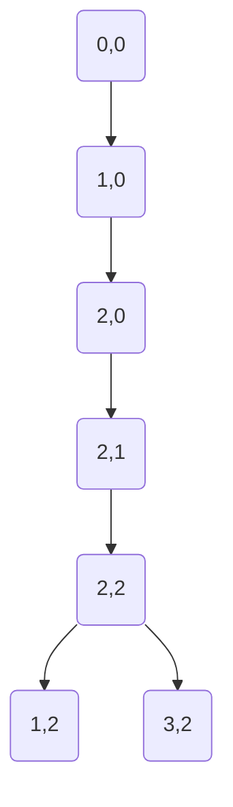

# Grafo implícito

Un **grafo implícito** es un grafo que no está explícitamente definido por una estructura de datos tradicional (como matriz de adyacencia o listas de adyacencia), sino que se deriva de la representación de un problema. La estructura del grafo y las conexiones entre nodos se determinan mediante reglas o transformaciones aplicadas a los estados del problema.

## Ejemplo: Grilla 2D con obstáculos

Consideremos un problema típico donde un jugador debe navegar por una grilla 2D para alcanzar una meta. La grilla contiene:
- **X**: Posición inicial del jugador
- **#**: Paredes u obstáculos (no accesibles)
- **0**: Posiciones libres (accesibles)
- **2**: Meta (objetivo)

Ejemplo de grilla:
```
X # 0 0 0
0 # 0 0 0
0 0 0 # 2
# # 0 0 0
```

## Mapeo a grafo implícito

Para transformar esta grilla en un grafo implícito:
1. **Nodos**: Cada celda accesible (0, X, 2) se convierte en un nodo.
2. **Aristas**: Existe una arista entre dos nodos si las celdas correspondientes son adyacentes (horizontal o verticalmente) y ambas son accesibles.
3. **Acciones**: Los movimientos posibles (arriba, abajo, izquierda, derecha) definen las transiciones entre estados.

## Representación parcial del grafo



**Nota**: Este grafo depende completamente de la estructura del mapa y de qué celdas son accesibles. Las conexiones mostradas representan solo una parte del grafo completo.

## Implementación de BFS para grafo implícito

```python
"""
Implementación de BFS para resolver problemas en grillas 2D usando grafos implícitos.
El grafo no se construye explícitamente; se generan los vecinos dinámicamente según las reglas del problema.
"""

from collections import deque

def es_valido(fila, col, filas, columnas, grid):
    """
    Verifica si una posición es válida dentro de la grilla.
    
    Args:
        fila (int): Índice de fila.
        col (int): Índice de columna.
        filas (int): Número total de filas.
        columnas (int): Número total de columnas.
        grid (list): Matriz que representa la grilla.
    
    Returns:
        bool: True si la posición es válida y accesible, False en caso contrario.
    """
    # Verifica límites de la grilla
    if fila < 0 or fila >= filas or col < 0 or col >= columnas:
        return False
    # Verifica que no sea un obstáculo
    if grid[fila][col] == '#':
        return False
    return True

def obtener_vecinos(fila, col, filas, columnas, grid):
    """
    Genera los vecinos válidos de una posición en la grilla.
    
    Args:
        fila (int): Fila actual.
        col (int): Columna actual.
        filas (int): Número total de filas.
        columnas (int): Número total de columnas.
        grid (list): Matriz que representa la grilla.
    
    Yields:
        tuple: Coordenadas (fila, columna) de cada vecino válido.
    """
    # Movimientos posibles: arriba, abajo, izquierda, derecha
    movimientos = [(-1, 0), (1, 0), (0, -1), (0, 1)]
    
    for df, dc in movimientos:
        nueva_fila, nueva_col = fila + df, col + dc
        if es_valido(nueva_fila, nueva_col, filas, columnas, grid):
            yield (nueva_fila, nueva_col)

def BFS_grilla(grid, inicio, meta):
    """
    Ejecuta BFS para encontrar el camino más corto en una grilla 2D.
    
    Args:
        grid (list): Matriz de caracteres que representa la grilla.
        inicio (tuple): Coordenadas (fila, columna) de la posición inicial.
        meta (tuple): Coordenadas (fila, columna) de la posición objetivo.
    
    Returns:
        int: Distancia mínima en pasos desde inicio hasta meta, o -1 si no hay camino.
    """
    filas = len(grid)
    columnas = len(grid[0])
    
    # Cola para BFS: almacena (fila, columna, distancia)
    Q = deque()
    Q.append((inicio[0], inicio[1], 0))
    
    # Conjunto para nodos visitados
    visitado = set()
    visitado.add(inicio)
    
    while Q:
        fila_actual, col_actual, distancia = Q.popleft()
        
        # Verificar si se alcanzó la meta
        if (fila_actual, col_actual) == meta:
            return distancia
        
        # Explorar vecinos
        for vecino in obtener_vecinos(fila_actual, col_actual, filas, columnas, grid):
            if vecino not in visitado:
                visitado.add(vecino)
                Q.append((vecino[0], vecino[1], distancia + 1))
    
    # Si la cola se vacía sin encontrar la meta
    return -1

def encontrar_posiciones(grid, simbolo):
    """
    Encuentra todas las posiciones de un símbolo específico en la grilla.
    
    Args:
        grid (list): Matriz que representa la grilla.
        simbolo (str): Símbolo a buscar (ej. 'X', '2', '0').
    
    Returns:
        list: Lista de tuplas (fila, columna) donde se encuentra el símbolo.
    """
    posiciones = []
    for i in range(len(grid)):
        for j in range(len(grid[0])):
            if grid[i][j] == simbolo:
                posiciones.append((i, j))
    return posiciones

if __name__ == "__main__":
    # Definir la grilla del ejemplo
    grid = [
        ['X', '#', '0', '0', '0'],
        ['0', '#', '0', '0', '0'],
        ['0', '0', '0', '#', '2'],
        ['#', '#', '0', '0', '0']
    ]
    
    # Encontrar posición inicial (X) y meta (2)
    inicio_lista = encontrar_posiciones(grid, 'X')
    meta_lista = encontrar_posiciones(grid, '2')
    
    if not inicio_lista:
        print("Error: No se encontró posición inicial 'X'")
    elif not meta_lista:
        print("Error: No se encontró posición meta '2'")
    else:
        inicio = inicio_lista[0]
        meta = meta_lista[0]
        
        print(f"Posición inicial: {inicio}")
        print(f"Posición meta: {meta}")
        
        # Ejecutar BFS
        distancia = BFS_grilla(grid, inicio, meta)
        
        if distancia == -1:
            print("No hay camino desde la posición inicial hasta la meta.")
        else:
            print(f"Distancia mínima: {distancia} pasos")
```

## Conceptos teóricos importantes

- **Grafo implícito**: Grafo cuya estructura no se almacena explícitamente, sino que se deriva de reglas aplicadas a los estados de un problema.
- **Espacio de estados**: Conjunto de todas las configuraciones posibles que puede tener un problema. En problemas de grillas, cada celda accesible es un estado.
- **Generación de vecinos**: Proceso de determinar los estados alcanzables desde un estado actual según las reglas del problema.
- **Búsqueda en espacio de estados**: Técnica para explorar sistemáticamente los estados posibles hasta encontrar una solución.
- **Problemas típicos con grafos implícitos**:
  - Laberintos y puzzles (como el 8-puzzle)
  - Juegos de tablero (ajedrez, damas)
  - Problemas de planificación de movimientos
  - Búsqueda de caminos en mapas con restricciones

## Tabla de resumen de conceptos

| Concepto | Descripción |
|----------|-------------|
| **Grafo implícito** | Grafo cuya estructura se deriva de reglas aplicadas a estados, no almacenado explícitamente en memoria. |
| **Espacio de estados** | Conjunto de todas las configuraciones posibles de un problema. Cada estado es un nodo en el grafo implícito. |
| **Generación de vecinos** | Proceso de determinar los estados alcanzables desde un estado actual según las reglas del problema. |
| **BFS en grafos implícitos** | Algoritmo que explora el espacio de estados nivel por nivel, garantizando encontrar la solución óptima si existe. |
| **Grilla 2D** | Representación común para problemas espaciales donde cada celda puede ser un estado. |
| **Movimientos válidos** | Conjunto de acciones permitidas que definen las transiciones entre estados (ej: arriba, abajo, izquierda, derecha). |
| **Complejidad** | Depende del tamaño del espacio de estados, no del grafo explícito (que no se construye). |
| **Aplicaciones** | Laberintos, puzzles, juegos, planificación de rutas, robótica, inteligencia artificial. |

## Comentarios adicionales

- **Ventajas de grafos implícitos**: Ahorran memoria al no almacenar toda la estructura del grafo, especialmente útil cuando el espacio de estados es enorme pero solo se explora una pequeña parte.
- **Desventajas**: La generación de vecinos debe ser eficiente, ya que se ejecuta muchas veces durante la búsqueda.
- **Optimizaciones comunes**:
  - **Podas**: Eliminar estados que no pueden llevar a una solución.
  - **Heurísticas**: Guiar la búsqueda hacia estados prometedores (en algoritmos como A*).
  - **Memoización**: Almacenar resultados parciales para evitar recomputación.
- **Variantes del problema**: 
  - Grillas con movimientos diagonales.
  - Grillas con costos diferentes por celda.
  - Múltiples agentes o metas.
  - Restricciones temporales o de recursos.
- **Relación con otros algoritmos**: 
  - **DFS** también puede usarse en grafos implícitos, pero no garantiza optimalidad.
  - **Dijkstra** para grafos con pesos (costos diferentes por movimiento).
  - **A*** combina BFS con heurísticas para búsqueda más eficiente.
- **Consideraciones prácticas**: En problemas reales, el espacio de estados puede ser tan grande que se requieren técnicas adicionales como búsqueda bidireccional o algoritmos de espacio limitado.