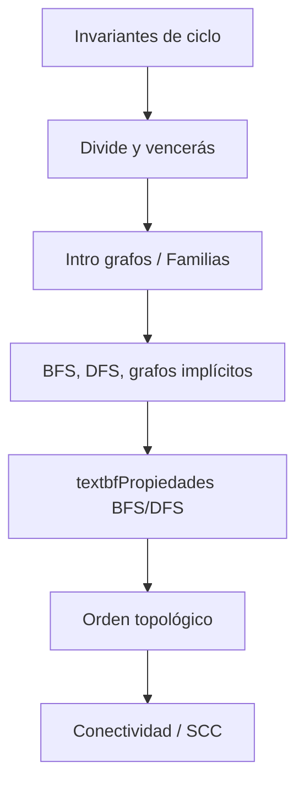

Agenda de la sesión


> ⚠️ **Motivación**
>
> Ya saben *ejecutar* BFS y DFS. Hoy van a entender *por qué* funcionan las aplicaciones que hemos visto (camino más corto, bipartitud, detección de ciclos).


> 📌 **Referencia**
>
> Cormen et al. (CLRS), Capítulo 22, secciones 22.1--22.5.


# Repaso


---

¿Dónde estamos?




---

Repaso rápido: BFS vs DFS


> 📋 **Comparación**
>
> **Característica**                     **BFS**                           **DFS**
> ---------------------- --------------------------------------- ---------------------------
> Estructura de datos                  Cola (FIFO)                 Pila (LIFO) / Recursión
> Exploración                          Por niveles                     Por profundidad
> Camino más corto        [Sí]{style="color: verde"} (no pond.)   [No]{style="color: rojo"}
> Complejidad temporal                  $O(V+E)$                          $O(V+E)$
> Complejidad espacial                   $O(V)$                   $O(V)$ it. / $O(d)$ rec.


> ⚠️ **Pregunta clave de hoy ¿Por qué BFS garantiza el camino más corto? ¿Qué estructura produce DFS que permite detectar ciclos, hacer ordenamiento topológico y encontrar componentes fuertemente conexas?**


La respuesta está en las **propiedades formales** de los árboles que estos recorridos generan.

# Árbol BFS


---

El árbol BFS


> 📋 **Definición**
>
> Cuando ejecutamos BFS desde una fuente $s$, el diccionario de **padres** $\pi[v]$ define un **árbol BFS** (*breadth-first tree*) enraizado en $s$.


0.45


> 📌 **Grafo original**
>
> ```mermaid
> flowchart TD
> 0["0"]
> 1["1"]
> 2["2"]
> 3["3"]
> 4["4"]
> 0 --> 1
> 0 --> 2
> 1 --> 3
> 2 -.-> 3
> 3 --> 4
> ```


0.45


> 📌 **Árbol**
>
> BFS desde 0
>
> ```mermaid
> flowchart TD
> N1["0"]
> ```


La arista $(2,3)$ **no** pertenece al árbol BFS: cuando BFS llega a 3 desde 1, ya lo marcó como visitado.


---

Propiedad de distancia mínima

**Teorema 1** (Distancia mínima --- CLRS Teorema 22.5). *Sea $G = (V,E)$ un grafo (dirigido o no dirigido) y $s \in V$ la fuente de BFS. Para todo vértice $v \in V$ alcanzable desde $s$: $$d[v] = \delta(s, v)$$ donde $\delta(s,v)$ es la distancia más corta (en número de aristas) de $s$ a $v$.*


> 📋 **Idea de la demostración (inducción sobre $\delta(s,v)$)**
>
> Base:
>
> :   $\delta(s,s) = 0 = d[s]$.
>
> H.I.:
>
> :   Para todo $u$ con $\delta(s,u) = k-1$, se cumple $d[u] = k-1$.
>
> Paso:
>
> :   Sea $v$ con $\delta(s,v) = k$. Existe $u$ con $\delta(s,u) = k-1$ y $(u,v) \in E$. Por H.I., $d[u] = k-1$. Cuando BFS procesa $u$, encola a $v$ (si no fue visitado antes), asignando $d[v] = d[u]+1 = k$.


> ⚠️ **Clave**
>
> BFS procesa **todos** los nodos a distancia $k-1$ **antes** que cualquier nodo a distancia $k$.


---

Lema: Monotonía de la cola

**Lema 1** (Monotonía de la cola BFS --- CLRS Lema 22.3). *Si los vértices se encolan en el orden $v_1, v_2, \ldots, v_n$, entonces: $$d[v_1] \leq d[v_2] \leq \cdots \leq d[v_n]$$ Además, en cualquier instante, si $v_i$ está al frente y $v_j$ al final: $$d[v_j] \leq d[v_i] + 1$$*


> 📋 **Consecuencia**
>
> La cola BFS contiene a lo sumo nodos de **dos niveles consecutivos** $k$ y $k+1$. Esto garantiza la exploración nivel por nivel.


> 📌 **Nota**
>
> Este lema es la base formal de por qué BFS funciona como "onda expansiva".


---

Propiedad de las aristas en BFS

**Propiedad 1** (Aristas y niveles). *Sea $G = (V,E)$ un grafo no dirigido y $(u,v) \in E$ una arista cualquiera. Después de ejecutar BFS desde $s$: $$|d[u] - d[v]| \leq 1$$*


> 📋 **Interpretación**
>
> Toda arista del grafo conecta nodos del **mismo nivel** o de **niveles adyacentes**.


> ⚠️ **Aplicación directa --- Bipartitud**
>
> -   Si $d[u] = d[v]$ y $(u,v) \in E$ $\Rightarrow$ existe un [ciclo de longitud impar]{style="color: rojo"}
>
> -   Un grafo es bipartito $\iff$ no tiene ciclos de longitud impar
>
> -   Por eso la 2-coloración con BFS funciona: asignamos color según la paridad de $d[v]$


> 📌 **Conexión con el parcial**
>
> Esto es exactamente lo que resolvieron en el examen con el problema de grafos bipartitos.


---

BFS y componentes conexas

**Propiedad 2**. *Si ejecutamos BFS desde cada vértice no visitado de un grafo no dirigido $G$, obtenemos exactamente las **componentes conexas** de $G$.*


> 📌 **Implementación --- $O(V + E)$**
>
> ``` {.python fontsize="\\scriptsize" bgcolor="grisclaro"}
> def componentes_conexas(grafo, n):
> visitado = set()
> componentes = []
> for nodo in range(n):
> if nodo not in visitado:
> componente = []
> cola = deque([nodo])
> visitado.add(nodo)
> while cola:
> actual = cola.popleft()
> componente.append(actual)
> for vecino in grafo[actual]:
> if vecino not in visitado:
> visitado.add(vecino)
> cola.append(vecino)
> componentes.append(componente)
> return componentes
> ```


# Árbol DFS


---

DFS con tiempos de descubrimiento y finalización


> 📋 **Idea**
>
> DFS puede enriquecerse registrando **cuándo** se descubre y se finaliza cada vértice.


> 📋 **Definiciones**
>
> Para cada vértice $v$ definimos:
>
> $d[v]$: **Tiempo de descubrimiento** cuando DFS visita $v$ por primera vez (se pone [GRIS]{style="color: SteelBlue"}).
>
> $f[v]$: **Tiempo de finalización** cuando DFS termina de explorar todos los descendientes de $v$ (se pone **NEGRO**).
>
> Los tiempos son enteros del 1 al $2|V|$.


> 📋 **Tres colores (estados de cada vértice)**
>
> ------------------------------------------ --------------- ----------------------------------------
> **BLANCO** (0)                              $\rightarrow$  No descubierto aún
> [**GRIS**]{style="color: SteelBlue"} (1)    $\rightarrow$  En proceso --- en la pila de recursión
> **NEGRO** (2)                               $\rightarrow$  Completamente procesado
> ------------------------------------------ --------------- ----------------------------------------


> ⚠️ **Invariante clave**
>
> Un vértice está [GRIS]{style="color: SteelBlue"} durante todo el intervalo $[d[v], f[v]]$. Si al explorar una arista $(u,v)$ encontramos que $v$ está GRIS, entonces $v$ es **ancestro** de $u$ en el árbol DFS.


---

Implementación: DFS con tiempos


> 📌 **Código**
>
> Python I
>
> ``` {.python fontsize="\\scriptsize" bgcolor="grisclaro"}
> tiempo = [0]  # Variable global mutable
>
> def dfs_completo(grafo, n):
> color = [0] * n      # 0=BLANCO, 1=GRIS, 2=NEGRO
> desc  = [0] * n      # Tiempo de descubrimiento
> fin   = [0] * n      # Tiempo de finalización
> padre = [-1] * n
>
> for u in range(n):
> if color[u] == 0:
> dfs_visitar(grafo, u, color, desc, fin, padre)
> return desc, fin, padre
> ```


> 📌 **Código**
>
> Python II
>
> ``` {.python fontsize="\\scriptsize" bgcolor="grisclaro"}
>
> def dfs_visitar(grafo, u, color, desc, fin, padre):
> tiempo[0] += 1
> desc[u] = tiempo[0]
> color[u] = 1  # GRIS: descubierto
>
> for v in grafo[u]:
> if color[v] == 0:       # Arista del arbol
> padre[v] = u
> dfs_visitar(grafo, v, color, desc, fin, padre)
>
> color[u] = 2  # NEGRO: finalizado
> tiempo[0] += 1
> fin[u] = tiempo[0]
> ```


---

Ejemplo: Traza de DFS con tiempos


> 📌 **Grafo dirigido con tiempos $d[v]/f[v]$**
>
> ```mermaid
> flowchart TD
> 0["u"]
> 1["v"]
> 2["w"]
> 3["x"]
> 4["y"]
> 5["z"]
> 1_8["1/8"]
> 2_7["2/7"]
> 3_6["3/6"]
> 9_12["9/12"]
> 4_5["4/5"]
> 10_11["10/11"]
> 0 --> 1
> 0 --> 3
> 1 --> 2
> 3 --> 1
> 4 --> 3
> 2 --> 5
> 5 --> 4
> ```


> 📋 **Observaciones**
>
> -   Intervalo de $v$: $[2,7] \subset [1,8]$ de $u$ $\Rightarrow$ $v$ es **descendiente** de $u$.
>
> -   Intervalo de $x$: $[9,12]$, disjunto de $[1,8]$ $\Rightarrow$ $x$ **no es** descendiente ni ancestro de $u$.


---

Teorema del paréntesis

**Teorema 2** (Teorema del paréntesis --- CLRS 22.7). *Para cualquier par de vértices $u, v$ en un DFS, se cumple **exactamente una** de:*

1.  *$[d[u], f[u]]$ y $[d[v], f[v]]$ son **disjuntos**: ninguno es descendiente del otro.*

2.  *$[d[u], f[u]] \subset [d[v], f[v]]$: $u$ es **descendiente** de $v$.*

3.  *$[d[v], f[v]] \subset [d[u], f[u]]$: $v$ es **descendiente** de $u$.*


> 📋 **Idea clave**
>
> Los intervalos de tiempo de dos vértices **nunca se cruzan parcialmente**. Es decir, nunca ocurre $d[u] < d[v] < f[u] < f[v]$.


> 📌 **Ejemplo: Intervalos del grafo anterior Recordemos los tiempos obtenidos:**
>
> Vértice      $u$       $v$       $w$       $y$       $x$         $z$
> ----------- --------- --------- --------- --------- ---------- -----------
> $d$         1         2         3         4         9          10
> $f$         8         7         6         5         12         11
> Intervalo   $[1,8]$   $[2,7]$   $[3,6]$   $[4,5]$   $[9,12]$   $[10,11]$


> 📌 **Visualización en recta numérica**
>
> Cada intervalo $[d[v], f[v]]$ se muestra como un segmento horizontal:
>
> ```mermaid
> flowchart TD
> x["x"]
> u["u"]
> v["v"]
> w["w"]
> y["y"]
> z["z"]
> 0_5_0 --> 12_8_0
> _x___0_15 --> _x__0_15
> 1__5 --> 8__5
> 2__4 --> 7__4
> 3__3 --> 6__3
> 4__2 --> 5__2
> 9__5 --> 12__5
> 10__4 --> 11__4
> ```


Observen: los intervalos se **anidan** (uno contiene al otro) o son **completamente disjuntos**. Nunca se cruzan parcialmente.


> 📋 **Verificación par por par**
>
> Tomemos algunos pares representativos del ejemplo:
>
> $u$ y $v$:
>
> :   $[2,7] \subset [1,8]$ $\Rightarrow$ $v$ es **descendiente** de $u$.
>
> $w$ y $y$:
>
> :   $[4,5] \subset [3,6]$ $\Rightarrow$ $y$ es **descendiente** de $w$.
>
> $u$ y $x$:
>
> :   $[1,8]$ y $[9,12]$ son **disjuntos** $\Rightarrow$ ni ancestro ni descendiente.
>
> $v$ y $x$:
>
> :   $[2,7]$ y $[9,12]$ son **disjuntos** $\Rightarrow$ ni ancestro ni descendiente.
>
> $x$ y $z$:
>
> :   $[10,11] \subset [9,12]$ $\Rightarrow$ $z$ es **descendiente** de $x$.


> ⚠️ **Pregunta al estudiante ¿Qué relación tienen $y$ y $z$? Sus intervalos son $[4,5]$ y $[10,11]$: disjuntos. Efectivamente, $y$ y $z$ están en **árboles DFS distintos** y no tienen relación ancestro-descendiente.**


> 📌 **Notación como paréntesis**
>
> Otra forma de visualizar: escribimos "`(`" cuando se descubre un vértice y "`)`" cuando se finaliza:
>
> `(`[`u`]{style="color: SteelBlue"}` (`[`v`]{style="color: verde"}` (`[`w`]{style="color: naranja"}` (`[`y`]{style="color: rojo"}` `[`y`]{style="color: rojo"}`) `[`w`]{style="color: naranja"}`) `[`v`]{style="color: verde"}`) `[`u`]{style="color: SteelBlue"}`) (`[`x`]{style="color: SteelBlue!60"}` (`[`z`]{style="color: verde!60"}` `[`z`]{style="color: verde!60"}`) `[`x`]{style="color: SteelBlue!60"}`)`
>
> Los paréntesis están **correctamente anidados**, como en una expresión matemática bien formada. Si un paréntesis abre dentro de otro, también cierra dentro de él.


> 📋 **Analogía**
>
> Es como HTML bien formado: si abrimos `<u>` y dentro abrimos `<v>`, debemos cerrar `</v>` antes de cerrar `</u>`. Nunca se "cruzan" las etiquetas.


---

Demostración del Teorema del paréntesis


> 📋 **Caso: $d[u] < d[v]$ Se analizan dos subcasos según la relación entre $d[v]$ y $f[u]$.**


> 📋 **Subcaso 1: $d[v] < f[u]$ Se descubre $v$ antes de finalizar $u$.**
>
> $\Rightarrow$ $v$ fue descubierto mientras $u$ estaba GRIS.
>
> $\Rightarrow$ $v$ es descendiente de $u$ en el árbol DFS.
>
> $\Rightarrow$ $v$ se finaliza antes que $u$: $f[v] < f[u]$.
>
> $\Rightarrow$ $[d[v], f[v]] \subset [d[u], f[u]]$.


> 📋 **Subcaso 2: $f[u] < d[v]$ Se finaliza $u$ antes de descubrir $v$.**
>
> $\Rightarrow$ Los intervalos son completamente disjuntos.


> 📋 **Casos restantes**
>
> -   $d[v] < d[u]$: simétrico al caso anterior.
>
> -   $d[u] = d[v]$: implica $u = v$.


> ⚠️ **Nota**
>
> No puede ocurrir que $d[u] < d[v] < f[u] < f[v]$ ("cruce parcial"), pues $v$ descubierto antes de finalizar $u$ implica que $v$ se finaliza antes que $u$. $\square$


# Clasificación de aristas


---

Clasificación de aristas en DFS


> 📋 **Definición**
>
> Al ejecutar DFS sobre un grafo **dirigido** $G$, cada arista $(u,v)$ se clasifica según el **color de $v$** al explorar la arista:


> 📋 **Tipos de aristas**
>
> **Tipo**                                       **Color de $v$**   **Significado**
> ---------------------------------------------- ------------------ ---------------------------------------------
> [**Tree edge**]{style="color: verde"}          BLANCO             $v$ se descubre por primera vez
> [**Back edge**]{style="color: rojo"}           GRIS               $v$ es ancestro de $u$ ($d[v] < d[u]$)
> [**Forward edge**]{style="color: SteelBlue"}   NEGRO              $v$ es descendiente de $u$ ($d[u] < d[v]$)
> [**Cross edge**]{style="color: naranja"}       NEGRO              Sin relación ancestro-desc. ($d[v] < d[u]$)


> ⚠️ **¿Por qué importa?**
>
> -   [Back edges]{style="color: rojo"} $\Leftrightarrow$ **ciclos** en grafos dirigidos.
>
> -   [Tree edges]{style="color: verde"} $\Rightarrow$ definen el **árbol/bosque DFS**.
>
> -   La clasificación es la base del orden topológico y de los algoritmos de Tarjan/Kosaraju.


---

Implementación: Clasificación de aristas


> 📌 **Código**
>
> Python
>
> ``` {.python fontsize="\\scriptsize" bgcolor="grisclaro"}
> def dfs_clasificar(grafo, u, color, desc, fin, tiempo):
> tiempo[0] += 1
> desc[u] = tiempo[0]
> color[u] = 1  # GRIS
>
> for v in grafo[u]:
> if color[v] == 0:
> print(f"Tree edge:    ({u},{v})")
> dfs_clasificar(grafo, v, color, desc,
> fin, tiempo)
> elif color[v] == 1:
> print(f"Back edge:    ({u},{v})  -> CICLO!")
> elif desc[u] < desc[v]:
> print(f"Forward edge: ({u},{v})")
> else:
> print(f"Cross edge:   ({u},{v})")
>
> color[u] = 2  # NEGRO
> tiempo[0] += 1
> fin[u] = tiempo[0]
> ```


La clasificación se determina en $O(1)$ por arista $\Rightarrow$ complejidad total $O(V+E)$.


---

Ejemplo visual: Clasificación de aristas


> 📌 **Grafo dirigido con aristas clasificadas**
>
> ```mermaid
> flowchart TD
> u["u"]
> v["v"]
> w["w"]
> x["x"]
> y["y"]
> z["z"]
> 1_8["1/8"]
> 2_7["2/7"]
> 3_6["3/6"]
> 9_10["9/10"]
> 4_5["4/5"]
> 11_12["11/12"]
> u --> v
> v --> w
> w --> y
> y -.-> u
> w --> x
> ```


> 📋 **Leyenda**
>
> ::: {style="color: verde"}
>
> ------------------------------------------------------------------------


Tree [- - -]{style="color: rojo"} Back [$\cdots$]{style="color: SteelBlue"} Forward [-$\cdot$-]{style="color: naranja"} Cross


> 📋 **¿Por qué cada arista se clasifica así? DFS comienza en $u$ (tiempo 1). Al explorar cada arista $(a,b)$, miramos el **color de $b$** en ese instante:**


> 📌 **Paso 1: Explorar $(u, v)$ --- tiempo $d[u]=1$ $v$ está **BLANCO** (no descubierto) $\Rightarrow$ [**Tree edge**]{style="color: verde"}. DFS desciende a $v$.**


> 📌 **Paso 2: Explorar $(v, w)$ --- tiempo $d[v]=2$ $w$ está **BLANCO** $\Rightarrow$ [**Tree edge**]{style="color: verde"}. DFS desciende a $w$.**


> 📌 **Paso 3: Explorar $(w, y)$ --- tiempo $d[w]=3$ $y$ está **BLANCO** $\Rightarrow$ [**Tree edge**]{style="color: verde"}. DFS desciende a $y$.**


> ⚠️ **Paso 4: Explorar $(y, u)$ --- tiempo $d[y]=4$ $u$ está [**GRIS**]{style="color: SteelBlue"} (descubierto en tiempo 1, aún no finalizado). Un vértice GRIS está en la pila de recursión, es decir, es **ancestro** de $y$.**
>
> $\Rightarrow$ [**Back edge**]{style="color: rojo"}. Esto indica un **ciclo**: $u \to v \to w \to y \to u$.


DFS retrocede: finaliza $y$ ($f[y]=5$), $w$ ($f[w]=6$), $v$ ($f[v]=7$). Ahora vuelve a $u$.


> 📌 **Paso 5: Explorar $(u, w)$ --- todavía en tiempo de $u$ $w$ está **NEGRO** (ya finalizado, $f[w]=6$).**
>
> ¿Cómo distinguir forward de cross? Comparamos tiempos de descubrimiento:
>
> -   $d[u] = 1 < 3 = d[w]$ $\Rightarrow$ $u$ se descubrió **antes** que $w$.
>
> -   Además, $[3,6] \subset [1,8]$, es decir, $w$ es descendiente de $u$ en el árbol.
>
> $\Rightarrow$ [**Forward edge**]{style="color: SteelBlue"}. (Arista hacia un descendiente ya procesado.)


> 📌 **Paso 6: Explorar $(w, x)$ --- durante el procesamiento de $w$ $x$ está **NEGRO** (finalizado, $f[x]=10$).**
>
> Comparamos tiempos: $d[w] = 3 > 9 = d[x]$\... en realidad $d[x]=9 > 3 = d[w]$. Pero $x$ se descubrió **después** de que $w$ finalizara.
>
> Revisemos: $d[x] = 9$, $f[w] = 6$. $x$ se descubrió en tiempo 9, pero $w$ ya finalizó en tiempo 6. Los intervalos $[3,6]$ y $[9,12]$ son **disjuntos**: no hay relación ancestro-descendiente.
>
> $\Rightarrow$ [**Cross edge**]{style="color: naranja"}. (Arista entre nodos sin relación.)


> 📋 **Resumen: Regla de decisión Al explorar la arista $(a, b)$:**
>
> **Color de $b$**       **Tipo**                              **Razonamiento**
> ---------------------- ------------------------------------- ----------------------------------
> BLANCO                 [Tree]{style="color: verde"}          Primera vez que vemos $b$
> GRIS                   [Back]{style="color: rojo"}           $b$ es ancestro (en la pila)
> NEGRO, $d[a] < d[b]$   [Forward]{style="color: SteelBlue"}   $b$ es descendiente ya terminado
> NEGRO, $d[a] > d[b]$   [Cross]{style="color: naranja"}       $b$ terminó en otro subárbol


---


Caso especial: Grafos no dirigidos

**Propiedad 3**. *En un grafo **no dirigido**, DFS solo produce dos tipos de aristas:*

1.  *[**Tree edges**]{style="color: verde"}*

2.  *[**Back edges**]{style="color: rojo"}*

*No existen forward edges ni cross edges.*


> 📋 **¿Por qué? Si existe arista $\{u,v\}$ y DFS descubre $u$ antes que $v$:**
>
> -   $v$ no visitado $\Rightarrow$ se descubre desde $u$ (**tree edge**).
>
> -   $v$ ya visitado $\Rightarrow$ como la arista es bidireccional, $v$ necesariamente es ancestro de $u$ (**back edge**).
>
> No puede ser cross ni forward porque la arista "va en ambas direcciones".


> ⚠️ **Detección de ciclos simplificada**
>
> Hay ciclo en un grafo no dirigido $\iff$ DFS encuentra un vecino **ya visitado** que **no es el padre**.


> 📌 **Conexión**
>
> Esto es lo que implementamos en la clase 11 con la condición `vecino != padre`.


---

Teorema: Ciclos y back edges

**Teorema 3** (Detección de ciclos --- CLRS Teorema 22.11). *Un grafo dirigido $G$ tiene un ciclo $\iff$ DFS sobre $G$ produce al menos una **back edge**.*


> 📋 **Demostración ($\Leftarrow$): Back edge $\Rightarrow$ ciclo Si $(u,v)$ es back edge, $v$ es ancestro de $u$ en el árbol DFS.**
>
> $\Rightarrow$ Existe camino $v \leadsto u$ por tree edges.
>
> $\Rightarrow$ $v \leadsto u \to v$ es un ciclo.


> 📋 **Demostración ($\Rightarrow$): Ciclo $\Rightarrow$ back edge Sea $v$ el primer vértice descubierto en un ciclo $C$.**
>
> Como $v$ es el primero en $C$ en ser descubierto, DFS explorará todo el ciclo antes de finalizar $v$.
>
> Sea $u$ el predecesor de $v$ en $C$.
>
> $\Rightarrow$ $u$ se descubre después de $v$ y antes de que $v$ finalice.
>
> $\Rightarrow$ $u$ es descendiente de $v$ en el árbol DFS.
>
> $\Rightarrow$ La arista $(u,v)$ es una **back edge**. $\square$


---

Teorema del camino blanco

**Teorema 4** (Camino blanco --- CLRS Teorema 22.9). *En un bosque DFS de un grafo $G$, el vértice $v$ es descendiente de $u$ $\iff$ en el momento $d[u]$ (cuando $u$ se descubre), existe un camino de $u$ a $v$ compuesto **enteramente de vértices blancos**.*


> 📋 **Intuición**
>
> DFS "absorbe" todos los vértices alcanzables por caminos blancos antes de retroceder.


> ⚠️ **Utilidad**
>
> Este teorema es fundamental para demostrar la correctitud de:
>
> -   Ordenamiento topológico (clase 15)
>
> -   Algoritmo de Kosaraju para SCC (clase 17)
>
> -   Puntos de articulación y puentes (clase 18)


# Resumen y conexiones


---

Resumen: Propiedades clave


> 📋 **Comparación de propiedades**
>
> **Propiedad**   **BFS**                           **DFS**
> --------------- --------------------------------- -----------------------------------
> Estructura      Árbol BFS (niveles)               Bosque DFS (profundidad)
> Distancia       $d[v] = \delta(s,v)$ (mínima)     $d[v]$ = tiempo descubr.
> Aristas         $|d[u] - d[v]| \leq 1$            4 tipos de aristas
> Ciclos          Mismo nivel $\Rightarrow$ impar   Back edge $\Leftrightarrow$ ciclo
> Teorema clave   Monotonía de la cola              Tma. del paréntesis


> ⚠️ **Mensaje central**
>
> Estas propiedades son los **bloques de construcción** para todos los algoritmos de grafos del resto del curso.


---

¿Qué sigue?


> 📋 **Las propiedades de hoy habilitan directamente:**
>
> ```mermaid
> flowchart TD
> hoy("textbfPropiedades BFS/DFS")
> topo("Orden topológico")
> conex("Conectividad")
> scc("SCC (Kosaraju/Tarjan)")
> art("Puntos de articulación")
> hoy -->|"f[v]"| topo
> hoy -->|"Árbol BFS"| conex
> topo -->|"Kosaraju"| scc
> conex -->|"Back edges"| art
> ```


> 📌 **Lectura recomendada**
>
> CLRS Cap. 22, secciones 22.3 a 22.5. Prestar atención a las demostraciones formales de los teoremas vistos hoy.


---

Ejercicio propuesto


> 📋 **Enunciado**
>
> Dado el siguiente grafo **dirigido**, ejecute DFS desde $A$ (vecinos en orden alfabético):


0.4


> 📌 **Grafo**
>
> ```mermaid
> flowchart TD
> A["A"]
> B["B"]
> C["C"]
> D["D"]
> E["E"]
> A --> B
> A --> C
> B --> D
> C --> D
> D --> A
> D --> E
> E --> C
> ```


0.55


> ⚠️ **Determine**
>
> 1.  Los tiempos $d[v]/f[v]$ para cada vértice.
>
> 2.  Clasifique **cada arista** (tree, back, forward, cross).
>
> 3.  Verifique el teorema del paréntesis.
>
> 4.  ¿Tiene ciclos? ¿Cuáles?


**Pista:** Debería encontrar al menos una back edge.


---

**¡Gracias!**

¿Preguntas?
