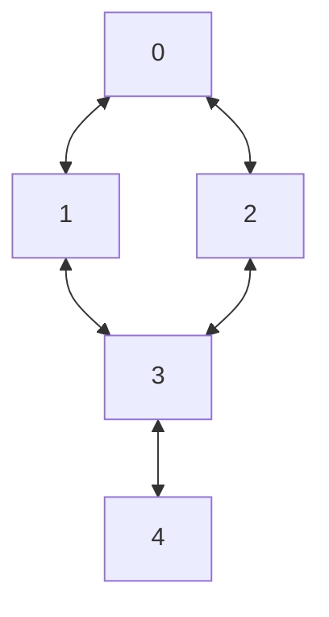
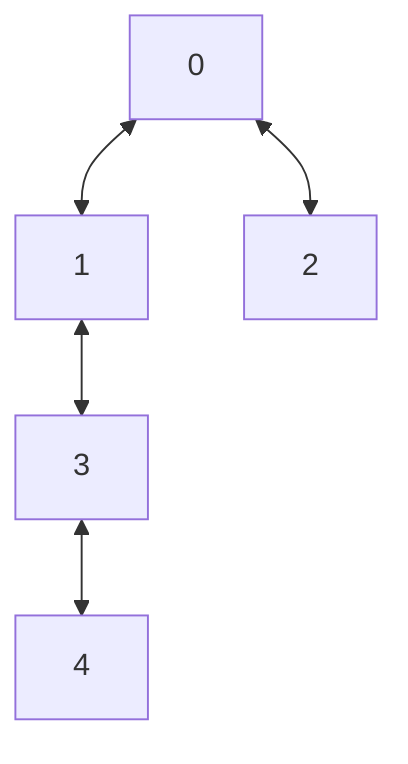
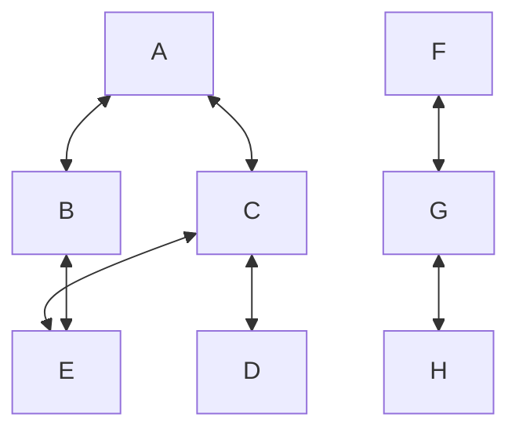

# Definiciones

Cuando ejecutamos BFS desde una fuente $s$, el arreglo de padres $\pi[v]$ define un **árbol BFS** enraizado en $s$.

Un **árbol** es un grafo acíclico dirigido.

Por ejemplo:



Al ejecutar BFS desde el nodo 0, obtenemos el siguiente árbol BFS:



Al realizar la búsqueda BFS, la arista entre 2 y 3 no se agrega al árbol porque, al procesar el nodo 2, el nodo 3 ya ha sido visitado desde el nodo 1.

# Teorema de distancia mínima

**Teorema 22.5 del libro de Cormen**

Sea un grafo $G(V,E)$ y $s \in V$ como nodo fuente. Todo vértice $v \in V$ alcanzable desde $s$ tiene asignada la distancia más corta desde $s$.

**Demostración por inducción:**

*   **Paso base:** $d[s] = 0$, que es la distancia mínima desde un nodo hacia sí mismo.
*   **Paso inductivo:** Supongamos que para un nodo $u$, $d[u] = k$ es la distancia mínima desde $s$ (hipótesis inductiva). Si existe una arista $(u, v)$ y $v$ no ha sido visitado, significa que no existe un camino de longitud $k$ o menor desde $s$ hasta $v$. Por lo tanto, al procesar $u$ y descubrir $v$, se le asigna $d[v] = d[u] + 1 = k+1$, que es la distancia mínima.

Otra forma de verlo: si $d[v] = k$, entonces debe existir un nodo $u$ con $d[u] = k-1$ que fue su predecesor en el árbol BFS. Al procesar $u$, se descubre $v$ y se le asigna $d[v] = d[u] + 1 = k$.

**En conclusión, BFS procesa todos los nodos a distancia $k-1$ antes de procesar los nodos a distancia $k$.**

# Teorema de monotonicidad de la cola

**Teorema 22.5 (Cormen)**

Los vértices $v_1, v_2, v_3, \ldots, v_n$ se encolan en orden creciente con respecto a su distancia desde la fuente $s$.

$$
d[v_1] \leq d[v_2] \leq d[v_3] \leq \ldots \leq d[v_n]
$$

Además, si tenemos una arista $(u, v)$, se cumple que:

$$
d[u] \leq d[v] + 1
$$

**Propiedad importante:** La cola de BFS contiene, a lo sumo, nodos de dos niveles de distancia consecutivos: $k$ y $k+1$.

**Ejemplo:**

```
Cola = {A}       d = [0]
Cola = {B, C}    d = [1, 1]
Cola = {C, D}    d = [1, 2]
Cola = {D, E}    d = [2, 3]
```

Nunca vamos a tener en la cola nodos cuyas distancias difieran en más de una unidad.

# Teorema de la distancia mínima (Reafirmación)

**Teorema 22.5 de Cormen**

Todo vértice $v$ alcanzable desde $s$ tendrá asignada la distancia más corta (en número de aristas) desde $s$. Es decir, $d[s, v]$ calculado por BFS es la distancia mínima.

**Demostración (resumen):**

*   **Paso base:** $d[s, s] = 0$, que es la distancia mínima.
*   **Paso inductivo:** Si $d[s, v] = k$ es la distancia mínima, entonces existe un nodo $u$ con $d[s, u] = k-1$ que es su predecesor en el árbol BFS. Al procesar $u$, se descubre $v$ y se le asigna $d[v] = d[u] + 1 = k$, manteniendo la propiedad de distancia mínima.

# Componentes conexas

Si ejecutamos BFS desde un nodo no visitado, exploramos todos los nodos de su **componente conexa** (en grafos no dirigidos) o **componente fuertemente conexa** (en grafos dirigidos, aunque BFS por sí solo no la identifica completamente).



**Simulación de BFS:**

```
// Primera componente conexa (nodos A, B, C, D, E)
Fuente A
Cola = {A}           Visitado = {A}
Cola = {B, C}        Visitado = {A, B, C}
Cola = {B, C, E}     Visitado = {A, B, C, E} // E es descubierto desde C
Cola = {C, E}        Visitado = {A, B, C, E} // B es procesado y desencolado
Cola = {E, D}        Visitado = {A, B, C, E, D} // D es descubierto desde C
Cola = {E}           Visitado = {A, B, C, E, D} // D es procesado y desencolado
Cola = {}            Visitado = {A, B, C, E, D} // E es procesado y desencolado

// Segunda componente conexa (nodos F, G, H)
Fuente G
Cola = {G}           Visitado = {G}
Cola = {F, H}        Visitado = {G, F, H}
Cola = {H}           Visitado = {G, F, H} // F es procesado y desencolado
Cola = {}            Visitado = {G, F, H} // H es procesado y desencolado
```

---

## Tabla de Resumen de Conceptos

Concepto | Descripción | Teorema/Propiedad Relacionado
--- | --- | ---
Árbol BFS | Subgrafo del grafo original, acíclico y enraizado en la fuente $s$, que contiene todos los vértices alcanzables desde $s$ y las aristas que los descubrieron. | Definido por el arreglo de padres $\pi[v]$.
Distancia mínima ($d[v]$) | Número mínimo de aristas en cualquier camino desde la fuente $s$ hasta el vértice $v$. | **Teorema 22.5 (Cormen):** BFS calcula la distancia mínima para todos los vértices alcanzables.
Monotonicidad de la cola | Los vértices son encolados (y por tanto procesados) en orden estrictamente creciente de su distancia desde la fuente. | $d[v_1] \leq d[v_2] \leq \ldots \leq d[v_n]$. La cola solo contiene nodos de dos niveles de distancia consecutivos.
Relación de distancias en aristas | Para cualquier arista $(u, v)$ en el grafo, las distancias de sus extremos difieren a lo sumo en 1. | $d[u] \leq d[v] + 1$ y $d[v] \leq d[u] + 1$.
Componentes conexas | Conjunto máximo de vértices donde existe un camino entre cualquier par. BFS desde un nodo no visitado explora completamente su componente conexa (en grafos no dirigidos). | Se puede usar BFS para contar y etiquetar componentes conexas en $O(V+E)$.

## Comentarios Adicionales

*   **Complejidad:** La complejidad temporal de BFS es $O(V + E)$ cuando se usa una lista de adyacencia, ya que cada vértice y cada arista se procesan una vez.
*   **Aplicaciones clave:** Además de encontrar caminos más cortos en grafos no ponderados, BFS es fundamental para:
    *   Probar la bipartitud de un grafo.
    *   Encontrar componentes conexas.
    *   Implementar algoritmos como el de Edmonds-Karp para flujo máximo.
    *   Resolver puzzles y problemas de búsqueda en estado (ej., el problema del granjero, lobo, cabra y col).
*   **BFS vs. DFS:** Mientras BFS explora "en capas" (por niveles de distancia), DFS explora a profundidad a lo largo de una rama antes de retroceder. BFS garantiza el camino más corto; DFS no, pero suele usar menos memoria (en su forma recursiva).
*   **Grafos dirigidos:** En grafos dirigidos, BFS desde un nodo $s$ encuentra todos los nodos **alcanzables** desde $s$, pero no necesariamente todos los nodos desde los que $s$ es alcanzable (esto definiría la componente fuertemente conexa, para lo que se necesita el algoritmo de Kosaraju o Tarjan).