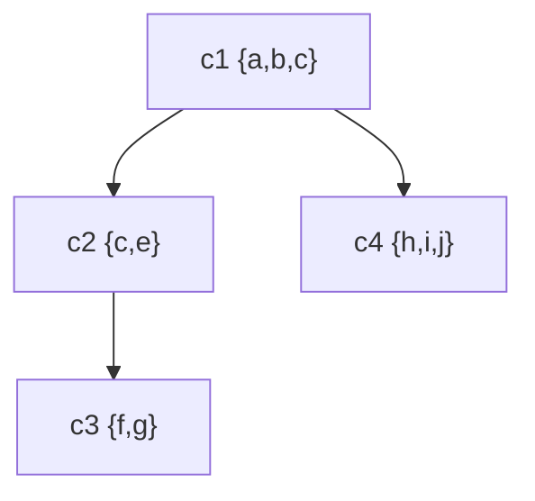
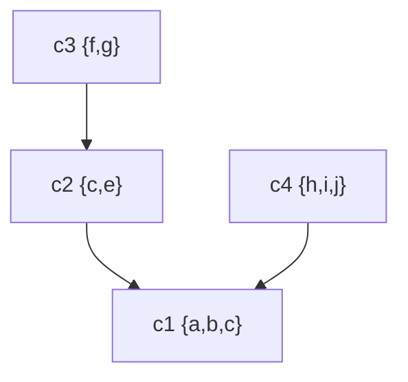

# Algoritmos para detección de SCC

## Algoritmo de Kosaraju

Utiliza $G$ y $G^T$, dado que ambos grafos contienen los mismos SCC (componentes fuertemente conexos).

Complejidad: $O(|V|+|E|)$ cuando se usa una representación por listas de adyacencia.

Realiza dos pasadas de DFS (búsqueda en profundidad):

1. Ejecutar DFS sobre $G$ y registrar el orden de finalización de cada vértice (orden de la pila).
2. Construir $G^T$ (grafo transpuesto).
3. Ejecutar DFS sobre $G^T$, procesando los vértices en orden decreciente según su tiempo de finalización obtenido en el paso 1.

Imaginemos este grafo de componentes $G^{SCC}$:

Los tiempos de finalización de $C_1$ serán mayores que los de $C_2$, $C_3$ y $C_4$, y el tiempo de $C_3$ será menor que el de $C_2$. Cuando construimos $G^T$ (transpuesto de $G$, no de $G^{SCC}$), las aristas entre componentes se invierten. En términos del grafo de componentes, el efecto es:

Este es el grafo transpuesto. Ahora, si aplicamos DFS considerando el orden de los tiempos de finalización (mayor a menor), el algoritmo arranca en $C_1$ (mayor tiempo de finalización). En $G^T$, desde $C_1$ no puedo ir a los otros componentes porque las aristas ahora apuntan hacia $C_1$, no desde él. Luego, al procesar $C_2$, no puedo ir a $C_1$ porque $C_1$ ya fue visitado por el DFS anterior, aislando así cada SCC correctamente.

**Explicación conceptual**: En la primera DFS sobre $G$, el vértice con el mayor tiempo de finalización pertenece a un SCC que es una "fuente" en $G^{SCC}$ (no tiene aristas entrantes desde otros SCCs). Al procesar $G^T$ en orden decreciente de $f$, comenzamos por una fuente en $(G^T)^{SCC}$, que corresponde a un sumidero en $G^{SCC}$, asegurando que cada DFS en $G^T$ explore exactamente un SCC completo.

## Algoritmo de Tarjan

Requiere una sola pasada de DFS y una pila auxiliar. Se basa en la propiedad de que los SCC forman subárboles del árbol DFS.

Para cada vértice $v$ se mantienen dos valores:
1. `v.d`: Tiempo de descubrimiento (índice DFS).
2. `v.low`: El menor tiempo de descubrimiento alcanzable desde el subárbol de $v$, usando a lo sumo una arista de retroceso (back edge) o de cruz (cross edge) hacia un ancestro en la pila.

Cuando se explora un vértice, se empuja a una pila. Si `v.low == v.d`, significa que $v$ es la raíz de un SCC; entonces se desapila hasta $v$, formando el componente.

**Inicialización**: Al descubrir un vértice $v$, se establece `v.low = v.d`.

**Proceso**: Durante el DFS, para cada arista $(v, w)$:
- Si $w$ no ha sido visitado, se explora recursivamente y luego `v.low = min(v.low, w.low)`.
- Si $w$ está en la pila (es parte del SCC actual), `v.low = min(v.low, w.d)`.

**Detección de SCC**: Al finalizar la exploración de $v$, si `v.low == v.d`, se desapila hasta $v$ (incluyéndolo); todos los vértices desapilados forman un SCC.

---

## Tabla de resumen

Algoritmo | Idea principal | Complejidad | Ventajas | Desventajas |
| --- | --- | --- | --- | --- |
| **Kosaraju** | Dos DFS: una en $G$ para orden de finalización, otra en $G^T$ en ese orden. | $O(|V|+|E|)$ | Conceptualmente simple, fácil de implementar. | Requiere dos pasadas DFS y la construcción explícita de $G^T$. |
| **Tarjan** | Una DFS con pila, usando `v.low` para identificar raíces de SCC. | $O(|V|+|E|)$ | Una sola DFS, no necesita $G^T$ explícito, más eficiente en práctica. | Más complejo de entender e implementar correctamente. |

**Comentarios adicionales**:
- Ambos algoritmos son óptimos en tiempo ($O(V+E)$) para grafos representados con listas de adyacencia.
- El algoritmo de **Kosaraju** es útil para enseñanza por su claridad, pero **Tarjan** (o el algoritmo de **Path-based strong component algorithm**) es preferido en implementaciones prácticas por su menor sobrecarga.
- La pila en Tarjan asegura que solo se consideren vértices del SCC actual, evitando mezclar componentes.
- Estos algoritmos son la base para problemas como: detección de ciclos en grafos dirigidos, cálculo de conectividad en redes, análisis de circuitos, y en compiladores para optimización de código.